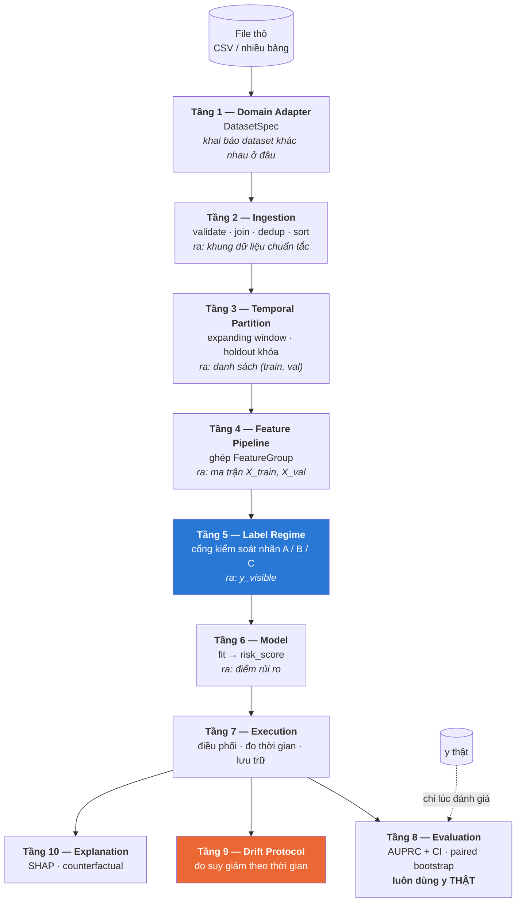

# Sentinel — Kiến trúc tầng của Model Pipeline

> **Hướng dẫn kiến trúc.** Tài liệu này mô tả từng tầng của pipeline: trách nhiệm, giao diện, cách hoạt động, bất biến phải giữ, và cạm bẫy đã biết.
>
> Đọc từ trên xuống sẽ hiểu dữ liệu đi qua những gì, ai chịu trách nhiệm cho cái gì, và vì sao ranh giới giữa các tầng được đặt ở đó.

---

## Mục lục

**Nền tảng**
1. [Bốn bất biến của kiến trúc](#1-bốn-bất-biến-của-kiến-trúc)
2. [Sơ đồ tầng](#2-sơ-đồ-tầng)

**Các tầng**

3. [Tầng 1 — Domain Adapter](#3-tầng-1--domain-adapter)
4. [Tầng 2 — Ingestion](#4-tầng-2--ingestion)
5. [Tầng 3 — Temporal Partition](#5-tầng-3--temporal-partition)
6. [Tầng 4 — Feature Pipeline](#6-tầng-4--feature-pipeline)
7. [Tầng 5 — Label Regime](#7-tầng-5--label-regime)
8. [Tầng 6 — Model](#8-tầng-6--model)
9. [Tầng 7 — Execution](#9-tầng-7--execution)
10. [Tầng 8 — Evaluation](#10-tầng-8--evaluation)
11. [Tầng 9 — Drift Protocol](#11-tầng-9--drift-protocol)
12. [Tầng 10 — Explanation](#12-tầng-10--explanation)

**Vận dụng**

13. [Roster model theo track](#13-roster-model-theo-track)
14. [Chương trình thí nghiệm](#14-chương-trình-thí-nghiệm)
15. [Thứ tự triển khai](#15-thứ-tự-triển-khai)

---

## 1. Bốn bất biến của kiến trúc

Toàn bộ thiết kế phục vụ bốn điều sau. Mỗi ranh giới tầng tồn tại để bảo vệ ít nhất một trong số chúng.

### I. Thông tin chỉ chảy từ quá khứ sang tương lai

Không một con số nào dùng để huấn luyện hay biến đổi được phép bắt nguồn từ dữ liệu nằm sau ranh giới đánh giá. Điều này áp dụng cho model, cho bộ chuẩn hóa, cho từ điển mã hóa, và cho **mọi thống kê tổng hợp trong tầng feature** — chỗ dễ vi phạm nhất và khó phát hiện nhất.

### II. Lượng nhãn model được thấy là một khai báo tường minh

Một model không được "tình cờ" dùng nhãn. Nó phải đi qua một cổng khai báo rõ nó thấy bao nhiêu thông tin nhãn. Nhãn thật **luôn** được dùng lúc đánh giá, bất kể model thấy gì lúc huấn luyện.

Đây là tầng khiến câu hỏi *"model hoạt động ra sao khi không biết nhãn?"* trở thành đo được thay vì phỏng đoán.

### III. Khác biệt giữa các dataset bị cô lập ở hai tầng đầu

Từ tầng 4 trở xuống, không tầng nào biết đang chạy dataset nào. Thêm dataset thứ ba không được phép sửa một dòng nào ở tầng model, execution, hay evaluation.

### IV. Mọi so sánh phải paired trên cùng những dòng dữ liệu

Điểm số thô của từng fold phải sống lâu hơn lần chạy sinh ra nó. Tính lại về sau không tương đương — nó kéo theo mọi khác biệt về phiên bản thư viện và seed mà phép so sánh paired sinh ra để loại bỏ.

---

## 2. Sơ đồ tầng



**Đọc sơ đồ:** đường liền là luồng dữ liệu chính. Đường đứt là nhãn thật — nó **đi vòng qua** tầng 5 và 6, chỉ xuất hiện ở tầng 8. Đó là cơ chế khiến track "mù nhãn" có ý nghĩa: model không thể chạm vào thứ nó không được thấy, kể cả do nhầm lẫn.

---

## 3. Tầng 1 — Domain Adapter

### Trách nhiệm

Khai báo **mọi thứ khiến một dataset khác một dataset khác**, dưới dạng dữ liệu chứ không phải code. Không tầng nào bên dưới được phép import hằng số schema trực tiếp.

### Giao diện

```python
@dataclass(frozen=True)
class DatasetSpec:
    name: str                        # namespace cho kết quả

    # Vị trí và cấu trúc file
    raw_paths: dict[str, Path]       # {"transaction": ..., "identity": ...}
    join_key: str | None

    # Vai trò cột — thay thế mọi hằng số hardcode
    time_column: str
    target_column: str
    amount_column: str
    entity_keys: list[str] | None
    categorical_columns: list[str]

    # Hợp đồng dữ liệu — kiểm tra lúc nạp
    expected_rows: int
    expected_fraud: int
    drop_exact_duplicates: bool

    # Hợp đồng chia tập
    holdout_fraction: float
    n_cv_folds: int

    @property
    def has_entity(self) -> bool:
        return bool(self.entity_keys)
```

### Hoạt động

Spec là **dữ liệu bất biến**, không có hành vi. Nó được truyền xuống theo tham số qua toàn bộ ngăn xếp. Mọi tầng cần biết "cột thời gian tên gì" đều hỏi `spec.time_column` thay vì import một hằng số.

Thuộc tính `has_entity` là **công tắc kiến trúc quan trọng nhất** trong toàn bộ hệ thống. Nó quyết định:

- Tầng 4 có bật các feature group hành vi hay không
- Tầng 5 có cho phép các chế độ nhãn theo thực thể hay không
- Tầng 9 có đo được drift theo thực thể hay không

### Hai instance hiện tại

| Thuộc tính | `CREDITCARD` | `IEEECIS` |
|---|---|---|
| `time_column` | `Time` | `TransactionDT` |
| `target_column` | `Class` | `isFraud` |
| `amount_column` | `Amount` | `TransactionAmt` |
| `entity_keys` | `None` | `["card1", "card2", "addr1"]` |
| `join_key` | `None` | `TransactionID` |
| `expected_rows` | 284,807 | 590,540 |
| `expected_fraud` | 492 | 20,663 |
| `drop_exact_duplicates` | `True` | `False` *(chưa đo)* |
| `n_cv_folds` | 4 | 6 |

### Bất biến

> Thêm một dataset = thêm một `DatasetSpec` + (nếu có cấu trúc dữ liệu mới) một `FeatureGroup`. **Không sửa tầng 5–10.**

Nếu việc thêm dataset buộc phải sửa tầng dưới, ranh giới tầng đã bị vi phạm ở đâu đó và cần tìm ra.

### Cạm bẫy

**Đừng nhét logic vào spec.** Spec khai báo *cái gì*, không mô tả *làm thế nào*. Nếu thấy muốn viết `if spec.name == "ieeecis"` ở tầng dưới, đó là dấu hiệu spec thiếu một trường khai báo — hãy thêm trường đó thay vì rẽ nhánh theo tên.

---

## 4. Tầng 2 — Ingestion

### Trách nhiệm

Biến file thô thành **khung dữ liệu chuẩn tắc**, hoặc dừng chương trình. Không có trạng thái trung gian "gần đúng".

### Hoạt động — năm bước theo thứ tự

```
1. Nạp        đọc từng bảng trong spec.raw_paths
2. Join       nếu spec.join_key: gộp bằng LEFT JOIN trên bảng chính
3. Validate   kiểm tra hợp đồng dữ liệu — raise nếu lệch
4. Dedup      nếu spec.drop_exact_duplicates: xóa dòng trùng hoàn toàn
5. Sort       sắp xếp theo spec.time_column bằng STABLE SORT
```

### Chi tiết từng bước

**Bước 2 — Join phải là LEFT.** Với IEEE-CIS, `train_identity.csv` chỉ phủ một phần `train_transaction.csv`. INNER JOIN sẽ âm thầm vứt bỏ phần lớn dữ liệu. LEFT JOIN giữ nguyên số dòng và để lại `NaN` — thông tin "không có dữ liệu thiết bị" tự nó là một tín hiệu.

**Bước 3 — Validate là cổng chặn, không phải cảnh báo.** Kiểm tra: tên và **thứ tự** cột, giá trị thiếu ở các cột bắt buộc, nhãn nhị phân, cột thời gian và số tiền không âm, và với `strict=True` thì cả số dòng lẫn số ca gian lận.

Lý do phải cứng rắn: nếu file trên đĩa lệch khỏi tài liệu, mọi kết quả downstream đều sai nhưng **trông vẫn hợp lý**. Thà dừng còn hơn cho ra một con số không ai biết là giả.

**Bước 4 — Dedup là quyết định theo dataset.** Với `creditcard.csv`, 1,081 dòng trùng hoàn toàn (19 là fraud). Một dòng trùng nằm trong tập đánh giá được chấm hai lần, làm phồng mọi chỉ số; tệ hơn, một cặp trùng nằm hai bên ranh giới split là rò rỉ trực tiếp. Với IEEE-CIS chưa đo — mỗi dòng có `TransactionID` riêng và trùng về feature có thể hợp lệ.

**Bước 5 — Stable sort là chi tiết quan trọng.** Rất nhiều giao dịch chia sẻ cùng một mốc thời gian. Stable sort giữ nguyên thứ tự file gốc trong nhóm trùng — đó là thông tin thứ tự duy nhất còn lại, và nó phải xác định để kết quả tái lập được.

### Đầu ra

Ngoài khung dữ liệu, tầng này trả về một **báo cáo nạp** ghi lại chính xác nó đã làm gì: SHA-256 của file nguồn, số dòng trước/sau dedup, số ca gian lận trước/sau, dải thời gian. Báo cáo này đi vào mọi bản ghi thí nghiệm để kết quả truy vết ngược được.

### Bất biến

> Không có đường nào để bỏ qua validate. Kết quả từ dữ liệu chưa validate không phải kết quả.

---

## 5. Tầng 3 — Temporal Partition

### Trách nhiệm

Chia dữ liệu sao cho **mọi dòng huấn luyện đứng trước mọi dòng đánh giá**, và tách một tập holdout bị khóa.

Đây là tầng bảo vệ bất biến I, và cũng là tầng dễ làm sai nhất trong toàn bộ hệ thống.

### Hoạt động

**Bước 1 — Cắt theo giá trị thời gian, không theo vị trí dòng.**

```python
cut = find_cut_time(times, fraction)      # một mốc thời gian CÓ THẬT
before = df[df[time_col] <= cut]
after  = df[df[time_col] >  cut]
```

Lý do: `creditcard.csv` có 284,807 dòng nhưng chỉ **124,592 mốc thời gian phân biệt**. Cắt theo vị trí (`df.iloc[:227000]`) sẽ xẻ đôi một nhóm giao dịch ghi cùng một giây — nửa vào train, nửa vào val. Cắt theo *giá trị* thì `<= cut` tự động lấy trọn nhóm.

Cái giá phải trả: tỷ lệ thực tế lệch nhẹ so với tỷ lệ yêu cầu. Đó là đánh đổi đúng.

**Bước 2 — Tách holdout, khóa lại.**

Phần cuối theo thời gian (`holdout_fraction`) được tách ra và **chỉ chấm một lần cho mỗi giai đoạn**. Trong code, phải truyền cờ tường minh `--touch-holdout` mới chạm được. Đây là rào cản cố ý, không phải sự bất tiện do sơ suất.

**Bước 3 — Chia phần còn lại thành cửa sổ mở rộng dần.**

Tập phát triển được chia thành `n_folds + 1` khối đều nhau. Fold `i` huấn luyện trên khối `0..i`, đánh giá trên khối `i+1`:

```
khối:      [0][1][2][3][4]        thời gian ─────►
fold 0:    train│val
fold 1:    train────│val
fold 2:    train───────│val
fold 3:    train──────────│val
```

Mỗi fold chỉ huấn luyện trên quá khứ và đánh giá trên tương lai kề. Đây là lý do dùng cửa sổ mở rộng thay vì k-fold thường: k-fold ngẫu nhiên sẽ huấn luyện trên tương lai.

**Bước 4 — Kiểm tra trước khi ghi.**

`assert_no_temporal_leakage(train, val)` chạy trên mọi split **trước khi bất kỳ thứ gì được ghi ra đĩa**. Một split hỏng không thể tồn tại trên hệ thống file.

### Vì sao số fold khác nhau giữa hai dataset

Số fold không phải sở thích — nó được chọn theo **số ca gian lận trong mỗi khối đánh giá**.

| | creditcard (4 fold) | IEEE-CIS (6 fold) |
|---|---:|---:|
| Tập phát triển | 226,982 | ~472,432 |
| Số khối | 5 | 7 |
| Dòng mỗi khối val | 45,396 | ~67,490 |
| **Ca gian lận mỗi khối** | **47–89** | **~2,360** |
| Ca gian lận trong holdout | **74** | **~4,130** |

Với 74 ca gian lận, khoảng tin cậy AUPRC rộng khoảng **0.23** — lớn hơn hầu hết khoảng cách giữa các model, khiến bảng xếp hạng gần như vô nghĩa. Với ~2,360 ca, khoảng đó hẹp đi hàng chục lần.

### Bất biến

> Không thí nghiệm nào được tự định nghĩa cách chia của riêng mình. Fold được tái dựng từ manifest ở mỗi lần chạy.

Nếu hai model chạy trên hai cách chia khác nhau, chúng **không so sánh được**, và tầng 8 sẽ từ chối ghép chúng.

### Cạm bẫy

**Số fold quá nhiều làm mỏng cả hai đầu.** Mỗi fold thêm vào vừa giảm số ca gian lận mỗi khối đánh giá, vừa giảm dữ liệu huấn luyện của fold đầu tiên. Chọn theo con số cụ thể, không theo thói quen "5-fold vì ai cũng làm vậy".

---

## 6. Tầng 4 — Feature Pipeline

### Trách nhiệm

Biến khung dữ liệu thành ma trận số, bằng cách **ghép các nhóm feature độc lập**, mỗi nhóm tự khai báo điều kiện áp dụng.

### Giao diện

```python
class FeatureGroup(ABC):
    name: str
    requires_entity: bool = False

    def applies_to(self, spec: DatasetSpec) -> bool:
        return spec.has_entity or not self.requires_entity

    @abstractmethod
    def fit(self, train: pd.DataFrame, spec: DatasetSpec) -> "FeatureGroup":
        """Học thống kê CHỈ từ train. Không bao giờ thấy tập đánh giá."""

    @abstractmethod
    def transform(self, df: pd.DataFrame) -> pd.DataFrame: ...

    @abstractmethod
    def output_columns(self) -> list[str]: ...


class FeaturePipeline:
    def __init__(self, groups: list[FeatureGroup], spec: DatasetSpec):
        self.groups = [g for g in groups if g.applies_to(spec)]
```

### Hoạt động

Cơ chế then chốt là `applies_to()`. Các nhóm cần thực thể **tự loại mình** khi `spec.entity_keys is None`. Nhờ đó **một danh sách nhóm duy nhất** chạy được mọi dataset — không cần cấu hình riêng cho từng bộ dữ liệu, không cần rẽ nhánh theo tên.

Kết quả cụ thể:

| Nhóm | Cần thực thể | creditcard | IEEE-CIS | Số cột |
|---|:---:|:---:|:---:|---:|
| `PassThrough` | | ✅ | ✅ | 30 / ~380 |
| `TimeOfDay` | | ✅ | ✅ | 2 |
| `CategoricalEncode` | | — | ✅ | 16 |
| `RollingWindows` | ✅ | ❌ | ✅ | 12 |
| `VelocityRatios` | ✅ | ❌ | ✅ | 7 |
| `EntityHistory` | ✅ | ❌ | ✅ | 6 |
| `BenfordDeviation` | ✅ | ❌ | ✅ | 1 |

**Tổng:** creditcard **32** cột, IEEE-CIS **~424** cột.

### Lịch sử phải đi qua ranh giới fold — điều thiết kế gốc bỏ sót

*(Bổ sung sau khi cài đặt. Bản thiết kế ban đầu không nói gì về điều này, và nó là quyết định quan trọng nhất của cả nhóm.)*

Một `FeatureGroup` chỉ nhận **một khung dữ liệu mỗi lần gọi**. Cứ để nguyên như vậy thì `transform(val)` sẽ **khởi động lại lịch sử của mọi thực thể từ dòng đánh giá đầu tiên**: một khách hàng đã có 50 giao dịch trong train sẽ hiện ra như khách mới, và `HIST_TXN_COUNT` mang nghĩa *"số giao dịch từ lúc khối đánh giá bắt đầu"* thay vì *"số giao dịch của khách này"*.

Hậu quả: dòng train và dòng val mang **hai đại lượng khác nhau dưới cùng một tên cột**. Đó là train/serve skew, và nó sẽ làm tầng hành vi trông vô dụng vì một lý do chẳng liên quan gì đến việc hành vi có dự báo được gian lận hay không.

**Cách xử lý:** `fit()` lưu lại `(entity, time, amount)` của mọi dòng train; `transform()` ghép vào phần lịch sử **xảy ra nghiêm ngặt trước** khung nó nhận được.

Vì sao đó không phải rò rỉ — hai lý do độc lập, mỗi lý do tự nó đã đủ:

1. `fit()` chỉ nhận tập train, nên lịch sử lưu lại **không thể chứa dòng đánh giá**.
2. Chỉ phần lịch sử **sớm hơn nghiêm ngặt** mốc thời gian đầu tiên của khung mới được dùng — thông tin vẫn chỉ chảy một chiều.

Quy tắc "sớm hơn nghiêm ngặt" còn khiến nhóm **tự nhất quán**: gọi `transform(train)` ngay sau `fit(train)` sẽ không tìm thấy gì để ghép (không dòng train nào đứng trước chính điểm bắt đầu của tập train), nên cùng một lịch sử không thể bị đếm hai lần.

### Chi tiết các nhóm cần thực thể

Bốn nhóm này là nơi kiến trúc thực sự tạo ra giá trị, và cũng là nơi rò rỉ dễ xảy ra nhất.

#### `RollingWindows` — 12 cột

Sáu cửa sổ × hai chỉ số, tính trong phạm vi từng thực thể, **bao gồm dòng hiện tại**:

```
w ∈ {1H, 3H, 24H, 48H, 7D, 30D}
SUM_AMOUNT_w  = tổng số tiền của thực thể trong (t − w, t]
COUNT_w       = số giao dịch của thực thể trong (t − w, t]
```

Nhóm này **an toàn về bản chất** — cửa sổ chỉ nhìn về quá khứ theo định nghĩa.

> **Cửa sổ là nửa mở `(t − w, t]`**, không phải đóng như bản thiết kế viết. Giao dịch cách đúng một giờ đã **rời khỏi** cửa sổ 1H. Đây là cách đọc khiến các cửa sổ liên tiếp phân hoạch thời gian mà không đếm trùng.

Độ dài cửa sổ khai báo bằng **giây thật**, rồi quy đổi qua `spec.seconds_per_time_unit`. Đó là một trường mới ở tầng 1: nếu không có nó, "24H" ngầm giả định cột thời gian tính bằng giây, và một dataset tính bằng mili-giây sẽ cho cửa sổ ngắn đi một nghìn lần **mà không báo lỗi gì**.

#### `VelocityRatios` — 7 cột

```
VELOCITY_AMOUNT_1H_VS_24H  = SUM_AMOUNT_1H  / (SUM_AMOUNT_24H + ε)
VELOCITY_AMOUNT_24H_VS_7D  = SUM_AMOUNT_24H / (SUM_AMOUNT_7D  + ε)
VELOCITY_AMOUNT_7D_VS_30D  = SUM_AMOUNT_7D  / (SUM_AMOUNT_30D + ε)
VELOCITY_COUNT_1H_VS_24H   = COUNT_1H  / (COUNT_24H + ε)
VELOCITY_COUNT_24H_VS_7D   = COUNT_24H / (COUNT_7D  + ε)
VELOCITY_COUNT_7D_VS_30D   = COUNT_7D  / (COUNT_30D + ε)
AMOUNT_VS_30D_AVG_RATIO    = amount / (SUM_AMOUNT_30D / (COUNT_30D + ε) + ε)
```

với ε = 10⁻⁵. Ý nghĩa: một cụm giao dịch dồn trong một giờ trên nền một tháng yên ắng cho tỷ số gần 1.0; hoạt động đều đặn cho tỷ số nhỏ.

#### `EntityHistory` — 6 cột, **nơi rò rỉ dễ xảy ra nhất**

```
HIST_TXN_COUNT       số giao dịch trước đó của thực thể (expanding)
HIST_AVG_AMOUNT      trung bình số tiền của thực thể (expanding)
AMOUNT_Z_SCORE       amount / (HIST_AVG_AMOUNT + ε)
HIST_NIGHT_RATIO     tỷ lệ giao dịch trước rơi vào 0h–5h (expanding)
DAYS_SINCE_LAST      (t − t_trước) / 86400, mặc định 999
ENTITY_IS_SINGLETON  cờ: thực thể chưa có lịch sử
```

**Mọi cột `HIST_` đều loại trừ chính dòng đang tính** — expanding *nghiêm ngặt trước*, không bao gồm hiện tại. Đây là cách đọc mạnh hơn của câu hỏi *"ta biết gì về thực thể này trước giao dịch này"*, và nó là điều khiến `AMOUNT_Z_SCORE` có nghĩa: nếu số tiền hiện tại nằm trong chính mẫu số của nó, một giao dịch lớn sẽ tự triệt tiêu một phần.

**Vắng mặt được mã hóa theo hai cách khác nhau, có chủ ý.** `DAYS_SINCE_LAST` dùng sentinel 999 vì ở đây "chưa có giao dịch trước" **có chiều đúng** — nó phải đọc là "đã rất lâu". Các cột lịch sử còn lại dùng `NaN`, vì không con số nào là câu trả lời đúng cho "số tiền trung bình của thực thể này" khi thực thể chưa có số tiền nào. Runner đã xử lý được cả hai: model cây đọc NaN nguyên bản, model không đọc được thì nhận median fill. Chọn đại một con số ở đây là **khẳng định một điều không biết**.

Cụm từ "trung bình lịch sử" là một cái bẫy. Cách cài đặt trực giác nhất lại sai:

```python
# ❌ SAI — gộp cả giao dịch tương lai của cùng thực thể
hist_avg = df.groupby(entity)[amount].transform("mean")

# ✅ ĐÚNG — expanding, chỉ quá khứ và hiện tại
hist_avg = (df.groupby(entity)[amount]
              .expanding().mean()
              .reset_index(level=0, drop=True))
```

Bản sai không hề báo lỗi. Nó chỉ làm mọi kết quả tốt lên một cách giả tạo. Áp dụng cùng cách sửa cho `HIST_NIGHT_RATIO` và `BenfordDeviation`.

Cột `ENTITY_IS_SINGLETON` tồn tại vì một lý do cụ thể: với thực thể chỉ có một giao dịch, **mọi velocity ratio đều bằng 1.0** — không phải vì hành vi đều đặn mà vì không có lịch sử. Model cần phân biệt được hai trường hợp đó.

#### `BenfordDeviation` — 1 cột

KL-divergence giữa phân bố chữ số đầu của thực thể và định luật Benford, **tính mở rộng dần**:

```
q_d = log₁₀(1 + 1/d)                d ∈ {1..9}
p_d = tỷ lệ giao dịch có chữ số đầu d, trên lịch sử tới hiện tại
BENFORD_DEV = Σ_d p_d · ln(p_d / q_d)
```

Thực thể có dưới 5 giao dịch trong lịch sử nhận giá trị 0.

#### `CategoricalEncode` — 16 cột

Từ điển nhãn **fit trên train**; giá trị lạ ở tập đánh giá map về `UNKNOWN`. Rò rỉ tinh vi: fit encoder trên toàn bộ dữ liệu sẽ để lộ tập giá trị của tương lai — model biết được "loại thiết bị này sẽ xuất hiện".

### Bất biến

> `fit()` chỉ thấy train. `transform()` không bao giờ học thêm gì.

Cùng hợp đồng với bộ chuẩn hóa, vì cùng một lý do.

### Cạm bẫy: chất lượng proxy thực thể

Khi dataset không có ID khách hàng thật, ta dùng proxy. Với IEEE-CIS là `card1 + card2 + addr1`:

| Chỉ số | Giá trị |
|---|---:|
| Số nhóm | 41,672 |
| Giao dịch trung bình mỗi nhóm | 14.2 |
| Giao dịch nằm trong nhóm có ≥ 5 giao dịch | **91.9%** |
| **Nhóm chỉ có 1 giao dịch** | **16,801 (40.3% số nhóm)** |

Hơn 40% số nhóm không có lịch sử để tính. Đây là giả định phải ghi vào mọi báo cáo dùng feature hành vi — thẻ được cấp lại và địa chỉ thay đổi sẽ làm một khách hàng tách thành nhiều nhóm.

> **Đính chính.** Bảng trước đây ghi 37,280 nhóm và **80.3%** giao dịch nằm trong nhóm ≥5. Cả hai đều sai: chúng được tính bằng đoạn code mắc đúng lỗi mô tả ở dưới, nên 60,417 dòng thiếu `card2` hoặc `addr1` bị `value_counts()` **âm thầm bỏ khỏi mẫu số** thay vì được xếp vào nhóm thật của chúng. Con số bị ảnh hưởng nhiều nhất là tỷ lệ lịch sử dùng được, và nó đổi hướng một kết luận: khoảng cách giữa `card1` (97.7%) và khóa ghép thực ra là **97.7% vs 91.9%**, không phải 97.7% vs 80.3%. Lập luận đổi sang `card1` yếu hơn hẳn so với những gì đã ghi.

### Cạm bẫy nghiêm trọng nhất: khóa ghép thiếu thành phần

`Series.astype(str)` **giữ nguyên `NaN`** thay vì đổi thành chuỗi `"nan"`. Nối các thành phần lại thì một `NaN` duy nhất làm **null cả định danh**:

```python
# ❌ SAI — một thành phần thiếu là null cả khóa
joined = df["card1"].astype(str) + "_" + df["addr1"].astype(str)

# ✅ ĐÚNG — vắng mặt là một trạng thái phân biệt được
joined = df["card1"].astype(str).fillna("?") + "_" + df["addr1"].astype(str).fillna("?")
```

Trên IEEE-CIS đó là **60,417 dòng** (riêng `addr1` vắng ở 11.4%). Và `pd.factorize` đánh dấu null bằng `-1`, mà `-1` sắp trước mọi mã thật — nên chúng **không gây lỗi**, chúng gộp thành **một thực thể duy nhất mang 60,416 giao dịch "lịch sử"**. Mọi cột hành vi khi đó mô tả một cái thùng rác chứ không phải một khách hàng.

Lý do phải **điền** chứ không phải loại: `card1` không bao giờ thiếu, nên một dòng không có `addr1` vẫn mang phần lớn thông tin định danh và thuộc về đúng cái thẻ đó. Cách này khớp với `MISSING_CODE` trong bộ mã hóa phân loại — vắng mặt là trạng thái phân biệt được, không phải null.

Hàng rào đã dựng: `_EntityView` **raise** nếu gặp mã âm. Đây là loại lỗi im lặng và tai hại, nên không thể để nó tái diễn qua một đường khác.

---

## 7. Tầng 5 — Label Regime

### Trách nhiệm

Kiểm soát **chính xác bao nhiêu thông tin nhãn** model được thấy khi huấn luyện. Đây là tầng bảo vệ bất biến II.

### Vì sao đây là một tầng, không phải một cờ

Vì thiếu tầng này, ranh giới giữa "supervised" và "unsupervised" trở nên mơ hồ. Ví dụ cụ thể: một anomaly model được huấn luyện trên *riêng lớp bình thường* — nó có phải unsupervised không?

Không. Nó **dùng nhãn để lọc tập huấn luyện**, chỉ là không đưa nhãn vào hàm mất mát. Đó là *one-class semi-supervised*. Model thật sự mù nhãn phải huấn luyện trên **toàn bộ dữ liệu, gồm cả gian lận chưa phát hiện lẫn trong đó**.

Ba tình huống này khác nhau về bản chất và cho ra kết quả khác nhau. Làm chúng thành một tầng tường minh biến sự khác biệt thành thứ đo được.

### Giao diện

```python
class LabelRegime(ABC):
    """Cổng kiểm soát lượng thông tin nhãn đi vào model."""

    name: str
    track: str          # "A" | "B" | "C"

    @abstractmethod
    def apply(self, X: pd.DataFrame, y: pd.Series) -> tuple[pd.DataFrame, pd.Series]:
        """Trả về (X, y) mà model được phép thấy khi fit."""
```

### Ba chế độ

```python
class FullySupervised(LabelRegime):
    """Track A — model thấy toàn bộ nhãn."""
    track = "A"
    def apply(self, X, y):
        return X, y


class OneClass(LabelRegime):
    """Track B — nhãn dùng để LỌC tập train, không vào loss.

    Model chỉ thấy lớp bình thường. Đây là semi-supervised, không phải
    unsupervised: nó tiêu thụ thông tin nhãn ở bước lọc.
    """
    track = "B"
    def apply(self, X, y):
        normal = y == 0
        return X[normal], y[normal]


class Unlabeled(LabelRegime):
    """Track C — model không thấy nhãn nào.

    Tập train giữ nguyên độ nhiễm gian lận thật. Đây là điều kiện
    thực tế của cold start và của khoảng trống trước khi nhãn về.
    """
    track = "C"
    def apply(self, X, y):
        return X, pd.Series(0, index=y.index)   # nhãn giả, không mang thông tin
```

### Bất biến quyết định

> Nhãn thật **luôn** được dùng ở tầng 8. Tầng 5 chỉ kiểm soát những gì đi vào `fit()`.

Nhờ đó, câu *"model hoạt động ra sao khi mù nhãn?"* trở thành một phép đo chứ không phải phỏng đoán: chạy track C, chấm bằng nhãn thật.

### Vì sao ba track đáng xây

Khi cả ba chạy trên **cùng fold, cùng feature, cùng metric**, hai hiệu số trở thành hai đại lượng có ý nghĩa:

| Hiệu số | Đo cái gì |
|---|---|
| **A − B** | Giá trị của nhãn gian lận trong hàm mất mát |
| **B − C** | Giá trị của việc **biết tập huấn luyện sạch** |

Và có một dự đoán kiểm chứng được ngay: hiệu số **B − C phụ thuộc độ nhiễm** của tập huấn luyện.

- Trên creditcard (0.17% gian lận), độ nhiễm gần như không đáng kể → **B ≈ C**
- Trên IEEE-CIS (3.5%), autoencoder ở track C phải học tái tạo cả gian lận → **B − C rộng ra rõ rệt**

Nếu đo ra đúng như vậy, đó là kết quả đáng báo cáo, và nó định lượng được chính xác giá trị của công tác gán nhãn.

### Vì sao track C không phải bài tập học thuật

Ba điều kiện vận hành thật khiến nó có ý nghĩa trực tiếp:

| Điều kiện | Mô tả |
|---|---|
| **Nhãn đến trễ** | Chu kỳ chargeback 30–90 ngày. Ngày giao dịch xảy ra, không ai biết nó có gian lận không |
| **Nhãn không đầy đủ** | Gian lận không bị phát hiện thì vĩnh viễn mang nhãn "hợp lệ" |
| **Cold start** | Ngày đầu triển khai ở một lĩnh vực mới, chưa có nhãn nào |

Track C đo **cận trên của những gì làm được trong khoảng trống trước khi nhãn về**.

### Mở rộng: chế độ nhãn một phần

```python
class PartialLabel(LabelRegime):
    """Chỉ để lộ p% số ca gian lận; phần còn lại bị đánh dấu hợp lệ.

    Mô phỏng định lượng độ trễ nhãn. Quét p từ 0 đến 1 cho ra
    đường cong hiệu năng theo lượng nhãn — trả lời được câu hỏi
    "cần gán nhãn bao nhiêu thì đủ".
    """
    track = "A/C"
    def __init__(self, reveal_fraction: float, seed: int): ...
```

Không cần ngay, nhưng kiến trúc đã sẵn sàng cho nó.

---

## 8. Tầng 6 — Model

### Trách nhiệm

Nhận ma trận feature, trả về **điểm rủi ro** — lớn hơn nghĩa là khả nghi hơn.

### Giao diện

```python
class SentinelModel(ABC):
    name: str
    label_regime: LabelRegime               # khai báo tường minh, không mặc định ngầm
    scale_columns: list[str] | Literal["all", "none"] = "none"

    def select_features(self, available: list[str], spec: DatasetSpec) -> list[str]:
        """Mặc định: dùng toàn bộ feature pipeline sinh ra."""
        return available

    @abstractmethod
    def fit(self, X: pd.DataFrame, y: pd.Series) -> "SentinelModel": ...

    @abstractmethod
    def risk_score(self, X: pd.DataFrame) -> np.ndarray: ...

    @abstractmethod
    def params(self) -> dict: ...
```

### Ba khai báo, ba lý do

**`label_regime`** — model nói rõ nó thuộc track nào. Không có mặc định ngầm; một model không khai báo thì không chạy được.

**`scale_columns`** — chuẩn hóa là quyết định **theo từng model**, không phải mặc định toàn cục:

| Loại model | Khai báo | Lý do |
|---|---|---|
| Cây (XGBoost, Isolation Forest) | `"none"` | Bất biến với biến đổi đơn điệu — đây là **tuyên bố**, không phải sơ suất |
| Tuyến tính, khoảng cách, kernel | `"all"` | Phạt chính quy và hình học khoảng cách đều nhạy với thang đo |
| Autoencoder | `"all"` | Sai số tái tạo là tổng trên các feature; feature biên độ rộng chiếm ưu thế bất kể có thông tin hay không |

Một so sánh quantum-vs-classical mà hai bên chuẩn hóa khác nhau thì **không phải so sánh**.

**`select_features`** — model chọn tập cột từ không gian feature thực tế, thay vì nhận một danh sách cứng.

### Bốn biến thể chọn feature

```python
class AnomalyModel(SentinelModel):
    """Bỏ tọa độ thời gian khỏi đầu vào.

    Dưới cửa sổ mở rộng, MỌI timestamp của tập đánh giá nằm ngoài dải
    huấn luyện — đó chính là mục đích của cách chia. Model nào tái tạo
    hoặc cô lập theo cột thời gian sẽ phạt các dòng càng về sau càng
    nặng: nhiễu thuần túy đối với gian lận.

    Cột thời gian là TỌA ĐỘ CHIA TÁCH, không phải đặc trưng hành vi.
    """
    def select_features(self, available, spec):
        return [c for c in available if c != spec.time_column]


class BehavioralOnlyModel(SentinelModel):
    """Chỉ dùng feature hành vi, bỏ cột thô.

    Cô lập đóng góp của tầng 4: nếu nó thắng model chạy trên cột thô,
    đó là bằng chứng feature hành vi mang thông tin cột gốc không có.
    """
    def select_features(self, available, spec):
        return [c for c in available if is_behavioral(c)]


class BudgetedModel(SentinelModel):
    """Giới hạn xuống k feature.

    Bắt buộc cho thí nghiệm quantum (phần cứng chỉ xử lý được 4–8 feature).
    Việc chọn PHẢI diễn ra bên trong từng fold huấn luyện; chọn dựa trên
    toàn bộ dataset là rò rỉ.
    """
    def __init__(self, k: int, selector: FeatureSelector): ...


class AugmentedModel(SentinelModel):
    """Bọc một model supervised, thêm điểm bất thường làm cột feature.

    An toàn rò rỉ nhờ CẤU TRÚC LỒNG NHAU, không nhờ một câu kiểm tra:
    thành phần bất thường được fit BÊN TRONG fit(), mà fit() theo định
    nghĩa chỉ nhận được tập huấn luyện.
    """
```

### Tìm kiếm siêu tham số — `TunedModel`

*(Bổ sung sau khi đo. Bản thiết kế gốc không có bước nào cho việc này.)*

Mọi model ở trên chạy trên hằng số đặt tay. Đó là điểm khởi đầu đúng — một model đã tune và một model chưa tune thì **không so sánh được**, nên giao thức cần các baseline cố định trước khi đo được bất cứ thứ gì. Nhưng nó để ngỏ một câu hỏi hiển nhiên, và một phép đo cho thấy độ lớn của nó: `lightgbm_unweighted` đạt 0.5937 trên IEEE-CIS so với 0.5393 của `xgboost` — chênh **10% tương đối**, sinh ra từ **một cờ nhị phân duy nhất**.

#### Vì sao là wrapper chứ không phải script

Một script tune sẽ chọn siêu tham số **một lần, trên dữ liệu bao gồm mọi fold đánh giá**, và mọi con số downstream lạc quan lên một lượng không ai ước lượng được. Đó là dạng kinh điển của rò rỉ và nó **không để lại dấu vết** nào.

Ở đây phép tìm kiếm diễn ra **bên trong `fit`**, mà `fit` theo định nghĩa chỉ nhận tập huấn luyện. **Chính sự lồng nhau là bảo đảm** — cùng lập luận mà `AnomalyAugmentedModel` dựa vào. Không có câu kiểm tra nào để quên, vì không có đường code nào chạm tới được dòng đánh giá.

#### Lát validation nội bộ

`fit` cắt lát validation của riêng nó ở **cuối** tập huấn luyện, tìm kiếm trên đó, rồi **refit người thắng trên toàn bộ fold**.

Lát đó cắt **theo vị trí**, và điều đó chỉ đúng vì khung dữ liệu đến theo thứ tự thời gian. Giả định này chịu tải, nên nó được **kiểm tra** chứ không phải tin tưởng: `_assert_time_ordered` raise nếu cột thời gian còn sống sót vào ma trận feature mà không tăng đơn điệu.

#### Model tự từ chối dataset quá mỏng

| Dataset | Ước ca dương trong lát mỏng nhất | Kết quả |
|---|---:|---|
| creditcard | ~20 | **từ chối** |
| IEEE-CIS | ~590 | chạy |

Trên creditcard mỗi fold chỉ có 47–89 ca gian lận, nên một phần tư khối huấn luyện đầu tiên còn khoảng 20 ca. **Tìm kiếm chấm trên 20 ca dương là chọn nhiễu** — rồi báo cáo nó như một model đã tune, tệ hơn hẳn việc không tune. Từ chối là kết quả trung thực, và nó dùng đúng cơ chế mà `requires_entity` dùng: model khai báo nó cần gì, registry tự lọc.

#### Mọi khai báo đều ủy quyền, không viết lại

`scale_columns`, `handles_missing`, `label_regime`, `feature_groups`, `select_features` — tất cả lấy từ model được bọc. Phép so sánh mà wrapper tồn tại để phục vụ là `xgboost` với `xgboost_tuned`, và nó **chỉ là phép so sánh nếu siêu tham số là thứ duy nhất khác nhau**.

#### Về early stopping

`supervised.py` ghi lại quyết định **không** dùng early stopping, vì nó sẽ cắt một lát validation khỏi mỗi fold huấn luyện và tạo ra một **cách chia thứ hai không được ghi lại**. Lập luận đó đúng cho một baseline cố định. Nó **không áp dụng ở đây**: mục đích của cả tầng này là một lát nội bộ tường minh và đã ghi lại.

Vẫn tắt early stopping ở phiên bản đầu, vì bật nó sẽ khiến số cây lúc refit khác số cây đã thắng cuộc tìm kiếm — đó là một quyết định riêng, cần phép đo riêng.

### Bất biến

> Registry chứa **factory**, không phải instance. Runner tạo model mới cho mỗi fold, nên không trạng thái nào sống sót từ tập huấn luyện của fold trước.

---

## 9. Tầng 7 — Execution

### Trách nhiệm

Điều phối các tầng trên theo **đúng thứ tự**, đo thời gian, và lưu trữ đủ để so sánh về sau.

### Thứ tự — chính thứ tự này là đảm bảo chống rò rỉ

```
Với mỗi fold:
 1. train, val = dev[fold.train_idx], dev[fold.val_idx]
 2. assert_no_temporal_leakage(train, val)          ← cổng chặn
 3. pipeline.fit(train, spec)                       ← CHỈ train
 4. X_train = pipeline.transform(train)
    X_val   = pipeline.transform(val)
 5. columns = model.select_features(X_train.columns, spec)
 6. preprocessor.fit(X_train[columns])              ← CHỈ train
 7. X_fit, y_fit = model.label_regime.apply(X_train, y_train)   ← cổng nhãn
 8. model.fit(X_fit, y_fit)
 9. scores = model.risk_score(X_val[columns])
10. score_resolution_warning(scores, y_val)         ← hàng rào bão hòa
11. evaluate(y_val_THẬT, scores)                    ← nhãn thật vào ở đây
```

Bước 7 là nơi tầng 5 phát huy tác dụng. Bước 11 là nơi nhãn thật quay lại. **Giữa hai bước đó, model không có đường nào chạm vào nhãn nó không được thấy.**

### Hàng rào phát hiện model bão hòa

Bước 10 tồn tại vì một lỗi có thật đã gặp: một cấu hình LightGBM cho **AUPRC 0.0148** — gần sàn ngẫu nhiên — trong khi **ROC-AUC vẫn đọc 0.80**.

Nguyên nhân: model sụp về đầu ra gần như nhị phân, chỉ **65 giá trị điểm phân biệt trên 45,397 dòng**, với 2,062 dòng trùng đúng ở giá trị lớn nhất mà chỉ 45 là gian lận. Xếp hạng bên trong khối trùng là ngẫu nhiên.

ROC-AUC không phát hiện được vì các *khối* vẫn sắp đúng thứ tự. Nên không thể trông chờ bảng metric tự phơi bày lỗi này:

```python
MIN_DISTINCT_SCORE_RATIO = 0.01

def score_resolution_warning(scores, y) -> str | None:
    """Cảnh báo khi metric xếp hạng đang đo cơ chế phá hòa, không đo model."""
```

Ngưỡng 0.01 chọn từ chính sự cố đó (65 / 45,397 = 0.0014).

### Lưu trữ

```text
experiments/results/
├── creditcard/
│   ├── xgboost/{record.json, scores.npz}
│   └── comparisons/logreg__vs__xgboost.json
└── ieeecis/
    ├── xgboost_behavioral/…
    └── comparisons/…
```

**Tách theo dataset là bắt buộc.** Cùng tên model nhưng khác dataset thì không được phép so sánh paired, và cấu trúc thư mục phải làm cho việc đó khó xảy ra do nhầm lẫn.

`scores.npz` giữ điểm thô từng fold. Đây là bất biến IV: tính lại về sau **không tương đương** — nó kéo theo mọi khác biệt phiên bản và seed mà phép so sánh paired sinh ra để loại bỏ.

### Bản ghi thí nghiệm

Mỗi lần chạy sinh ra một bản ghi chứa đủ để tái lập và để kiểm toán:

```python
dataset, model_declaration, label_regime, feature_groups_applied,
n_features, seed, split_manifest_timestamp, source_sha256,
per_fold_auprc_with_ci, fit_seconds, score_microseconds_per_row,
n_distinct_scores, resolution_warning
```

---

## 10. Tầng 8 — Evaluation

### Trách nhiệm

Biến điểm số thành **kết luận có căn cứ**, và từ chối kết luận khi dữ liệu không đủ.

### Thứ tự ưu tiên metric

| Metric | Vai trò | Ghi chú |
|---|---|---|
| **AUPRC** | Chính | Sàn của đoán bừa = tỷ lệ gian lận, **không phải 0.5** |
| **Khoảng tin cậy AUPRC** | **Bắt buộc đi kèm** | Bootstrap 2,000 lần; báo cáo AUPRC trần là vi phạm giao thức |
| `lift_over_random` | So sánh chéo dataset | AUPRC trần không so chéo được |
| ROC-AUC | Phụ | Lạc quan gây hiểu lầm ở mức mất cân bằng cao |
| Precision@k, Recall@k | Vận hành | Hàng đợi xử lý của đội phân tích là hữu hạn |
| Precision/Recall/F1 @ ngưỡng | Vận hành | Ngưỡng **phải** lấy từ tập validation |

Một điểm phải nhớ khi đọc kết quả hai dataset: **sàn AUPRC khác nhau** — 0.0017 (creditcard) so với 0.035 (IEEE-CIS). Nên `lift_over_random` là con số so sánh chéo được; AUPRC trần thì không.

### Vì sao khoảng tin cậy là bắt buộc

Với 74 ca gian lận trong holdout của creditcard, khoảng tin cậy AUPRC rộng khoảng **0.23** — bằng một phần ba giá trị đo được. Một điểm ước lượng trần trên cỡ mẫu đó không phải bằng chứng.

Bootstrap: bốc lại có hoàn lại N dòng, tính lại AUPRC, lặp 2,000 lần, lấy phân vị 2.5% và 97.5%. Các mẫu bốc ra không có ca dương nào bị **bỏ qua**, không tính là 0 — nếu tính là 0 sẽ kéo cận dưới xuống vì một lý do không liên quan gì đến model.

### So sánh hai model: paired bootstrap

Cách sai phổ biến: *"Model A 0.77 ± 0.10, model B 0.69 ± 0.12, hai khoảng chồng lấn → không khác biệt."*

Cách này quá bảo thủ và bỏ sót hiệu ứng có thật. Hai model được chấm trên **cùng một tập đánh giá**, cùng gặp đúng những ca khó đó, nên sai số của chúng tương quan:

$$\mathrm{Var}(A - B) = \mathrm{Var}(A) + \mathrm{Var}(B) - 2\,\mathrm{Cov}(A, B)$$

Khi hai model xây trên cùng bộ feature, chúng đồng ý ở đa số trường hợp → hiệp phương sai lớn → phương sai của **hiệu số** nhỏ hơn nhiều so với phương sai từng cái.

Cách đúng: bootstrap trên **hiệu số**. Mỗi vòng, chấm cả hai model trên **đúng tập mẫu vừa bốc**, ghi lại `AUPRC_B − AUPRC_A`. Nếu khoảng tin cậy của hiệu số không chứa 0 → khác biệt có ý nghĩa.

**Giới hạn trung thực:** phương pháp này chỉ chặt hơn khi hai model **tương quan dương**. Với hai model mắc lỗi không liên quan, phương sai hiệu số là **tổng** hai phương sai và khoảng tin cậy sẽ *rộng hơn*. Đây là điều kiện, không phải tính chất vô điều kiện.

### Cổng an toàn

Trước khi tính bất cứ thứ gì, phép so sánh **kiểm tra hai lần chạy được chấm trên đúng cùng những dòng**. Ghép điểm từ hai cách chia khác nhau sẽ cho ra một con số tự tin và vô nghĩa.

### Bất biến

> Nhãn thật vào ở đây, và chỉ ở đây. Bảng xếp hạng theo điểm trung bình **không phải kết luận** — kết luận đến từ paired test.

---

## 11. Tầng 9 — Drift Protocol

### Trách nhiệm

Đo **hiệu năng suy giảm nhanh đến đâu theo thời gian**, và trả lời được câu hỏi nên huấn luyện lại bao lâu một lần.

### Vì sao tầng này tồn tại

Gian lận là bài toán đối kháng — kẻ gian lận đọc được là mình đang bị chặn và đổi cách làm. Một model đứng yên sẽ mất giá trị, nhưng **với tốc độ nào** thì phải đo, không đoán.

IEEE-CIS lần đầu cho phép đo điều này. Tỷ lệ gian lận qua 182 ngày:

| Khối 30 ngày | 0 | 1 | 2 | 3 | 4 | 5 | 6 |
|---|---:|---:|---:|---:|---:|---:|---:|
| Giao dịch | 130,968 | 89,838 | 91,768 | 98,027 | 85,303 | 86,525 | 8,111 |
| Tỷ lệ gian lận | 2.48% | **4.04%** | 4.03% | 3.93% | 3.47% | **3.40%** | 4.18% |

Biên độ 1.6×. Trên creditcard (2 ngày) điều này bất khả thi.

### Ba phép đo

**1. Đường cong suy giảm.** Huấn luyện một lần trên khối đầu, chấm trên **từng** khối sau đó. Vẽ AUPRC theo khoảng cách thời gian. Đây là phép đo cơ bản nhất và chưa ai trong dự án làm.

```
train trên khối 0 → chấm trên khối 1, 2, 3, 4, 5, 6
                    → AUPRC(Δt) là đường cong suy giảm
```

**2. Đóng băng so với huấn luyện lại.** So model đóng băng với model huấn luyện lại ở mỗi ranh giới fold. Hiệu số là **giá trị của việc huấn luyện lại** — và nó cho biết trực tiếp nên huấn luyện lại bao lâu một lần.

**3. Cửa sổ mở rộng so với cửa sổ trượt.** Giữ toàn bộ lịch sử, hay chỉ giữ N ngày gần nhất? Đây là một tham số của tầng 3, và câu trả lời phụ thuộc dữ liệu chứ không phải nguyên tắc.

> **Đã xây** — `splitter.sliding_window_folds()` + `drift.sliding_curve()` + `drift.decompose()`.
>
> Và nó **không phải phép đo tùy chọn**: phép đo 1 và 2 ở trên tự nó tạo ra một kết luận không tách bạch được. Cửa sổ mở rộng lớn dần theo thời gian, nên model huấn luyện lại vừa có dữ liệu **mới hơn** vừa có **nhiều hơn**. Khoản lời đo được vì thế **trộn lẫn hai hiệu ứng**.
>
> Giữ chiều rộng cửa sổ cố định thì tách được:
>
> ```
> đóng băng   train khối 0       chấm khối i+1    cùng chiều rộng, cũ nhất
> trượt       train khối i       chấm khối i+1    cùng chiều rộng, mới nhất
> mở rộng     train khối 0..i    chấm khối i+1    rộng nhất
> ```
>
> `trượt − đóng băng` là **độ mới với khối lượng giữ cố định**; `mở rộng − trượt` là **phần khối lượng cộng thêm**. Hai phần cộng lại đúng bằng tổng, theo cấu tạo.
>
> Hai chi tiết khiến phép so hợp lệ:
>
> - **Khối validation trùng khít** giữa hai cách chia — chỉ dòng huấn luyện đổi. Nên cổng "cùng những dòng" của tầng 8 vẫn qua và phép so là paired đúng nghĩa.
> - **Fold 0 trùng khít cả phần train**, vì chưa có lịch sử nào để bỏ. Đó là kiểm tra miễn phí rằng hai cách chia thực sự là **cùng một phân hoạch**.
>
> Vì sao nó quan trọng ngoài học thuật: hai câu trả lời dẫn tới **hai chính sách vận hành ngược nhau**. Nếu là độ mới → huấn luyện lại thường xuyên và **chủ động vứt dữ liệu cũ**. Nếu là khối lượng → **tích lũy** và huấn luyện lại khi có thêm đáng kể.
>
> **Chiều rộng tối ưu — đo bằng `scripts/window_sweep.py`.** Phép phân tách buộc dùng `train_blocks=1` (phải khớp arm đóng băng), nhưng đó **không** phải điểm vận hành nên chọn. Quét toàn dải cho thấy đường cong **bão hòa ngay ở width=2**:
>
> | Chiều rộng | AUPRC | % dữ liệu | Paired vs mở rộng |
> |---:|---:|---:|---|
> | 1 | 0.5253 | 17% | −0.0128 **tệ hơn có ý nghĩa** |
> | **2** | 0.5409 | **33%** | +0.0026, CI chứa 0 → **tương đương** |
> | 3–5 | 0.5397–0.5414 | 50–83% | không đơn điệu → nhiễu |
>
> Giữ ~2 khối (60 ngày) là đủ; 67% lịch sử còn lại không mua được gì đo được. Width=1 là điểm **duy nhất** tệ hơn có ý nghĩa — nên tóm tắt kết quả trượt bằng width=1 sẽ chọn nhầm điểm vận hành.
>
> **Đo được trên IEEE-CIS / xgboost: độ mới 82%, khối lượng 18%** — paired bootstrap 2000 lần, độ mới có ý nghĩa **5/5 khối**, khối lượng 4/5. Arm trượt đạt 0.5329 so với mở rộng 0.5457 dù dùng **ít hơn 6 lần dữ liệu**.
>
> Tỷ lệ gộp 82/18 che mất cấu trúc quan trọng hơn: **độ mới tăng dần theo khoảng cách thời gian** (+0.0221 ở khối 2 → +0.1071 ở khối 6) trong khi **khối lượng phẳng** (~+0.017). Ở khối 2 hai khoảng tin cậy chồng lấn — hai hiệu ứng ngang nhau; tới khối 6 chúng tách rời hoàn toàn. Nên phát biểu đúng là *"nhịp huấn luyện lại càng thưa thì độ mới càng chiếm ưu thế"*, tức chính sự trì hoãn làm tăng cái giá của trì hoãn.
>
> Phép đo này **bác bỏ** một kết luận rút ra từ phép đo 1 và 2 (rằng khối lượng chiếm ưu thế). Lỗi ở đó là so model đóng băng **với chính nó ở khối trước**, mà các khối khác nhau về độ khó nội tại — khối 2 dễ hơn khối 1 với cả ba arm. So dọc theo thời gian của một arm duy nhất không tách được *model đổi* khỏi *bài toán đổi*; phải so **hai arm trên cùng một khối**. Đó chính là nguyên tắc paired-comparison của tầng 8, áp theo trục thời gian.

### Về Elastic Weight Consolidation

EWC là kỹ thuật chống *catastrophic forgetting*: sau khi học xong nhiệm vụ A, tính ma trận Fisher để biết trọng số nào quan trọng, rồi phạt bậc hai khi học nhiệm vụ B để neo chúng lại.

$$\mathcal{L}_{\text{total}} = \mathcal{L}_{\text{mới}} + \frac{\lambda}{2}\sum_k F_k (\theta_k - \theta_k^*)^2$$

**Kết luận: chưa nên áp dụng.** Năm lý do:

**1. Không có ranh giới nhiệm vụ.** EWC cần một điểm dừng để tính Fisher và đóng băng θ\*. Drift trong gian lận là liên tục và từ từ, không có mốc chuyển nhiệm vụ nào.

**2. Nó giải một ràng buộc ta không có.** EWC tồn tại vì trong nhiều bối cảnh **không được xem lại dữ liệu cũ** — quyền riêng tư, streaming, giới hạn lưu trữ. Ta có toàn bộ 182 ngày trên đĩa. Baseline tầm thường là huấn luyện lại trên cửa sổ mở rộng gồm cả lịch sử, và nó gần như chắc chắn tốt hơn.

**3. Catastrophic forgetting là bệnh của mạng nơ-ron.** Nó đặc thù cho fine-tuning tuần tự bằng gradient. Model mạnh nhất hiện tại là XGBoost — cây thì huấn luyện lại. EWC chỉ áp dụng được cho autoencoder, hiện là model **yếu nhất trong roster**.

**4. Tiêu chí "giữ được điểm bất thường thấp trên dữ liệu gốc" bị suy biến.** Nó đo *độ ổn định*, không đo *khả năng phát hiện*. Một model **không cập nhật gì cả** sẽ đạt điểm tuyệt đối theo tiêu chí đó.

**5. Trong gian lận, quên đôi khi là đúng.** Nếu một lỗ hổng đã được vá hoặc một mạng lưới bot bị triệt, model **nên** ngừng đặt trọng số vào pattern đó. Drift đối kháng nghĩa là pattern cũ có thể trở nên **gây nhiễu chủ động**, không chỉ lỗi thời.

### Ba cách chữa rẻ hơn phải thử trước

Nếu phép đo ở trên cho thấy suy giảm đáng kể:

| Cách | Chi phí | Ghi chú |
|---|---|---|
| Huấn luyện lại thường xuyên hơn | Miễn phí — dữ liệu đã có | Thử đầu tiên |
| Trọng số mẫu theo độ mới | Một dòng code | `sample_weight = exp(-λ · Δt)` |
| Cửa sổ trượt thay vì mở rộng | Một tham số của tầng 3 | Có đánh đổi rõ ràng |

### Điều kiện để EWC quay lại bàn

Ba điều kiện, cần ít nhất một:

1. Dự án chuyển sang chế độ streaming thật, không được xem lại dữ liệu cũ
2. Model nơ-ron trở nên cạnh tranh với cây trên bảng xếp hạng
3. Ba cách chữa rẻ ở trên đã thử và **đo được là không đủ**

Chừng nào chưa có điều kiện nào, EWC là độ phức tạp không có bằng chứng biện minh.

---

## 12. Tầng 10 — Explanation

### Trách nhiệm

Với mỗi cảnh báo, sinh ra **bằng chứng kiểm tra được**.

Đây là nguyên tắc thiết kế #5 của dự án — *"Explainability by design"*.

> **Đã xây.** `src/evaluation/explain.py` + `scripts/explain_alerts.py`, 14 test. Hai điểm cài đặt khác bản thiết kế dưới đây, cả hai đều có chủ ý — xem [phần cuối mục này](#hai-điểm-cài-đặt-khác-bản-thiết-kế).

### Ba sản phẩm

**1. Đóng góp SHAP.** Với model dạng cây, TreeSHAP tính giá trị đóng góp cộng tính $\phi_j$ cho từng feature của từng mẫu:

$$g(x) = \phi_0 + \sum_{j=1}^{F}\phi_j$$

Xếp hạng theo độ lớn, lấy 3 đóng góp dương hàng đầu.

**2. Giá trị tương tác SHAP.** Ma trận $F \times F$; phần tử ngoài đường chéo là hiệu ứng chung của cặp feature vượt quá đóng góp riêng lẻ:

$$\text{Interaction}(i, j) = \Phi_{ij} + \Phi_{ji}$$

**3. Counterfactual có lan truyền nhân quả.** Với mỗi feature đóng góp hàng đầu, tìm mức thay đổi nhỏ nhất khiến điểm rủi ro tụt xuống dưới ngưỡng, bằng tìm kiếm nhị phân.

Điểm then chốt — và là chỗ đa số cài đặt làm sai: khi nhiễu loạn một feature gốc, **phải tính lại toàn bộ feature phụ thuộc**. Đổi `amount` thì:

$$\text{SUM\_AMOUNT}_w' = \max(0,\; \text{SUM\_AMOUNT}_w - a_0 + a')$$
$$\text{AMOUNT\_Z\_SCORE}' = \frac{a'}{\text{HIST\_AVG\_AMOUNT} + \epsilon}$$
$$\text{VELOCITY\_AMOUNT}_{w_1 \text{VS} w_2}' = \frac{\text{SUM}_{w_1}'}{\text{SUM}_{w_2}' + \epsilon}$$

Thay đúng một ô rồi chấm lại sẽ cho ra khuyến nghị **bất khả thi về mặt toán học** — một trạng thái không thể tồn tại trong dữ liệu thật.

**Feature bất biến phải bị chặn.** Tuổi, thâm niên, giới tính, kênh đăng ký, loại giao dịch, giờ, thứ — không được đề xuất thay đổi. Khuyến nghị "hãy trẻ hơn 10 tuổi" là vô nghĩa.

### Giới hạn cần nói rõ

Với `creditcard.csv`, `V1`–`V28` là thành phần PCA ẩn danh. SHAP sẽ chỉ ra được **feature nào quan trọng**, nhưng không dịch được sang ngôn ngữ nghiệp vụ. Ta nói được *"V17 rất thấp"*, không nói được *"giao dịch đến từ một quốc gia lạ"*.

Với IEEE-CIS cộng feature hành vi, tình hình khá hơn hẳn: `AMOUNT_Z_SCORE = 40` dịch trực tiếp thành *"số tiền gấp 40 lần trung bình của chính khách hàng này"*.

### Hai điểm cài đặt khác bản thiết kế

**1. Counterfactual tính lại thay vì dựng lại bằng công thức.**

Bản thiết kế liệt kê từng công thức lan truyền (`SUM_AMOUNT_w'`, `AMOUNT_Z_SCORE'`, từng velocity ratio…). Lập luận đúng và lỗi nó chỉ ra là có thật. Nhưng thay vì viết lại các công thức đó, cài đặt **nhiễu loạn cột thô rồi chạy lại chính feature pipeline**.

Ba lợi thế, và cái thứ ba mới là quan trọng:

1. Chính xác, vì nó chạy đúng đoạn code đã tạo ra feature.
2. **Không thể lệch pha** — một nhóm feature mới được phủ ngay ngày nó ra đời, không có quy tắc lan truyền nào phải nhớ viết thêm.
3. Nó lan truyền **xa hơn** công thức: đổi số tiền của một giao dịch cũng đổi lịch sử mà các giao dịch **sau đó** của cùng thực thể kế thừa, còn bộ quy tắc viết tay dừng ở đúng dòng đang giải thích.

Kiểm chứng trên dữ liệu thật: đổi một ô `TransactionAmt` làm **9 cột** dịch chuyển. Và các `VELOCITY_COUNT_*` **đứng yên** — đúng, vì chúng đếm giao dịch chứ không phụ thuộc số tiền. Cách tính lại được trường hợp đó miễn phí; công thức viết tay phải nhớ xử lý.

**2. TreeSHAP lấy thẳng từ booster, không thêm dependency.**

XGBoost (`pred_contribs=True`) và LightGBM (`pred_contrib=True`) đều đã cài TreeSHAP bên trong. Gói `shap` độc lập gọi đúng thuật toán đó cho model cây, nên bọc thêm nó là thêm một phụ thuộc mà không thêm độ chính xác.

Đóng góp nằm ở **không gian margin**, không phải xác suất. Đó là nơi chúng cộng tính được, và tính cộng tính là toàn bộ lý do một attribution đáng báo cáo: `bias + Σ đóng góp == margin`, kiểm tra được từng dòng. `Explanation.check_additivity()` cưỡng chế điều đó thay vì tin tưởng.

**Giới hạn của phép tìm kiếm, nói thẳng.** Ensemble cây là hàm bậc thang, không đơn điệu, nên chia đôi đơn thuần có thể rơi vào một hốc và báo một thay đổi không có thật. Cài đặt quét lưới trước để tìm chỗ điểm số **thực sự cắt ngưỡng**, rồi mới chia đôi bên trong khoảng đó. Khoảng bao là chính xác; phần tinh chỉnh bên trong giả định điểm cắt là cục bộ — đó là giả định duy nhất không khử được, nên nó được nêu ra.

---

## 13. Roster model theo track

Roster được tổ chức theo **trục ngân sách nhãn** (tầng 5), không theo thuật toán. Cùng một thuật toán ở hai track khác nhau là hai thí nghiệm khác nhau.

### Track A — Supervised (thấy toàn bộ nhãn)

| Model | `scale_columns` | Vai trò |
|---|---|---|
| `logreg` | `all` | Sàn tuyến tính |
| `xgboost` | `none` | Baseline lịch sử — mọi phép so cũ neo vào nó |
| `xgboost_unweighted` | `none` | Cấu hình XGBoost tốt nhất tìm bằng tay |
| `lightgbm_unweighted` | `none` | Ý kiến boosting thứ hai |
| **`lightgbm_tuned`** | `none` | **Vô địch hiện tại trên IEEE-CIS (0.6096)** |
| `xgboost_tuned` | `none` | Đối chứng cho tune, họ model thứ hai |

> Bản LightGBM có `scale_pos_weight` **không vào roster**: đã đo được nó thua bản không trọng số ở **4/4 fold** trên creditcard (hiệu số trung bình +0.2683) và **6/6 fold** trên IEEE-CIS. Giữ lại thì phải nêu lý do.

> **`xgboost` giữ nguyên trong roster dù đã bị vượt.** Nó là mốc neo của mọi phép so sánh đã ghi; bỏ nó đi thì các kết quả cũ mất điểm tham chiếu. Nhưng nó **không còn là baseline đúng** cho một model mới: so cái mới với cấu hình mặc định lịch sử sẽ thổi phồng kết quả. Baseline đúng là **cấu hình tốt nhất đã biết**.

### Track B — One-class (nhãn chỉ dùng để lọc)

| Model | `scale_columns` | Vai trò |
|---|---|---|
| `isolation_forest` | `none` | Cô lập ngẫu nhiên |
| `autoencoder` | `all` | Sai số tái tạo; nút cổ chai 7 |

### Track C — Unlabeled (không thấy nhãn nào)

| Model | Mô tả |
|---|---|
| `if_contaminated` | Isolation Forest trên **toàn bộ** dữ liệu, gồm cả gian lận |
| `ae_contaminated` | Autoencoder trên toàn bộ dữ liệu |
| `pu_cascade` | Bootstrap nhãn giả bằng anomaly → lọc → supervised |

#### `pu_cascade` — chi tiết, và ba thứ cố ý không cài đặt

Model **supervised duy nhất không hề thấy nhãn**. Một anomaly detector xếp hạng tập huấn luyện, hai đầu của thứ hạng đó thành nhãn giả, rồi một model supervised học từ chúng.

**Baseline đúng là `if_contaminated`** — chính detector đó chấm trực tiếp. So một cascade với model *supervised* là đo ngân sách nhãn, việc mà tầng 5 đã làm rồi. Câu hỏi ở đây hẹp hơn: *học từ một thứ hạng có hơn dùng chính thứ hạng đó không?*

**Dải giữa bị vứt bỏ, không gọi là âm.** Những dòng ngay dưới ngưỡng gắn cờ là nơi gian lận chưa phát hiện tập trung; gán chúng là hợp lệ sẽ dạy model rằng **những cú suýt trượt của detector là an toàn** — tức huấn luyện nó tái tạo lỗi của detector thay vì phán đoán của detector.

**Tỷ lệ gắn cờ là tiên nghiệm khai báo, không phải phát hiện.** history.md §32 đã bắt được vòng lặp trong thiết kế mà lớp này thay thế: đặt `contamination=0.03` → gắn cờ 3% → học 3% đó → cắt ở phân vị 97 → lại ra 3%. Tỷ lệ cảnh báo đi ra vì nó đã đi vào. Ở đây nó là tham số tường minh và nằm trong record; lấy nó từ tỷ lệ gian lận quan sát được sẽ là **thông tin nhãn lọt vào bằng cửa sau**.

Ba kỹ thuật **cố ý không cài đặt**, mỗi cái đã được history.md §32 xem xét rồi bác bỏ:

| Kỹ thuật | Vì sao không |
|---|---|
| **Elkan-Noto** | Chia cho hằng số toàn cục → biến đổi đơn điệu → **không đổi metric xếp hạng nào**. Còn `min(·, 1.0)` thì gây hại: mọi mẫu trên hằng số bị ép về đúng 1.0, tạo khối điểm trùng — đúng chế độ hỏng mà `score_resolution_warning` sinh ra để bắt |
| **nnPU** | Là một risk estimator cụ thể với class prior và hiệu chỉnh non-negative. Không cài thì không được phép gọi tên |
| **CVuO** | Loại mẫu log-loss cao nhất chính là loại ca khó và giàu thông tin nhất |

**Chất lượng nhãn giả phải đo riêng.** AUPRC của cascade nói nó xếp hạng tốt đến đâu, không nói nhãn nó học có tốt không — một cascade vẫn có thể đạt điểm khá bằng cách xấp xỉ trơn tru một người thầy gắn cờ sai phần lớn. `scripts/pu_diagnostic.py` đo người thầy đó, và nó sống trong script chứ không trong model: **một model chạm được vào những con số đó thì không còn là track C nữa.**

### Cross-track — kết hợp

Kết hợp supervised và unsupervised tồn tại ở **hai mức khác nhau**:

| Model | Mức kết hợp | Cơ chế |
|---|---|---|
| `xgboost_hybrid` | **Feature** | Điểm bất thường (B hoặc C) làm cột đầu vào cho A |
| `pu_cascade` | **Nhãn** | C sinh nhãn giả cho A học |

### Chỉ IEEE-CIS — cần thực thể

| Model | Trả lời câu hỏi gì |
|---|---|
| `xgboost_behavioral` | Feature hành vi có hơn `C1–C14`/`D1–D15` sẵn có không? |
| `xgboost_behavioral_only` | Feature hành vi tự nó mang bao nhiêu tín hiệu? |
| `autoencoder_behavioral` | **Luận điểm trung tâm** — xem dưới |
| `isolation_forest_behavioral` | Đối chứng cho autoencoder |
| `xgboost_hybrid_behavioral` | Tầng bất thường đã đóng góp chưa? |

### Điều thay đổi về chất giữa hai dataset

| | creditcard | IEEE-CIS + hành vi |
|---|---|---|
| Anomaly model nhìn thấy | Một điểm tĩnh 29 chiều | Điểm **đã mã hóa lịch sử của chính thực thể** |
| *"Bình thường"* nghĩa là | Đám mây giao dịch hợp lệ **toàn cục** | **Bình thường đối với khách hàng này** |
| Ví dụ tín hiệu | `V17` thấp bất thường | `amount` gấp 40× trung bình **của chính người đó** |

Trên creditcard đã đo được: tầng bất thường **không đóng góp gì** — cả điều kiện thường (hiệu số −0.0064, 0/4 fold) lẫn điều kiện gian lận kiểu mới (0.4521 so với 0.4575). Lý do mang tính cấu trúc: anomaly model nhìn **đúng những feature mà XGBoost đã có**, không có thông tin mới nào để đóng góp.

Với `AMOUNT_Z_SCORE` và các velocity ratio, lần đầu tiên anomaly model có thông tin mà cột thô không chứa. **Đây là giả thuyết cần đo, không phải kết luận.**

### Nguyên tắc giữ kỷ luật registry

> **Không model nào vào registry mà không gắn với một câu hỏi đo được.**

Đây là thứ ngăn registry biến thành một sở thú model không diễn giải nổi. Ma trận model × dataset × track phình rất nhanh; mỗi ô phải biện minh được sự tồn tại của nó.

---

## 14. Chương trình thí nghiệm

| # | Dataset | So sánh | Câu hỏi |
|---|---|---|---|
| 1 | ieeecis | `logreg` → `xgboost` | Tái lập kết quả creditcard trên dữ liệu 42× nhiều gian lận hơn |
| 2 | ieeecis | `xgboost` → `xgboost_behavioral` | Feature hành vi có đáng công không? |
| 3 | ieeecis | `xgboost_behavioral` → `xgboost_behavioral_only` | Cột thô có còn cần thiết không? |
| 4 | ieeecis | `autoencoder` → `autoencoder_behavioral` | Normality theo thực thể có hơn toàn cục không? |
| **5** | ieeecis | `xgboost_behavioral` → `xgboost_hybrid_behavioral` | **Tầng bất thường đã đóng góp chưa?** |
| 6 | cả hai | Track A − Track B | Giá trị của nhãn trong hàm mất mát |
| 7 | cả hai | Track B − Track C | **Giá trị của việc biết tập train sạch** |
| 8 | ieeecis | `pu_cascade` chấm bằng nhãn thật | Bootstrap bằng anomaly tìm được bao nhiêu % gian lận thật? |

**Thí nghiệm #8 cần hai phép đo, không phải một.** AUPRC của cascade nói nó *xếp hạng* tốt đến đâu; nó không nói *nhãn giả* có tốt không. `scripts/pu_diagnostic.py` đo phần thứ hai bằng cách chấm nhãn giả với nhãn thật — chỉ để đo, sau khi bootstrap đã chạy xong, và không bao giờ đưa vào thứ gì được fit.
| 9 | ieeecis | Đường cong suy giảm | Model mất giá trị nhanh đến đâu? |
| 10 | ieeecis | Fraud kiểu mới, drift theo thời gian thật | Chi phí của tính mới, đo trên 20,663 ca |
| **11** | ieeecis | `xgboost` → `xgboost_tuned` | **Bao nhiêu phần khoảng cách giữa các model là thuật toán, bao nhiêu là cấu hình chưa ai nhìn tới?** |
| 12 | ieeecis | `lightgbm_unweighted` → `lightgbm_tuned` | Tune có vượt được nhà vô địch tìm ra bằng tay không? |

**Thí nghiệm #11 sinh ra từ kết quả của #2–#5.** Sau khi bốn phép so feature hành vi đều cho kết quả âm, câu hỏi tự nhiên là hiệu năng còn nằm ở đâu. Một cờ nhị phân (`scale_pos_weight`) đã đáng 10% tương đối; phần còn lại của không gian tham số **chưa bao giờ được chạm tới**. Đây là hạng mục có lợi suất cao nhất còn lại cho nhánh classical.

**Thí nghiệm #5 là câu hỏi trung tâm của dự án** — nó kiểm chứng nguyên tắc *"học cái bình thường trước"* trong điều kiện lần đầu tiên có đủ dữ liệu để nguyên tắc đó có ý nghĩa.

**Thí nghiệm #7 có một dự đoán kiểm chứng được:** hiệu số B − C sẽ **gần 0 trên creditcard** (độ nhiễm 0.17% không đáng kể) và **đáng kể trên IEEE-CIS** (3.5%). Nếu đo ra đúng vậy, nó định lượng chính xác giá trị của công tác gán nhãn.

**Thí nghiệm #10** đáng chú ý về phương pháp: với 182 ngày và drift thật, có thể thay thiết kế phân cụm nhân tạo bằng **drift theo thời gian thật** — huấn luyện trên tháng đầu, đánh giá trên tháng cuối. Đó là phiên bản trung thực hơn của cùng câu hỏi.

---

## 15. Thứ tự triển khai

| Bước | Nội dung | Đầu ra kiểm chứng được | Trạng thái |
|---|---|---|---|
| **1** | Tầng 1–3: `DatasetSpec`, ingestion, partition | Toàn bộ test hiện có vẫn pass; **creditcard tái lập đúng từng chữ số** | ✅ |
| **2** | Adapter IEEE-CIS: nạp, join, validate, build splits | Manifest cho ieeecis; ~2,360 ca gian lận mỗi fold | ✅ |
| **3** | Tầng 5: `LabelRegime` + ba track | Test: track C không chạm được nhãn | ✅ |
| **4** | Chạy roster A/B/C trên cột thô, cả hai dataset | Thí nghiệm #1, #6, #7 | ✅ |
| **5** | Tầng 4: bảy feature group, rò rỉ đã sửa | Test riêng: expanding aggregate không nhìn tương lai | ✅ |
| **6** | Chạy roster hành vi trên IEEE-CIS | Thí nghiệm #2–#5 | ✅ |
| **7** | `pu_cascade` | Thí nghiệm #8 | ✅ |
| **8** | Tầng 9: đường cong suy giảm | Thí nghiệm #9, #10 | ✅ |
| **9** | Tầng 10: SHAP + counterfactual | Đóng nốt yêu cầu explainability | ✅ |

### Ràng buộc di trú

> Sau bước 1, kết quả creditcard hiện có **phải tái lập được từng chữ số**. `xgboost` phải vẫn cho AUPRC trung bình `0.7741` với per-fold `[0.817, 0.667, 0.821, 0.792]`.

Lệch một chữ số nghĩa là quá trình tái cấu trúc đã thay đổi hành vi ở đâu đó, và phải tìm ra trước khi đi tiếp. Đây là phép thử duy nhất phân biệt được "tái cấu trúc" với "viết lại".

### Ghi chú về chi phí

Bước 1–2 chiếm phần lớn công sức và **không sinh ra kết quả nghiên cứu nào**. Nhưng không có chúng thì mọi con số từ bước 4 trở đi không so sánh được với gì cả.
