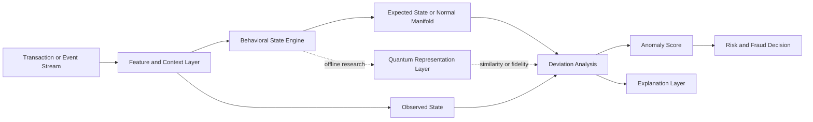

 # Sentinel

### Behavioral Anomaly Intelligence for Dynamic Systems

**Sentinel** is a behavioral anomaly intelligence platform designed to learn how complex systems normally behave, identify meaningful deviations, and produce explainable risk signals.

The first application domain is online payment fraud detection. The long-term objective is to develop a reusable intelligence layer that can be applied to other dynamic systems, including cybersecurity, anti-money laundering, data-center monitoring, aerospace telemetry, smart-grid operations, and quantum-system monitoring.

> **Project status:** Early research and pre-implementation foundation.

The repository currently establishes the problem framing, research direction, evaluation principles, and initial dataset context. Production pipelines, public APIs, deployed quantum circuits, and operational decision systems are not yet implemented.

## Vision

Most fraud-detection systems frame the problem as a direct classification task:

```text
Transaction -> Fraud or Non-Fraud
```

Sentinel takes a broader approach:

```text
System Events
    -> Behavioral Context
    -> State Representation
    -> Expected Behavior
    -> Observed vs. Expected Deviation
    -> Anomaly and Risk Intelligence
```

The central principle is:

> **Learn the normal world first; detect deviations from it second.**

This distinction matters because anomalous behavior is not always fraud, while new fraud patterns may not resemble previously labeled fraud examples. Sentinel therefore separates anomaly detection from the final risk or fraud decision.

## Initial Use Case: Online Payment Fraud

The initial vertical is card-not-present and digital-payment fraud. This domain provides a demanding and measurable environment for validating the platform because it combines:

- severe class imbalance;
- evolving fraud strategies;
- temporal behavior changes;
- relationships among customers, merchants, devices, locations, and transactions;
- a high cost of false positives and false negatives;
- strict latency and explainability requirements.

The first version is intended to support research and controlled evaluation rather than direct production authorization of live payments.

### Initial objectives

1. Build a reliable classical behavioral and anomaly-detection baseline.
2. Measure whether quantum-enhanced representations provide value under realistic constraints.
3. Detect deviations from normal transaction behavior, not only previously observed fraud labels.
4. Produce fraud-risk signals that can be inspected and explained.
5. Establish a reusable architecture that can later support additional domains.

## Conceptual Architecture



### Core layers

| Layer | Responsibility | Example outputs |
|---|---|---|
| Event and data layer | Ingest and validate transactions or system events | Clean event records |
| Context layer | Construct temporal, entity, graph, and behavioral features | Velocity, device history, merchant context |
| Behavioral State Engine | Represent normal behavior and its evolution | Current state, expected next state, behavior trajectory |
| Deviation layer | Compare observed behavior with expected or normal behavior | Residual, drift, distance, similarity |
| Anomaly layer | Convert deviations into interpretable anomaly signals | Anomaly score, contributing factors |
| Decision layer | Combine anomaly signals with supervised risk evidence | Fraud probability, risk tier, decision |
| Explanation layer | Make the signal auditable | Reasons, feature attribution, state comparison |
| Quantum research layer | Explore quantum representations and similarity measures | Quantum kernel, fidelity, latent representation |

## The Role of Quantum Computing

Quantum computing is treated as an enhancement layer, not as a requirement for every stage of the system.

Potential research directions include:

- quantum feature maps and quantum kernels;
- fidelity-based similarity between behavioral representations;
- quantum autoencoders for learning a normal manifold;
- hybrid classical-quantum anomaly scoring;
- noisy-simulation and hardware-aware evaluation.

The intended near-term architecture keeps latency-sensitive decisions classical. Quantum circuits are primarily evaluated offline or in batch workflows until their practical cost, reliability, and value are demonstrated.

The project does not assume quantum advantage. Any claim of improvement must be supported by controlled comparison against strong classical baselines, including equal feature budgets, leakage-safe splits, appropriate imbalance handling, and reproducible evaluation.

The acronym **QAE** may refer to two different concepts in related research:

- **Quantum Autoencoder**, a model for quantum compression and fidelity-based anomaly detection;
- **Quantum Anomaly Engine**, the broader platform-level anomaly component.

Sentinel uses the full term whenever this distinction is important.

## Current Dataset Context

The repository currently includes an anonymized European credit-card fraud dataset with:

- 284,807 transactions;
- 492 fraud cases;
- an approximate fraud rate of 0.1727%;
- 28 anonymized PCA features;
- transaction time and amount fields;
- a binary class label.

This dataset is suitable for an initial benchmark of:

- classical anomaly detection;
- one-class learning;
- quantum-kernel experiments;
- quantum-autoencoder research;
- imbalanced classification metrics.

It does not contain rich customer, merchant, device, or identity histories. Consequently, it is not sufficient by itself to validate the full behavioral-trajectory vision of Sentinel. Future research may require datasets with richer entity relationships and temporal context.

## Evaluation Principles

Because fraud is highly imbalanced, accuracy must not be treated as the primary success criterion.

The initial evaluation should prioritize:

- **AUPRC** as the primary ranking metric;
- ROC-AUC as a secondary metric;
- precision and recall at operating thresholds;
- F1 score and confusion matrices;
- false-positive rate and false-decline implications;
- calibration of predicted risk;
- robustness to class prevalence and temporal drift;
- inference latency and resource requirements;
- explainability of individual anomaly decisions.

Every quantum experiment should be compared with a clearly defined classical counterpart. Evaluation must also document:

- train, validation, and test methodology;
- temporal leakage prevention;
- preprocessing and feature-selection decisions;
- class-imbalance handling;
- random seeds and simulator settings;
- qubit count, circuit depth, parameter count, and noise model;
- whether the quantum component is simulated, hardware-executed, or hybrid.

## Roadmap

### Phase 0 — Research Contract

- Define the canonical data schema.
- Define anomaly, risk, and fraud labels separately.
- Establish leakage-safe temporal splits.
- Document the baseline and evaluation protocol.

### Phase 1 — Classical Behavioral Baseline

- Implement a reproducible data pipeline.
- Build temporal and behavioral features.
- Establish classical supervised and unsupervised baselines.
- Add anomaly scores and basic explanations.

### Phase 2 — Hybrid Anomaly Layer

- Evaluate quantum kernels and one-class methods.
- Evaluate quantum-autoencoder and fidelity-based approaches.
- Compare quantum representations with classical dimensionality reduction.
- Measure performance under noise and constrained feature budgets.

### Phase 3 — Behavioral State Intelligence

- Model customer, merchant, device, and transaction state evolution.
- Compare expected and observed behavioral trajectories.
- Combine temporal drift with geometric or fidelity-based anomaly signals.
- Expose a stable anomaly-intelligence contract.

### Phase 4 — Sentinel Platform

- Package the anomaly layer as a reusable service or SDK.
- Add domain adapters for new event streams.
- Support investigation workflows and auditability.
- Evaluate transfer to cybersecurity, AML, infrastructure, and aerospace telemetry.

## Non-Goals

Sentinel is not currently intended to:

- replace an entire bank fraud platform;
- authorize or decline live payments without independent validation;
- claim quantum advantage without reproducible evidence;
- put a noisy QPU directly in a latency-critical payment path;
- solve the full AML problem in the first release;
- support every target domain before the initial fraud workflow is proven.

## Repository Structure

The intended minimal project surface, after temporary research-context materials are removed, is:

```text
sentinel/
├── README.md
└── datasets/
    └── creditcard.csv
```

As implementation begins, the structure is expected to evolve toward explicit separation between data processing, behavioral modeling, anomaly detection, quantum experiments, evaluation, and deployment interfaces.

## Design Principles

1. **Normality before classification** — model the system’s normal behavior before making a fraud decision.
2. **Anomaly is not fraud** — preserve the distinction between detection, investigation, and final decision.
3. **Classical-first engineering** — establish a strong, useful baseline before adding quantum components.
4. **Quantum where it is meaningful** — use quantum methods for representation, similarity, and geometry when experiments justify them.
5. **Explainability by design** — every operational signal should have inspectable evidence.
6. **Leakage-safe evaluation** — temporal and entity relationships must not contaminate held-out results.
7. **Reusable abstractions** — separate the domain adapter from the behavioral intelligence engine.
8. **Evidence over hype** — performance, cost, noise, and limitations must be reported together.

## Responsible Use

Fraud and anomaly scores can affect legitimate users, businesses, and access to financial services. Sentinel research must therefore account for:

- false positives and customer friction;
- threshold selection and human review;
- data privacy and access control;
- dataset bias and representativeness;
- model drift and adversarial adaptation;
- auditability of automated decisions.

The system should be treated as decision support until its reliability, governance, and deployment safety have been independently validated.

## Long-Term Direction

The long-term ambition is to make Sentinel a general behavioral intelligence layer for complex systems:

> **Observe the system, learn its normal state, understand its evolution, detect meaningful deviations, and explain why they matter.**

Sentinel is the foundation for testing that idea in a concrete and measurable financial setting.

# sentinel
