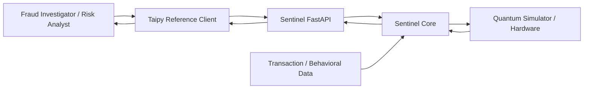
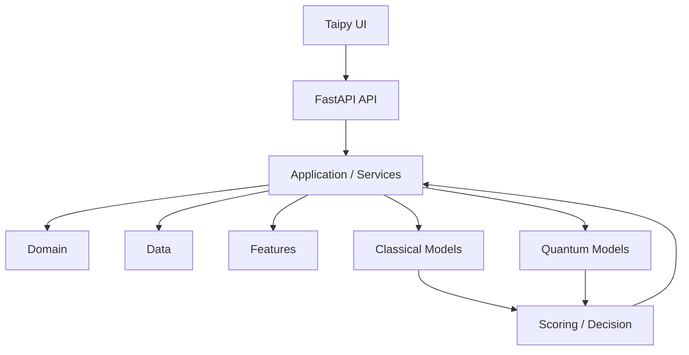
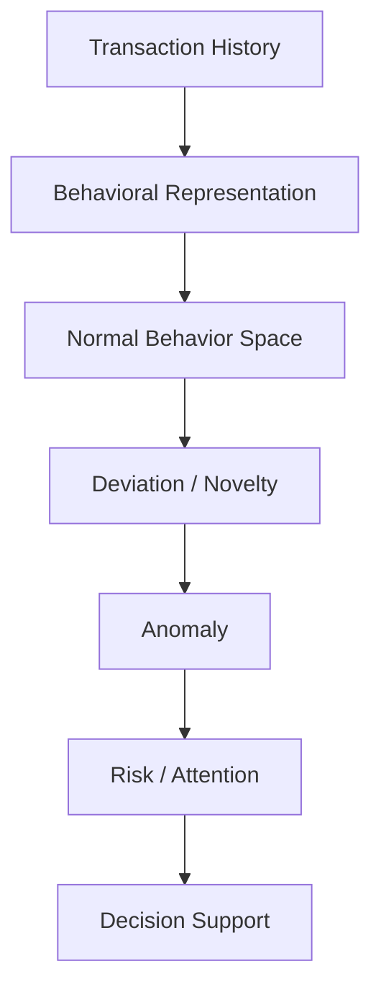
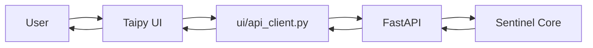
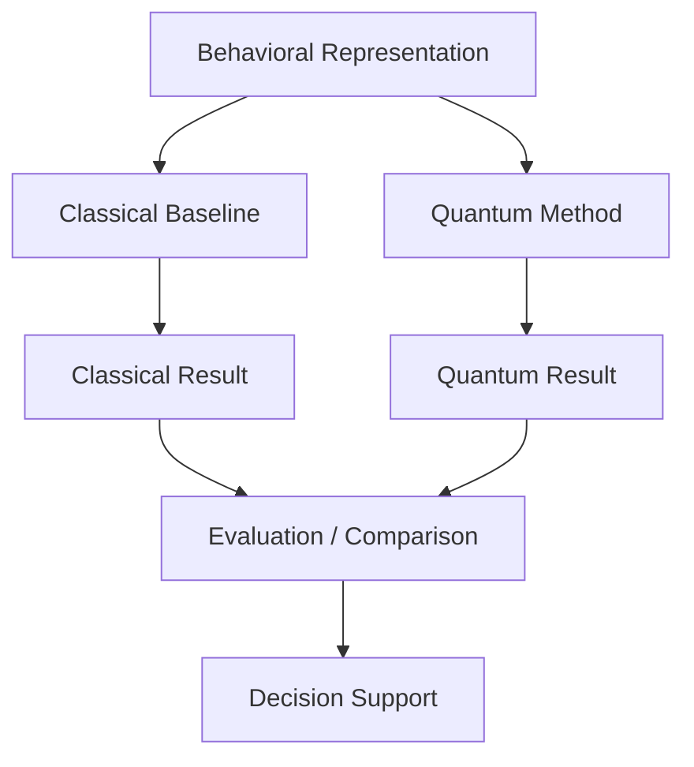
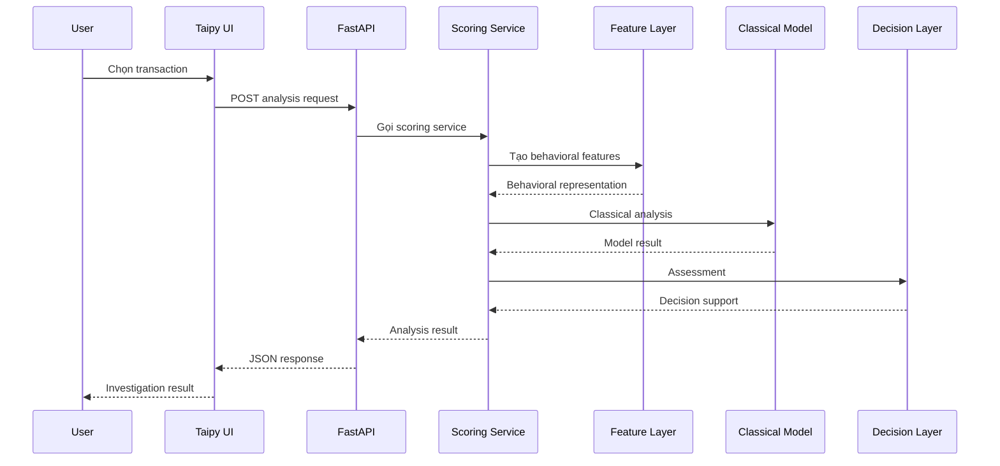
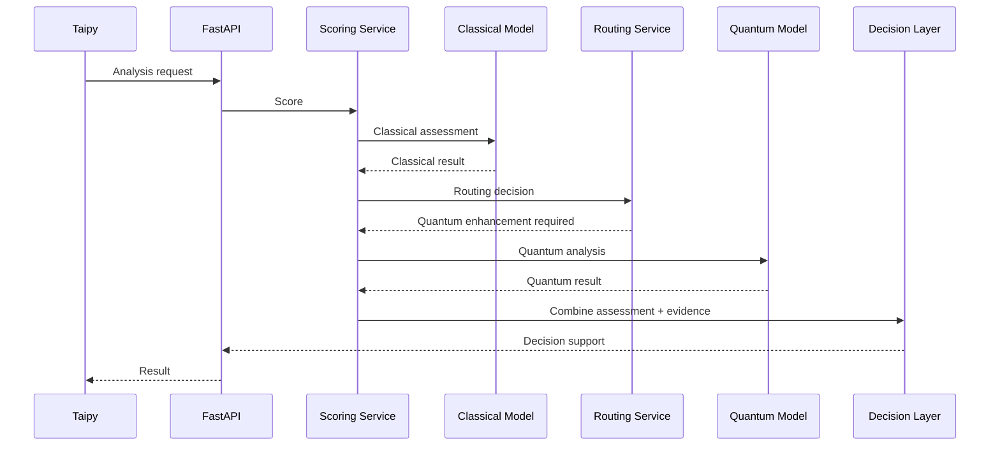
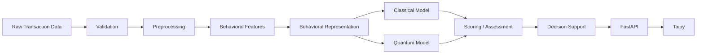
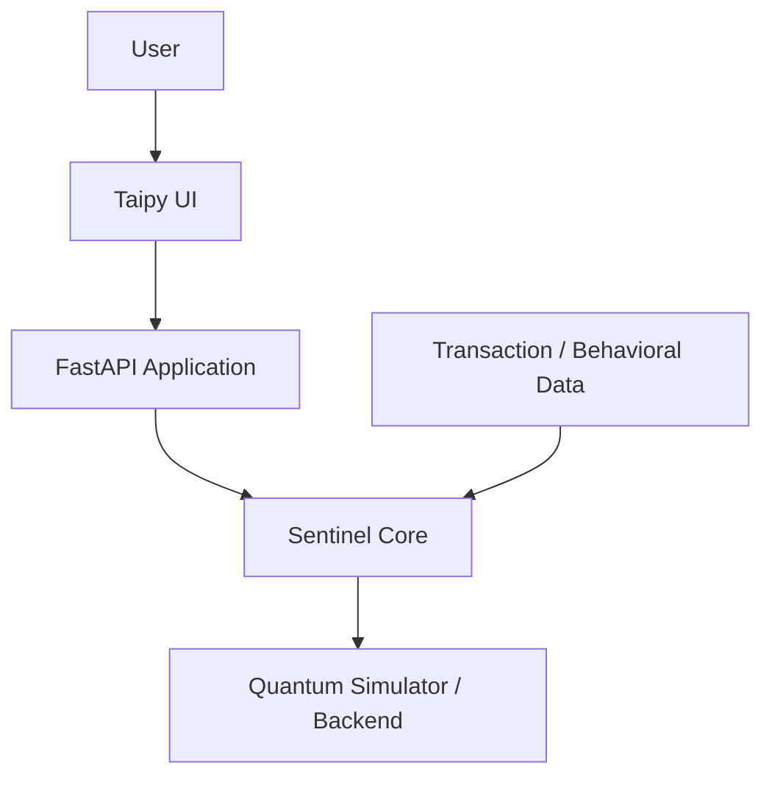

# Sentinel — Architecture Document

> **Phiên bản:** V1.0  
> **Trạng thái:** Draft chính thức cho giai đoạn phát triển V1  
> **Dự án:** Quantstellar Sentinel  
> **Kiến trúc:** Modular Monolith, API-first  
> **Nguyên tắc:** Classical First → Quantum Where Justified → Fair Benchmark → Measure Real Value → Decision Intelligence

---

## 1. Mục đích và phạm vi

`ARCHITECTURE.md` mô tả cấu trúc hệ thống Sentinel, các architectural boundaries, luồng dữ liệu, quan hệ giữa UI/API/Core, và cách Classical/Quantum computation được tổ chức.

Tài liệu này trả lời:

> **Sentinel được cấu trúc như thế nào, các thành phần tương tác ra sao và ranh giới trách nhiệm nằm ở đâu?**

Tài liệu không thay thế:

- `PRD.md` — Product requirements.
- `DESIGN.md` — User experience và interaction.
- `SCHEMA.md` — Data contracts.
- `TECH_STACK.md` — Công nghệ cụ thể.
- `RULES.md` — Engineering constraints và project rules.

---

## 2. Architectural Philosophy

Sentinel được xây dựng như một **Behavioral Intelligence application**, không phải một Quantum application có UI bao quanh.

Kiến trúc phải bảo vệ bốn nguyên tắc:

```text
Product Intelligence
        ↓
Application Services
        ↓
Classical / Quantum Computation
        ↓
Decision Support
```

Quantum là computational enhancement layer, không phải architectural center.

### 2.1. Modular Monolith

V1 sử dụng **Modular Monolith**:

```text
Một repository
+
Một application boundary
+
Các module có responsibility rõ ràng
+
Một FastAPI product interface
+
Một Taipy reference client
```

Không tách microservices chỉ vì các module có thể được gọi là “service”.

### 2.2. API-first

FastAPI là integration boundary giữa Sentinel Core và clients.

```text
Taipy
   ↓ HTTP
FastAPI
   ↓
Application Services
   ↓
Sentinel Core
```

Điều này cho phép cùng một core được sử dụng bởi:

- Taipy.
- CLI.
- Notebook.
- External application.
- Financial system tích hợp về sau.

### 2.3. Research ≠ Production

Research nằm ngoài production core.

```text
research/
    ↓
Hypothesis
    ↓
Experiment
    ↓
Benchmark
    ↓
Validation
    ↓
Production implementation
    ↓
src/sentinel/
```

Notebook không được xem là production architecture.

---

## 3. System Context

Sentinel nằm giữa người dùng điều tra, external clients, dữ liệu tài chính và computational backends.



### 3.1. Context interpretation

- Người dùng tương tác với Sentinel thông qua client.
- Taipy là reference client V1.
- FastAPI là product-facing interface.
- Sentinel Core chứa application/domain/data/model logic.
- Transaction và behavioral data đi vào Data layer.
- Quantum backend chỉ được sử dụng khi một computation path yêu cầu.
- Quantum backend không phải system-of-record.
- UI không trực tiếp gọi Quantum hoặc Classical model.

---

## 4. High-Level Architecture



Đây là conceptual architecture. Chi tiết class/interface, request/response schema và implementation contract thuộc các tài liệu/code tương ứng.

---

## 5. Repository Architecture

Cấu trúc repository V1:

```text
sentinel/
│
├── src/
│   └── sentinel/
│       ├── domain/
│       ├── data/
│       ├── features/
│       ├── models/
│       │   ├── classical/
│       │   └── quantum/
│       ├── services/
│       ├── api/
│       │   ├── routes/
│       │   └── schemas/
│       ├── config/
│       └── utils/
│
├── ui/
│   ├── app.py
│   ├── pages/
│   ├── components/
│   ├── api_client.py
│   ├── state/
│   └── assets/
│
├── research/
│   ├── notebooks/
│   └── experiments/
│
├── data/
│   ├── raw/
│   ├── processed/
│   ├── features/
│   └── predictions/
│
├── tests/
│   ├── unit/
│   ├── integration/
│   └── evaluation/
│
├── configs/
├── scripts/
├── docs/
├── deploy/
│
├── pyproject.toml
├── Makefile
└── README.md
```

Repository structure là organizational boundary. Không phải mọi folder đều là runtime layer.

---

## 6. Core Architecture

Production core nằm tại:

```text
src/sentinel/
```

Core được tổ chức thành các module theo responsibility.

### 6.1. Domain

Path:

```text
src/sentinel/domain/
```

Domain biểu diễn các khái niệm nghiệp vụ cốt lõi của Sentinel.

Ví dụ conceptual concepts:

```text
Transaction
Behavior
Anomaly
Risk
Decision
```

Domain không phụ thuộc vào:

- Taipy.
- HTTP.
- FastAPI route.
- UI.
- Quantum backend implementation.

Domain phải giữ semantic của Sentinel độc lập với computational implementation.

---

## 7. Data Layer

Path:

```text
src/sentinel/data/
```

Data layer chịu trách nhiệm đưa dữ liệu từ source/storage vào dạng phù hợp với application.

Conceptual flow:

```text
Raw / External Data
        ↓
Loading
        ↓
Validation
        ↓
Preprocessing
        ↓
Application-compatible Data
```

Data layer không chứa fraud decision logic.

Repository data lifecycle:

```text
data/
├── raw/
├── processed/
├── features/
└── predictions/
```

Ý nghĩa:

- `raw/` — dữ liệu đầu vào chưa xử lý.
- `processed/` — dữ liệu sau preprocessing.
- `features/` — behavioral/derived features.
- `predictions/` — model outputs/prediction artifacts.

Dữ liệu nhạy cảm hoặc dataset lớn không được mặc định commit vào Git.

---

## 8. Feature Layer

Path:

```text
src/sentinel/features/
```

Feature layer chuyển transaction/context thành representation mà model có thể sử dụng.

Conceptual flow:

```text
Transaction
    ↓
Historical Context
    ↓
Feature Engineering
    ↓
Behavioral Representation
    ↓
Model Input
```

Feature layer có thể bao gồm:

- Transaction-level features.
- Behavioral features.
- Temporal features khi dữ liệu hỗ trợ.
- Normalization/transformation phù hợp.

Feature engineering không thuộc UI và không nằm trong FastAPI route.

---

## 9. Model Architecture

Path:

```text
src/sentinel/models/
├── classical/
└── quantum/
```

Classical và Quantum được tổ chức dưới cùng một model boundary để có thể benchmark công bằng.

```text
                Model Interface
                     │
          ┌──────────┴──────────┐
          ↓                     ↓
    Classical Models      Quantum Models
          │                     │
          └──────────┬──────────┘
                     ↓
                  Result
```

### 9.1. Classical Models

Path:

```text
src/sentinel/models/classical/
```

Classical baseline core V1 (theo `SENTINEL_THESIS.md`):

- Logistic Regression — linear supervised reference point.
- LightGBM — strong classical supervised baseline (ưu tiên hơn XGBoost; không đưa cả hai vào core).
- Classical OCSVM — classical counterpart trực tiếp cho Quantum Kernel OCSVM.

XGBoost và Isolation Forest không nằm trong classical baseline core V1. Một classical kernel method (ví dụ RBF Kernel + OCSVM) có thể được dùng làm classical counterpart cho quantum kernel khi evaluation yêu cầu.

Classical baseline phải có thể chạy độc lập với Quantum.

### 9.2. Quantum Models

Path:

```text
src/sentinel/models/quantum/
```

V1 ưu tiên nghiên cứu/triển khai:

```text
Quantum Kernel
        ↓
OCSVM
```

Quantum methods khác chỉ được thêm khi có hypothesis và research justification.

Quantum module chịu trách nhiệm computational method; nó không định nghĩa financial/business semantics.

---

## 10. Behavioral Intelligence Pipeline

Đây là pipeline nghiệp vụ trung tâm của Sentinel:



Một implementation cụ thể có thể bổ sung preprocessing, feature engineering và model inference giữa các bước.

Điểm quan trọng là **behavioral representation nằm giữa raw transaction data và anomaly assessment**.

---

## 11. Application / Services Layer

Path:

```text
src/sentinel/services/
```

Services là nơi application orchestration và business/application logic được thực hiện.

Ví dụ conceptual services:

```text
scoring
routing
explanation
analysis
```

### 11.1. Scoring

Conceptual flow:

```text
Transaction
    ↓
Feature Engineering
    ↓
Classical Assessment
    ↓
Quantum Enhancement nếu cần
    ↓
Unified Assessment
    ↓
Decision Support
```

### 11.2. Routing

Routing quyết định computation path dựa trên policy đã được định nghĩa và benchmark.

Conceptually:

```text
Input
  ↓
Classical Analysis
  ↓
Routing Policy
  ├── Standard case → Classical result
  └── Selected case → Quantum enhancement
```

Routing không được mặc định có nghĩa:

> “Quantum cho case khó sẽ luôn tốt hơn.”

Routing strategy phải được chứng minh bằng evaluation.

### 11.3. Explanation

Explanation service chuyển model/data signals thành evidence có thể trình bày cho user.

UI chỉ trình bày evidence được backend cung cấp; UI không tự suy diễn model explanation.

---

## 12. API Architecture

Path:

```text
src/sentinel/api/
├── routes/
└── schemas/
```

FastAPI là interface layer.

Request flow:

```text
HTTP Request
     ↓
API Route
     ↓
Validation / Schema
     ↓
Application Service
     ↓
Core
     ↓
Result
     ↓
Response Schema
     ↓
HTTP Response
```

### 12.1. API route responsibility

Route chỉ nên:

- Nhận request.
- Validate input.
- Gọi application service.
- Chuyển result thành response.

Route không nên chứa:

- Feature engineering.
- Model inference logic.
- Quantum circuit logic.
- Routing policy.
- Fraud decision logic.

### 12.2. API schemas

`api/schemas/` định nghĩa contract giữa external client và application.

Schema chi tiết được quản lý trong `SCHEMA.md` và implementation tương ứng.

---

## 13. UI Architecture

UI nằm tại:

```text
ui/
```

Taipy là reference presentation layer V1.



### 13.1. UI boundary

UI không được trực tiếp gọi:

```text
Qiskit
LightGBM
scikit-learn
Feature Engineering
Sentinel services
```

Thay vào đó:

```text
Taipy
   ↓
api_client.py
   ↓ HTTP/JSON
FastAPI
   ↓
Sentinel Core
```

### 13.2. Reference client principle

Taipy là client, không phải core.

Nếu sau này thay Taipy bằng:

```text
React
Next.js
Mobile
External Financial System
```

Sentinel Core và API contract về nguyên tắc vẫn có thể được giữ nguyên.

---

## 14. Research Architecture

Research nằm tại:

```text
research/
├── notebooks/
└── experiments/
```

Research có thể chứa:

- Exploratory analysis.
- Feature experiments.
- Classical baselines.
- Quantum Kernel experiments.
- Feature-map experiments.
- Qubit/depth experiments.
- Noise experiments.
- Benchmarking.
- Prototype Quantum Autoencoder/QAE hoặc phương pháp tương lai.

Research code được phép exploratory.

Production code thì không.

Promotion path:

```text
Research Experiment
        ↓
Validation
        ↓
Benchmark
        ↓
Stable Method
        ↓
Production Implementation
```

Một experiment không tự động trở thành production feature.

---

## 15. Classical–Quantum Boundary

Sentinel không xây hai hệ thống độc lập.

Thay vào đó:



### 15.1. Classical independence

Nếu Quantum unavailable:

```text
Quantum unavailable
        ↓
Classical analysis
        ↓
Sentinel remains functional
```

Classical intelligence không được phụ thuộc vào Quantum availability.

### 15.2. Quantum enhancement

Quantum có thể được sử dụng như enhancement layer khi computation path yêu cầu.

Quantum không định nghĩa:

- Fraud semantics.
- Risk semantics.
- Decision semantics.

Nó cung cấp computational result cho application layer.

---

## 16. Decision / Scoring Boundary

Model output không phải trực tiếp là product decision.

```text
Model Output
    ↓
Assessment
    ↓
Evidence
    ↓
Decision Policy
    ↓
Decision Support
```

Sentinel có thể cung cấp:

- Anomaly signal.
- Risk/attention level.
- Supporting evidence.
- Model metadata.
- Decision-support information.

UI không tự biến một raw score thành fraud verdict nếu backend không định nghĩa semantics tương ứng.

---

## 17. End-to-End Runtime Flow

### 17.1. Standard analysis



### 17.2. Quantum-enhanced analysis



Quantum path chỉ được chạy khi routing policy thực sự yêu cầu.

---

## 18. Data Flow

Luồng dữ liệu conceptual:



Data Flow Diagram tập trung vào **data transformation**, trong khi Architecture Diagram tập trung vào **component boundaries**.

---

## 19. Testing và Evaluation Architecture

Tests được chia thành:

```text
tests/
├── unit/
├── integration/
└── evaluation/
```

### 19.1. Unit

Kiểm tra:

- Feature calculations.
- Domain logic.
- Score calculations.
- Routing.
- Quantum helper logic.
- Utility behavior.

### 19.2. Integration

Kiểm tra:

```text
API
 ↓
Service
 ↓
Feature
 ↓
Model
```

và các integration boundary liên quan.

### 19.3. Evaluation

Evaluation kiểm tra:

```text
Classical vs Quantum
```

theo cùng evaluation framework phù hợp.

Có thể bao gồm:

- Precision.
- Recall.
- F1.
- PR-AUC/Average Precision.
- FPR/FNR.
- Latency.
- Resource usage.
- Qubit count.
- Circuit depth.
- Shots.
- Noise robustness.
- End-to-end computational cost.

Evaluation là một phần architectural concern quan trọng vì Quantum contribution phải được kiểm chứng chứ không chỉ tích hợp.

---

## 20. Configuration Boundary

Configuration nằm tại:

```text
configs/
```

Configuration có thể quản lý:

- Model parameters.
- Feature parameters.
- Routing thresholds.
- Benchmark settings.
- Experiment settings.
- Runtime settings.

Configuration không chứa business logic.

Secrets không nằm trong source code hoặc committed configuration.

---

## 21. Observability Boundary

V1 chỉ cần observability phục vụ debugging, evaluation và operation.

Có thể theo dõi:

- API errors.
- Request latency.
- Model execution duration.
- Quantum execution duration.
- Routing statistics.
- Benchmark metadata.
- Experiment/model version.

Không cần xây distributed observability platform khi Sentinel chưa có distributed architecture.

---

## 22. Security Boundary

Security responsibility được phân lớp:

```text
Client
  ↓
API Boundary
  ↓
Application
  ↓
Core
```

Secrets phải nằm ngoài source code:

```text
Environment / External Secret Management
```

Không đặt secret trong:

```text
source code
configs/default.*
notebooks
```

Financial data access policy phải được xác định theo deployment context.

V1 ưu tiên:

- Không commit dữ liệu tài chính nhạy cảm.
- Không hard-code credentials.
- Giới hạn data access theo nhu cầu.
- Tách data artifacts khỏi source code.

---

## 23. Deployment Architecture — V1

V1 ưu tiên deployment đơn giản:



Các thành phần có thể chạy trong cùng application/deployment boundary khi phù hợp.

Không mặc định yêu cầu:

- Kubernetes.
- Service mesh.
- Kafka.
- Distributed workers.
- Complex cloud architecture.

Nếu Quantum hardware/cloud execution trở thành workload thực tế, deployment có thể tiến hóa mà không thay đổi core conceptual boundary.

---

## 24. Runtime Separation

Logical runtime:

```text
UI Runtime
    │
    │ HTTP
    ▼
API Runtime
    │
    ▼
Sentinel Core
```

Trong V1, các thành phần Core có thể chạy cùng process/application boundary khi phù hợp.

Điều này không làm mất modularity.

> **Module boundary và process boundary là hai khái niệm khác nhau.**

Một module chỉ nên được tách thành process/service riêng khi workload hoặc product requirement thực sự yêu cầu.

---

## 25. Scalability Strategy

Sentinel không scale infrastructure trước khi có evidence về bottleneck.

Evolution path:

```text
Modular Monolith
        ↓
Measure
        ↓
Identify Bottleneck
        ↓
Optimize
        ↓
Scale Specific Component
```

Ví dụ potential future bottleneck:

```text
Quantum Job Execution
```

Nếu quantum execution trở thành long-running workload thực tế, có thể chuyển sang job-based execution:

```text
POST /quantum/jobs
        ↓
job_id
        ↓
Quantum execution
        ↓
GET /quantum/jobs/{job_id}
```

Nhưng đây là **future architecture option**, không phải V1 requirement.

---

## 26. Architectural Decisions

### ADR-01 — Modular Monolith

**Quyết định:** Sentinel V1 sử dụng Modular Monolith.

**Lý do:** Giữ development/research velocity cao, giảm infrastructure complexity và vẫn duy trì module boundaries rõ ràng.

### ADR-02 — FastAPI as Product API

**Quyết định:** FastAPI là integration boundary của Sentinel.

**Lý do:** Giữ UI độc lập với Core và tạo API contract rõ ràng cho các clients khác.

### ADR-03 — Taipy as Reference Client

**Quyết định:** Taipy là reference UI client V1.

**Lý do:** Phù hợp với Python-centric research/product prototype và cho phép xây investigation interface nhanh mà không đưa UI logic vào Core.

### ADR-04 — Research Outside Core

**Quyết định:** Research notebooks và experiments nằm ngoài `src/sentinel/`.

**Lý do:** Bảo vệ production core khỏi exploratory code và duy trì reproducibility/maintainability.

### ADR-05 — Quantum Inside Core Boundary

**Quyết định:** Quantum là module computation trong Sentinel Core, không phải microservice riêng ở V1.

**Lý do:** Chưa có workload justification cho quantum service độc lập; giữ computation, model evaluation và application orchestration gần nhau.

### ADR-06 — Classical Independent from Quantum

**Quyết định:** Classical pipeline phải hoạt động độc lập với Quantum.

**Lý do:** Classical là baseline bắt buộc và Sentinel phải còn functional khi Quantum unavailable.

### ADR-07 — UI Through API

**Quyết định:** Taipy chỉ giao tiếp với Sentinel Core thông qua API.

**Lý do:** Bảo vệ separation of concerns và cho phép thay thế client trong tương lai.

### ADR-08 — No Premature Infrastructure

**Quyết định:** Không thêm microservices, Kubernetes, Kafka, Airflow/Prefect hoặc distributed infrastructure vào V1 nếu chưa có requirement.

**Lý do:** Tránh over-engineering và giữ architecture aligned với actual workload.

---

## 27. Architectural Non-goals

V1 không hướng tới:

- Microservices architecture.
- Kubernetes-first deployment.
- Distributed service mesh.
- Real-time high-frequency fraud infrastructure.
- Enterprise IAM/RBAC architecture.
- Complex event-driven infrastructure.
- Quantum-only architecture.
- Frontend chứa model/business logic.
- Tách Classical và Quantum thành microservices chỉ vì khác technology.
- Infrastructure abstraction chỉ để “trông enterprise”.

---

## 28. Architecture Invariants

Các nguyên tắc sau được xem là architectural invariants của Sentinel V1:

```text
1. UI không chứa core business/model logic.

2. Taipy giao tiếp với Core thông qua FastAPI.

3. FastAPI route không chứa computation logic.

4. Application services orchestrate; models compute.

5. Classical baseline tồn tại độc lập với Quantum.

6. Quantum không định nghĩa financial/business semantics.

7. Research không trực tiếp trở thành production code.

8. Data layer không chứa decision logic.

9. Configuration không chứa business logic.

10. Deployment complexity chỉ tăng khi workload yêu cầu.
```

Nếu một thay đổi kiến trúc phá vỡ invariant, thay đổi đó phải được xem xét như một architectural decision thay vì refactor nhỏ.

---

## 29. Ranh giới với các tài liệu khác

| Câu hỏi | Tài liệu |
|---|---|
| Sentinel xây gì và tại sao? | `PRD.md` |
| Người dùng trải nghiệm thế nào? | `DESIGN.md` |
| System được cấu trúc ra sao? | `ARCHITECTURE.md` |
| Data entities/schema là gì? | `SCHEMA.md` |
| Các rules/constraints là gì? | `RULES.md` |
| Công nghệ nào được sử dụng? | `TECH_STACK.md` |
| Team là ai? | `TEAM.md` |
| Ai ownership phần nào? | `ROLES.md` |
| Team làm việc thế nào? | `WORKFLOW.md` |

Architecture document xác định **structure và boundaries**, không thay thế implementation code.

---

## 30. Architecture Summary

Sentinel V1 là một **API-first modular monolith**:

```text
                         SENTINEL
                            │
             ┌──────────────┴──────────────┐
             │                             │
          Product                       Research
             │                             │
        FastAPI + UI                Notebooks / Experiments
             │
             ▼
      Sentinel Application
             │
      ┌──────┴──────┐
      ▼             ▼
    Domain        Services
      │             │
      ├──────┬──────┤
      ▼      ▼      ▼
    Data  Features Models
                    │
             ┌──────┴──────┐
             ▼             ▼
        Classical       Quantum
             │             │
             └──────┬──────┘
                    ▼
             Scoring / Decision
                    │
                    ▼
              FastAPI Response
                    │
                    ▼
                  Taipy
```

Kiến trúc này phản ánh đúng thesis của Sentinel:

> **Sentinel là Behavioral Intelligence system; Quantum là computational enhancement layer.**

Mục tiêu của architecture không phải tạo ra một hệ thống “enterprise-looking”, mà tạo ra một boundary đủ sạch để:

```text
Research
   ↓
Validated Intelligence
   ↓
Production Core
   ↓
API
   ↓
Investigation UI
   ↓
Financial Integration
```

có thể phát triển dần mà không phải xây lại toàn bộ hệ thống.
