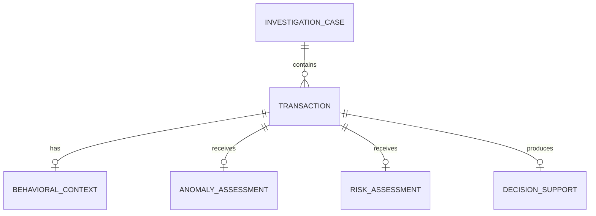

# Sentinel — Schema Document

> **Phiên bản:** V1.0  
> **Trạng thái:** Draft chính thức cho giai đoạn phát triển V1  
> **Dự án:** Quantstellar Sentinel  
> **Vai trò tài liệu:** Định nghĩa data contracts, domain entities, model outputs và decision-support structures của Sentinel.

---

## 1. Mục đích và phạm vi

`SCHEMA.md` định nghĩa cách dữ liệu được tổ chức và truyền qua các lớp chính của Sentinel.

Tài liệu tập trung vào:

- Domain entities.
- Input data.
- Processed data.
- Behavioral features.
- Model inputs.
- Model outputs.
- Anomaly/risk assessment.
- Decision-support results.
- Investigation/case information.
- Data lifecycle.
- Validation và compatibility rules.

Tài liệu này trả lời:

> **Sentinel nhận dữ liệu gì, biến đổi dữ liệu đó thành gì, và các kết quả được biểu diễn như thế nào?**

`SCHEMA.md` không định nghĩa implementation cụ thể của database, ORM hoặc Python classes. Physical persistence schema chỉ được xác định khi Sentinel thực sự có requirement cho persistence layer.

---

## 2. Schema Philosophy

### 2.1. Data contract trước implementation

Schema là contract giữa các thành phần.

```text
Input
  ↓
Validation
  ↓
Processing
  ↓
Feature Representation
  ↓
Model
  ↓
Assessment
  ↓
Decision Support
```

Implementation có thể thay đổi nhưng semantic của contract phải được bảo vệ.

### 2.2. Tách các loại dữ liệu

Sentinel không gộp toàn bộ thông tin vào một object duy nhất.

```text
Raw Data
    ↓
Processed Data
    ↓
Behavioral Features
    ↓
Model Input
    ↓
Model Output
    ↓
Assessment
    ↓
Decision Support
```

Ví dụ:

- `amount` có thể là transaction attribute.
- `amount_deviation` là behavioral feature.
- `anomaly_score` là model/assessment output.
- `risk_level` là application-level assessment.
- `decision_state` là decision-support information.

### 2.3. Raw data và derived data

Raw input phải được phân biệt với dữ liệu do Sentinel suy ra.

```text
Raw / Source Attribute
        ≠
Derived Feature
        ≠
Model Output
        ≠
Decision
```

Điều này giúp truy xuất nguồn gốc của kết quả và tránh nhầm lẫn semantic.

### 2.4. Quantum không thay đổi financial semantics

Quantum model có thể tạo ra một computational result nhưng không được tự định nghĩa các khái niệm:

- Fraud.
- Risk.
- Investigation decision.

Quantum output phải được đưa qua application/assessment layer để có semantic phù hợp.

---

## 3. Domain Entities

Các domain concepts chính của Sentinel V1:

```text
Transaction
    ↓
Behavioral Context
    ↓
Anomaly Assessment
    ↓
Risk Assessment
    ↓
Decision Support
    ↓
Investigation / Case
```

### 3.1. Transaction

Đại diện cho một giao dịch tài chính được Sentinel phân tích.

### 3.2. Behavioral Context

Đại diện cho context được xây dựng từ lịch sử giao dịch và behavioral features liên quan tới transaction.

### 3.3. Anomaly Assessment

Đại diện cho kết quả đánh giá mức độ bất thường của transaction/behavior.

### 3.4. Risk Assessment

Đại diện cho mức độ đáng chú ý/rủi ro được suy ra từ anomaly signals và các assessment phù hợp.

### 3.5. Decision Support

Đại diện cho thông tin hỗ trợ investigator hoặc downstream system đưa ra quyết định.

### 3.6. Investigation / Case

Đại diện cho context điều tra bao quanh một hoặc nhiều transaction khi product scope yêu cầu.

---

## 4. Transaction Schema

Transaction là input domain entity quan trọng nhất của Sentinel.

### 4.1. Conceptual structure

```text
Transaction
├── Identity
├── Temporal
├── Financial
├── Merchant / Context
├── Location
└── Device / Channel
```

Không phải mọi field đều bắt buộc trong mọi dataset. Field availability phụ thuộc vào source data.

### 4.2. Identity

Các thuộc tính định danh có thể bao gồm:

| Field | Kiểu khái niệm | Bắt buộc | Ý nghĩa |
|---|---|---:|---|
| `transaction_id` | string | Có | Định danh transaction |
| `customer_id` | string | Theo dataset | Định danh customer/account |
| `account_id` | string | Theo dataset | Định danh account |

`customer_id` và `account_id` không được coi là bắt buộc nếu source dataset không cung cấp.

### 4.3. Temporal

| Field | Kiểu khái niệm | Bắt buộc | Ý nghĩa |
|---|---|---:|---|
| `timestamp` | datetime | Có | Thời điểm transaction |
| `date` | date | Có thể suy ra | Ngày transaction |

Nếu `timestamp` tồn tại, các temporal features có thể được suy ra từ đó.

### 4.4. Financial

| Field | Kiểu khái niệm | Bắt buộc | Ý nghĩa |
|---|---|---:|---|
| `amount` | numeric | Có | Giá trị giao dịch |
| `currency` | string | Theo dataset | Đơn vị tiền tệ |

Không mặc định coi amount là fraud signal. Meaning của amount được xác định sau behavioral processing.

### 4.5. Merchant / Context

Có thể bao gồm:

| Field | Kiểu khái niệm | Bắt buộc | Ý nghĩa |
|---|---|---:|---|
| `merchant_id` | string | Theo dataset | Merchant identifier |
| `merchant_category` | string | Theo dataset | Nhóm merchant |
| `channel` | string | Theo dataset | Kênh giao dịch |

### 4.6. Location

Có thể bao gồm:

| Field | Kiểu khái niệm | Bắt buộc | Ý nghĩa |
|---|---|---:|---|
| `location` | structured value | Theo dataset | Context địa lý |
| `country` | string | Theo dataset | Quốc gia |
| `region` | string | Theo dataset | Vùng |

### 4.7. Device

Có thể bao gồm:

| Field | Kiểu khái niệm | Bắt buộc | Ý nghĩa |
|---|---|---:|---|
| `device_id` | string | Theo dataset | Device identifier |
| `device_type` | string | Theo dataset | Device category |

Các field trên là **schema candidates**, không phải cam kết rằng mọi dataset Sentinel đều phải có đầy đủ.

---

## 5. Behavioral Context Schema

Behavioral Context là lớp trung gian giữa transaction và model.

```text
Transaction
    +
Historical Context
    ↓
Behavioral Features
    ↓
Behavioral Representation
```

### 5.1. Behavioral Context

Conceptual structure:

```text
BehavioralContext
├── reference_window
├── baseline
├── features
├── temporal_context
└── representation_metadata
```

### 5.2. Reference Window

Reference window mô tả khoảng lịch sử được sử dụng để xây dựng behavioral baseline.

Ví dụ:

```text
reference_start
reference_end
```

Không mặc định một window cố định; window phải phụ thuộc vào research/modeling protocol.

### 5.3. Behavioral Baseline

Baseline đại diện cho normal behavior được sử dụng để đánh giá deviation.

Có thể bao gồm:

- Normal amount range.
- Transaction frequency.
- Merchant frequency.
- Geographic pattern.
- Temporal pattern.

Baseline cụ thể phải được xác định bởi feature/model pipeline.

### 5.4. Behavioral Features

Behavioral features là derived data.

Ví dụ conceptual:

| Feature | Ý nghĩa |
|---|---|
| `amount_deviation` | Độ lệch của amount so với behavioral baseline |
| `transaction_velocity` | Mức độ/tần suất transaction trong một window |
| `merchant_frequency` | Mức độ thường xuyên tương tác với merchant |
| `geographic_deviation` | Độ lệch địa lý |
| `temporal_deviation` | Độ lệch về thời điểm giao dịch |

Các feature trên là ví dụ định hướng. Feature set production phải được chốt theo dataset và feature engineering implementation.

### 5.5. Behavioral Representation

Representation là dữ liệu model-ready được tạo từ behavioral features.

Có thể là:

```text
Vector
Embedding
Kernel-ready representation
Other validated representation
```

Schema không giả định trước một representation duy nhất.

---

## 6. Model Input Schema

Model input phải được tách khỏi transaction schema.

```text
Transaction
    ↓
Features
    ↓
Model Input
```

### 6.1. Classical Model Input

Classical models nhận:

```text
ModelInput
├── feature_vector
├── feature_names
└── preprocessing_metadata
```

### 6.2. Quantum Model Input

Quantum model nhận một representation phù hợp với encoding/feature-map strategy.

Conceptual:

```text
QuantumModelInput
├── feature_vector / representation
├── feature_order
├── encoding_metadata
└── circuit_metadata
```

`encoding_metadata` có thể mô tả:

- Encoding strategy.
- Feature scaling.
- Feature-to-qubit mapping.
- Relevant circuit configuration.

Không đưa quantum-specific metadata vào raw transaction schema.

### 6.3. Input consistency

Classical và Quantum benchmark phải sử dụng input representation có thể so sánh công bằng theo evaluation protocol.

Không được tạo một Quantum input pipeline thuận lợi hơn rồi kết luận Quantum tốt hơn nếu Classical không được hưởng cùng điều kiện hợp lý.

---

## 7. Model Output Schema

Model output phải giữ information về phương pháp tạo ra kết quả.

### 7.1. Generic Model Result

```text
ModelResult
├── model_name
├── model_version
├── method
├── score
├── prediction / assessment
└── metadata
```

### 7.2. Classical Result

```text
ClassicalResult
├── model_name
├── model_version
├── score
├── assessment
└── metadata
```

Ví dụ model có thể là:

- Isolation Forest.
- One-Class SVM.
- Classical kernel method.
- XGBoost khi supervised formulation phù hợp.

### 7.3. Quantum Result

```text
QuantumResult
├── model_name
├── model_version
├── score
├── assessment
├── backend
└── resource_metadata
```

Có thể bao gồm:

- Quantum method.
- Backend/simulator.
- Qubit count.
- Circuit depth.
- Shots.
- Noise configuration.
- Runtime metadata.

Chỉ lưu các trường thực sự có thể đo/định nghĩa.

### 7.4. Quantum Kernel + OCSVM

Trong V1, Quantum path ưu tiên:

```text
Behavioral Representation
        ↓
Quantum Feature Map / Kernel
        ↓
Kernel Matrix / Similarity
        ↓
OCSVM
        ↓
Quantum Anomaly Result
```

Schema không nên gọi output đơn giản là `quantum_score` nếu semantic cụ thể là anomaly score.

Tên field phải phản ánh measurement thực tế.

---

## 8. Anomaly Assessment Schema

Anomaly Assessment chuyển model output thành assessment có semantic phù hợp với Sentinel.

Conceptual:

```text
AnomalyAssessment
├── score
├── level
├── method
├── evidence
└── context
```

### 8.1. Score

`score` là numerical output được định nghĩa bởi method.

Không mặc định mọi score nằm trong `[0, 1]`.

Range và direction phải được xác định bởi model contract.

### 8.2. Level

Nếu product có categorical attention level:

```text
NORMAL
LOW
MEDIUM
HIGH
```

thì mapping phải được định nghĩa bởi policy/model calibration phù hợp.

Không tự động suy ra level từ score nếu threshold chưa được xác định.

### 8.3. Evidence

Evidence có thể tham chiếu:

- Behavioral deviation.
- Transaction attributes.
- Model signal.
- Relevant historical context.

Evidence phải có nguồn truy xuất được.

---

## 9. Risk Assessment Schema

Risk Assessment là application-level interpretation.

```text
RiskAssessment
├── level
├── score (nếu có semantic phù hợp)
├── rationale
├── evidence
└── policy_version
```

### 9.1. Risk level

Risk level là semantic product/application, không nhất thiết bằng raw anomaly score.

Ví dụ:

```text
NORMAL
ATTENTION
HIGH_RISK
```

Taxonomy cuối cùng phải được thống nhất trong product/business rules.

### 9.2. Rationale

Rationale phải dựa trên:

```text
Model Output
+
Behavioral Evidence
+
Decision Policy
```

Không tạo rationale từ UI.

### 9.3. Policy Version

Nếu risk mapping dựa trên threshold/policy, cần có version để kết quả có thể tái lập.

---

## 10. Evidence Schema

Evidence là thành phần quan trọng để nối model result với investigation.

Conceptual:

```text
Evidence
├── type
├── source
├── feature
├── value
├── deviation
└── explanation
```

Ví dụ:

```text
type:
behavioral

source:
feature_pipeline

feature:
amount_deviation

value:
...

deviation:
...

explanation:
Transaction amount is unusual relative to the reference behavior.
```

Explanation phải phản ánh computation thực tế.

Không cho phép UI tự tạo explanation không có source.

---

## 11. Decision Support Schema

Decision Support không nhất thiết là automated final decision.

```text
DecisionSupport
├── attention_level
├── state
├── rationale
├── evidence
├── recommended_action (nếu có)
└── policy_version
```

### 11.1. Attention level

Ví dụ:

```text
NO_ATTENTION
REVIEW
URGENT_REVIEW
```

Taxonomy phải được định nghĩa trong `RULES.md` hoặc product policy khi được chốt.

### 11.2. Decision state

Có thể biểu diễn trạng thái investigation:

```text
PENDING_REVIEW
UNDER_REVIEW
REVIEWED
ESCALATED
```

Chỉ sử dụng những state thực sự được product hỗ trợ.

### 11.3. Recommended action

Nếu có:

```text
review
investigate
escalate
allow
```

thì action phải là output của explicit policy.

Sentinel không được biến anomaly score trực tiếp thành automated financial decision nếu policy chưa định nghĩa.

---

## 12. Investigation / Case Schema

Investigation layer có thể bao quanh một hoặc nhiều transaction.

Conceptual:

```text
InvestigationCase
├── case_id
├── transaction_ids
├── status
├── priority
├── created_at
├── updated_at
└── decision_support
```

### 12.1. Case relationship



Đây là **conceptual relationship diagram**, không phải physical database schema.

Nếu Sentinel V1 chưa có persistence layer cho case management, diagram này không được hiểu là yêu cầu phải triển khai relational database.

---

## 13. Data Lifecycle

Sentinel có data lifecycle:

```text
Raw
 ↓
Processed
 ↓
Features
 ↓
Predictions / Assessments
 ↓
Decision Support
```

### 13.1. Raw

```text
data/raw/
```

Chứa source data chưa được Sentinel biến đổi.

### 13.2. Processed

```text
data/processed/
```

Chứa dữ liệu sau:

- Validation.
- Cleaning.
- Normalization.
- Basic preprocessing.

### 13.3. Features

```text
data/features/
```

Chứa derived behavioral/ML features.

### 13.4. Predictions

```text
data/predictions/
```

Chứa model outputs và assessment artifacts khi cần persistence.

### 13.5. Traceability

Khi có thể, prediction/assessment nên có metadata liên kết về:

```text
transaction_id
model_name
model_version
feature_version
timestamp
configuration_version
```

Mục tiêu là có thể truy nguyên:

```text
Decision
  ↓
Assessment
  ↓
Model
  ↓
Features
  ↓
Processed Data
  ↓
Raw Input
```

---

## 14. Model Metadata Schema

Model result nên có metadata đủ để reproducibility.

Conceptual:

```text
ModelMetadata
├── model_name
├── model_version
├── method
├── feature_version
├── configuration_version
└── execution_metadata
```

Quantum execution có thể mở rộng:

```text
QuantumExecutionMetadata
├── backend
├── qubits
├── circuit_depth
├── shots
├── noise_model
└── runtime
```

Không phải mọi execution đều có đầy đủ trường trên.

---

## 15. Uncertainty Schema

Uncertainty là một capability riêng và không được suy diễn từ raw score.

Nếu Sentinel có phương pháp uncertainty hợp lệ:

```text
Uncertainty
├── value
├── method
├── calibration
└── interpretation
```

Ví dụ:

```text
confidence
prediction interval
probabilistic uncertainty
```

chỉ được sử dụng khi method tương ứng thực sự tồn tại.

Nếu V1 chưa có uncertainty methodology được xác định:

> **Không thêm `confidence` field chỉ để làm schema đầy đủ.**

---

## 16. Validation Rules

### 16.1. Identity

`transaction_id` phải xác định duy nhất transaction trong phạm vi dataset/application context.

### 16.2. Timestamp

Timestamp phải có format nhất quán và timezone handling rõ ràng.

### 16.3. Amount

Amount phải là numeric và tuân theo semantic của source dataset.

Không tự động giả định:

```text
amount > 0
```

nếu source/business rules chưa xác định điều đó.

### 16.4. Derived feature

Derived features phải có:

- Source definition.
- Transformation logic.
- Version hoặc reproducibility context khi cần.

### 16.5. Score

Mỗi score phải có:

- Tên rõ ràng.
- Method.
- Semantic.
- Range nếu có.
- Direction nếu có.

### 16.6. Risk / Decision

Risk và decision fields phải được tạo từ explicit application policy hoặc model contract.

Không được map arbitrary:

```text
score > 0.8 → HIGH_RISK
```

nếu threshold chưa được chốt.

---

## 17. Schema Versioning

Schema là contract nên phải có versioning.

Conceptual:

```text
schema_version
```

Có thể sử dụng semantic versioning cho public/stable contracts khi project bước vào giai đoạn cần compatibility guarantees.

### 17.1. Breaking change

Ví dụ:

- Xóa required field.
- Đổi semantic của field.
- Đổi type không backward-compatible.
- Đổi score meaning.

Breaking changes phải được version và document rõ.

### 17.2. Non-breaking change

Ví dụ:

- Thêm optional metadata.
- Thêm optional evidence field.

Không được coi một field mới là optional nếu client cũ có thể bị break vì thay đổi đó.

---

## 18. API Contract Boundary

Schema được sử dụng ở API boundary theo flow:

```text
External Client
      ↓
Request Schema
      ↓
FastAPI
      ↓
Application Service
      ↓
Domain / Data / Features / Models
      ↓
Assessment
      ↓
Response Schema
      ↓
External Client
```

API schemas không nhất thiết phải expose toàn bộ internal model/data structures.

Đặc biệt:

```text
Internal Model Representation
        ≠
Public API Response
```

Public API chỉ expose những information có product/API semantic.

---

## 19. UI Data Contract

Taipy UI nhận data thông qua API.

```text
FastAPI Response
      ↓
ui/api_client.py
      ↓
UI State
      ↓
Components / Pages
```

UI không được phụ thuộc trực tiếp vào:

```text
internal feature objects
model classes
quantum circuits
training artifacts
```

UI chỉ phụ thuộc vào API contract.

---

## 20. Privacy và Sensitive Data

Transaction data có thể chứa thông tin nhạy cảm.

Nguyên tắc:

- Không commit sensitive financial data vào repository.
- Không đưa credentials vào schema/data artifacts.
- Không expose unnecessary PII qua API.
- Chỉ lưu field cần thiết cho use case.
- Dataset/sample dùng cho demo phải được anonymize/sanitize khi cần.

`SCHEMA.md` không định nghĩa legal/compliance requirements cụ thể; các requirement đó phụ thuộc deployment context.

---

## 21. MVP Schema Scope

V1 ưu tiên các contracts sau:

```text
Transaction
    ↓
Behavioral Context
    ↓
Model Input
    ↓
Classical Result
    ↓
Quantum Result
    ↓
Anomaly Assessment
    ↓
Risk Assessment
    ↓
Decision Support
    ↓
Investigation Case (khi cần)
```

### MVP không bắt buộc

- Complex relational database schema.
- Full customer master data model.
- Enterprise case management schema.
- Multi-tenant schema.
- Distributed event schema.
- Full graph database schema.
- Advanced uncertainty schema nếu methodology chưa được xác định.

---

## 22. Schema Design Invariants

Các invariant chính:

```text
1. Raw transaction data không chứa derived model outputs.

2. Behavioral features được phân biệt với raw attributes.

3. Model output được phân biệt với risk/decision semantics.

4. Quantum output không tự định nghĩa financial risk.

5. Score phải có semantic rõ ràng.

6. Confidence/uncertainty không được suy diễn từ score.

7. API response không cần expose internal model representation.

8. UI không phụ thuộc trực tiếp vào internal model/data classes.

9. Derived data phải có khả năng truy nguyên về source khi phù hợp.

10. Schema chỉ phản ánh capability thực sự tồn tại hoặc đã được chốt.
```

---

## 23. Ranh giới với các tài liệu khác

| Câu hỏi | Tài liệu |
|---|---|
| Sentinel xây gì và tại sao? | `PRD.md` |
| Người dùng trải nghiệm thế nào? | `DESIGN.md` |
| System được cấu trúc ra sao? | `ARCHITECTURE.md` |
| Data được tổ chức thế nào? | `SCHEMA.md` |
| Các rules/constraints là gì? | `RULES.md` |
| Công nghệ nào được sử dụng? | `TECH_STACK.md` |
| Team là ai? | `TEAM.md` |
| Ai ownership phần nào? | `ROLES.md` |
| Team làm việc thế nào? | `WORKFLOW.md` |

---

## 24. Schema Summary

Sentinel sử dụng một data pipeline có ranh giới rõ:

```text
Transaction
      ↓
Behavioral Context
      ↓
Behavioral Representation
      ↓
Model Input
      ↓
Classical / Quantum Result
      ↓
Anomaly Assessment
      ↓
Risk Assessment
      ↓
Decision Support
      ↓
Investigation
```

Schema không cố định implementation cụ thể trước khi product requirement yêu cầu.

Mục tiêu của schema là bảo đảm:

```text
Clear Semantics
+
Traceability
+
Reproducibility
+
API Compatibility
+
Classical / Quantum Comparability
+
Product Integrity
```

Nguyên tắc cuối cùng:

> **Data contract phải mô tả đúng những gì Sentinel thực sự biết, thực sự tính toán và thực sự có thể giải thích — không thêm field chỉ để schema trông đầy đủ hơn.**
