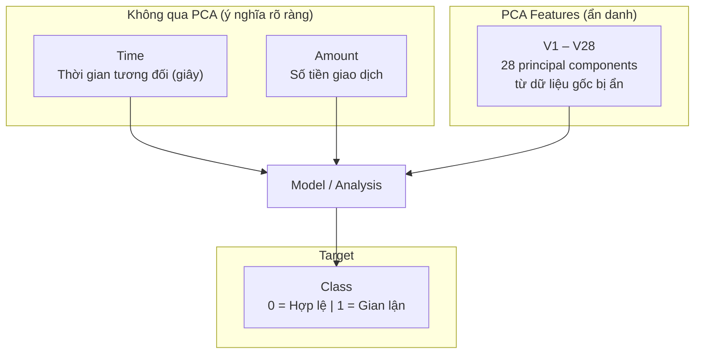

# Dataset Field Documentation — `creditcard.csv`

## Nguồn gốc

| Thuộc tính | Giá trị |
|---|---|
| **Tên chính thức** | Credit Card Fraud Detection |
| **Tổ chức** | Worldline + Machine Learning Group (MLG), ULB (Université Libre de Bruxelles) |
| **Thời gian thu thập** | Tháng 9/2013, châu Âu |
| **Khoảng thời gian** | 2 ngày liên tục (~48 giờ) |
| **License** | Database Contents License (DbCL-1.0) |
| **Kaggle URL** | [mlg-ulb/creditcardfraud](https://www.kaggle.com/datasets/mlg-ulb/creditcardfraud) |

> [!IMPORTANT]
> Do yêu cầu bảo mật, các feature gốc đã được biến đổi bằng **PCA (Principal Component Analysis)**. Chúng ta **không biết** V1–V28 tương ứng với biến gốc nào (ví dụ: loại thẻ, quốc gia, merchant, IP, thiết bị...). Chỉ có `Time` và `Amount` giữ nguyên ý nghĩa ban đầu.

---

## Tổng quan Dataset

| Metric | Giá trị |
|---|---|
| Tổng giao dịch | **284,807** |
| Giao dịch hợp lệ (Class=0) | 284,315 (99.83%) |
| Giao dịch gian lận (Class=1) | 492 (0.17%) |
| Tổng cột | **31** |
| Missing values | **0** |
| Duplicate rows | **1,081** |
| Kích thước file | ~150 MB |

---

## Chi tiết từng trường

### 1. `Time` — Thời gian giao dịch

| Thuộc tính | Giá trị |
|---|---|
| **Ý nghĩa** | Số giây trôi qua kể từ giao dịch đầu tiên trong dataset |
| **Kiểu dữ liệu** | `float64` |
| **Không phải PCA** | ✅ Giữ nguyên ý nghĩa gốc |
| **Min** | 0 (giao dịch đầu tiên) |
| **Max** | 172,792 (~48.0 giờ = ~2 ngày) |
| **Mean** | 94,813.86s (~26.34h) |
| **Median** | 84,692.0s (~23.52h) |
| **Std** | 47,488.15s |
| **Unique values** | 124,592 |
| **Null** | 0 |
| **Skewness** | −0.036 (gần đối xứng) |

**So sánh Fraud vs Non-Fraud:**

| | Non-Fraud | Fraud |
|---|---|---|
| Mean | 26.34h | **22.43h** |
| Std | 47,484s | 47,835s |

> [!NOTE]
> Giao dịch gian lận có xu hướng xảy ra **sớm hơn** trong khoảng thời gian 2 ngày. Tuy nhiên, đây là thời gian tương đối, không phải giờ trong ngày thực tế (không biết giao dịch đầu tiên bắt đầu lúc mấy giờ).

---

### 2–29. `V1` đến `V28` — PCA Features (28 trường)

| Thuộc tính | Giá trị |
|---|---|
| **Ý nghĩa** | Các thành phần chính (principal components) từ PCA trên dữ liệu gốc |
| **Kiểu dữ liệu** | `float64` (tất cả) |
| **Đã chuẩn hóa** | Có — mean ≈ 0 cho tất cả features |
| **Unique values** | 275,663 mỗi feature |
| **Null** | 0 (tất cả) |

> [!IMPORTANT]
> Vì PCA, các V-features **không có ý nghĩa kinh doanh trực tiếp**. Chúng ta không thể biết V1 là "số lần giao dịch trong 24h" hay "khoảng cách địa lý"... Tuy nhiên, chúng vẫn mang thông tin thống kê quan trọng và có tương quan với fraud.

#### Bảng thống kê tóm tắt V1–V28

| Feature | Std | Min | Max | Skewness | Kurtosis | Ghi chú |
|---|---|---|---|---|---|---|
| **V1** | 1.959 | −56.41 | 2.45 | −3.28 | 32.49 | Lệch trái mạnh |
| **V2** | 1.651 | −72.72 | 22.06 | −4.62 | 95.77 | Outlier cực trị |
| **V3** | 1.516 | −48.33 | 9.38 | −2.24 | 26.62 | Lệch trái |
| **V4** | 1.416 | −5.68 | 16.88 | 0.68 | 2.64 | Tương đối đối xứng |
| **V5** | 1.380 | −113.74 | 34.80 | −2.43 | **206.90** | Heavy-tailed cực kỳ |
| **V6** | 1.332 | −26.16 | 73.30 | 1.83 | 42.64 | |
| **V7** | 1.237 | −43.56 | 120.59 | 2.55 | **405.61** | Kurtosis rất cao |
| **V8** | 1.194 | −73.22 | 20.01 | −8.52 | 220.59 | Lệch trái nghiêm trọng |
| **V9** | 1.099 | −13.43 | 15.59 | 0.55 | 3.73 | |
| **V10** | 1.089 | −24.59 | 23.75 | 1.19 | 31.99 | |
| **V11** | 1.021 | −4.80 | 12.02 | 0.36 | 1.63 | Gần normal nhất |
| **V12** | 0.999 | −18.68 | 7.85 | −2.28 | 20.24 | |
| **V13** | 0.995 | −5.79 | 7.13 | 0.07 | 0.20 | **Gần Gaussian nhất** |
| **V14** | 0.959 | −19.21 | 10.53 | −2.00 | 23.88 | |
| **V15** | 0.915 | −4.50 | 8.88 | −0.31 | 0.28 | Gần normal |
| **V16** | 0.876 | −14.13 | 17.32 | −1.10 | 10.42 | |
| **V17** | 0.849 | −25.16 | 9.25 | −3.84 | 94.80 | |
| **V18** | 0.838 | −9.50 | 5.04 | −0.26 | 2.58 | |
| **V19** | 0.814 | −7.21 | 5.59 | 0.11 | 1.73 | |
| **V20** | 0.771 | −54.50 | 39.42 | −2.04 | 271.02 | Heavy-tailed |
| **V21** | 0.735 | −34.83 | 27.20 | 3.59 | 207.29 | |
| **V22** | 0.726 | −10.93 | 10.50 | −0.21 | 2.83 | |
| **V23** | 0.624 | −44.81 | 22.53 | −5.88 | **440.09** | Outlier cực trị |
| **V24** | 0.606 | −2.84 | 4.58 | −0.55 | 0.62 | Gần normal |
| **V25** | 0.521 | −10.30 | 7.52 | −0.42 | 4.29 | |
| **V26** | 0.482 | −2.60 | 3.52 | 0.58 | 0.92 | |
| **V27** | 0.404 | −22.57 | 31.61 | −1.17 | 244.99 | |
| **V28** | 0.330 | −15.43 | 33.85 | 11.19 | **933.40** | Kurtosis cao nhất |

#### Tương quan với gian lận (Class)

**5 features tương quan âm mạnh nhất** (giá trị thấp → khả năng fraud cao):

| Feature | Correlation |
|---|---|
| **V17** | **−0.3265** |
| **V14** | **−0.3025** |
| **V12** | −0.2606 |
| V10 | −0.2169 |
| V16 | −0.1965 |

**5 features tương quan dương mạnh nhất** (giá trị cao → khả năng fraud cao):

| Feature | Correlation |
|---|---|
| **V11** | **+0.1549** |
| **V4** | **+0.1334** |
| V2 | +0.0913 |
| V21 | +0.0404 |
| V19 | +0.0348 |

> [!TIP]
> **V17, V14, V12** là 3 features phân biệt fraud mạnh nhất. Khi xây dựng model, chúng nên được ưu tiên trong feature importance analysis.

---

### 30. `Amount` — Số tiền giao dịch

| Thuộc tính | Giá trị |
|---|---|
| **Ý nghĩa** | Giá trị tiền của giao dịch (đơn vị tiền tệ không được công bố, khả năng cao là EUR) |
| **Kiểu dữ liệu** | `float64` |
| **Không phải PCA** | ✅ Giữ nguyên ý nghĩa gốc |
| **Min** | $0.00 |
| **Max** | $25,691.16 |
| **Mean** | $88.35 |
| **Median** | $22.00 |
| **Std** | $250.12 |
| **Zero amounts** | 1,825 giao dịch |
| **Skewness** | 16.98 (lệch phải rất mạnh — đa số giao dịch nhỏ) |
| **Null** | 0 |

**Phân bố percentile:**

| Percentile | Giá trị |
|---|---|
| P1 | $0.12 |
| P5 | $0.92 |
| P10 | $1.00 |
| P25 | $5.60 |
| **P50 (median)** | **$22.00** |
| P75 | $77.16 |
| P90 | $203.00 |
| P95 | $365.00 |
| P99 | $1,017.97 |

**So sánh Fraud vs Non-Fraud:**

| Metric | Non-Fraud | Fraud |
|---|---|---|
| Mean | $88.29 | **$122.21** |
| Median | $22.00 | **$9.25** |
| Std | $250.11 | $256.68 |
| Max | $25,691.16 | **$2,125.87** |

> [!NOTE]
> Điểm thú vị: Fraud có **mean cao hơn** ($122 vs $88) nhưng **median thấp hơn** ($9.25 vs $22). Điều này gợi ý rằng nhiều giao dịch fraud là **các khoản nhỏ** (test card) kết hợp với một số **khoản lớn** (cash-out), tạo ra phân phối bimodal.

> [!TIP]
> Kaggle khuyến nghị sử dụng `Amount` cho **example-dependent cost-sensitive learning** — nghĩa là trọng số lỗi của mỗi mẫu tỷ lệ với giá trị giao dịch. Bỏ lỡ fraud $2,000 nghiêm trọng hơn bỏ lỡ fraud $2.

---

### 31. `Class` — Nhãn gian lận (Target Variable)

| Thuộc tính | Giá trị |
|---|---|
| **Ý nghĩa** | Nhãn nhị phân: giao dịch gian lận hay hợp lệ |
| **Kiểu dữ liệu** | `int64` |
| **Giá trị 0** | Hợp lệ (Non-Fraud) — **284,315** mẫu (99.83%) |
| **Giá trị 1** | Gian lận (Fraud) — **492** mẫu (0.17%) |
| **Tỷ lệ Fraud** | 0.1727% |
| **Imbalance ratio** | ~578:1 |

> [!WARNING]
> **Mất cân bằng cực kỳ nghiêm trọng** (578:1). Accuracy KHÔNG phải metric phù hợp. Một model luôn dự đoán "không gian lận" sẽ đạt 99.83% accuracy nhưng hoàn toàn vô dụng. Kaggle khuyến nghị dùng **AUPRC (Area Under the Precision-Recall Curve)** làm metric chính.

---

## Sơ đồ cấu trúc

---

## Hạn chế quan trọng

1. **Không có thông tin entity**: Không có customer ID, merchant ID, device fingerprint, IP, location → không thể xây dựng behavioral profiles theo README vision
2. **PCA làm mất ý nghĩa**: Không thể giải thích "tại sao giao dịch này bất thường" bằng ngôn ngữ kinh doanh
3. **Chỉ 2 ngày**: Không đủ để đánh giá temporal drift hoặc seasonality
4. **Không có thời gian tuyệt đối**: `Time` chỉ là offset tương đối, không biết ngày/giờ thực
5. **Dữ liệu cũ**: Thu thập năm 2013, patterns gian lận đã thay đổi nhiều
6. **Không rõ đơn vị tiền**: Có thể là EUR nhưng không được xác nhận

> [!TIP]
> Dataset này phù hợp nhất cho **Phase 1** (classical baseline) và **Phase 2** (quantum experiments) của Sentinel roadmap. Để hiện thực hóa đầy đủ Behavioral State Intelligence (Phase 3), cần dataset có entity relationships phong phú hơn.

---

## Tài liệu tham khảo

Các bài báo gốc từ nhóm nghiên cứu ULB:

1. Dal Pozzolo et al. — *Calibrating Probability with Undersampling for Unbalanced Classification* (CIDM, IEEE, 2015)
2. Dal Pozzolo et al. — *Learned lessons in credit card fraud detection from a practitioner perspective* (Expert Systems with Applications, 2014)
3. Dal Pozzolo et al. — *Credit card fraud detection: a realistic modeling and a novel learning strategy* (IEEE TNNLS, 2018)
4. Dal Pozzolo — *Adaptive Machine Learning for Credit Card Fraud Detection* (PhD Thesis, ULB)
5. Le Borgne, Bontempi — *Reproducible Machine Learning for Credit Card Fraud Detection - Practical Handbook*
6. Fraud Detection Handbook (simulator): https://fraud-detection-handbook.github.io/fraud-detection-handbook/
