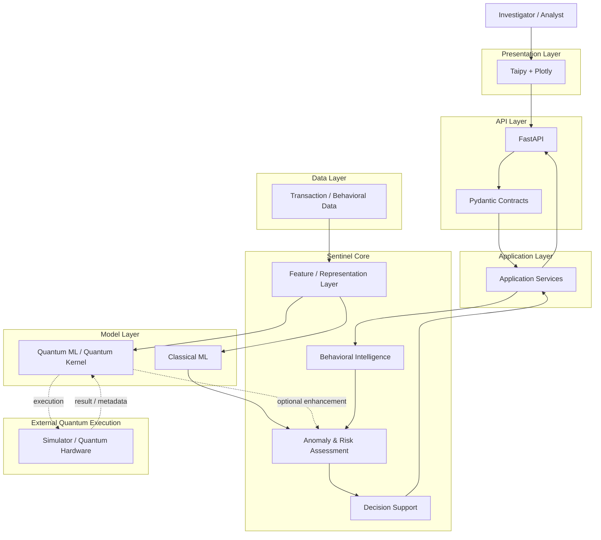

# Sentinel — Architecture Diagram

> **Phiên bản:** V1.0  
> **Dự án:** Quantstellar Sentinel  
> **Mục đích:** Mô tả kiến trúc logic cấp cao của Sentinel và ranh giới giữa Presentation, API, Application, Core, Data và Quantum layer.

---

## 1. Architecture Overview

Sentinel V1 ưu tiên kiến trúc **modular, API-first và Classical-first**.

```text
Presentation
    ↓
API
    ↓
Application
    ↓
Core
 ┌──┴───────────────┐
 ↓                  ↓
Classical         Quantum
 ML Layer       Research Layer
 └───────┬──────────┘
         ↓
     Assessment
         ↓
   Decision Support
```

---

## 2. Architecture Diagram



---

## 3. Layer Responsibilities

| Layer | Responsibility |
|---|---|
| **Presentation** | Investigation UI và visualization. |
| **API** | Public application boundary và data contracts. |
| **Application** | Orchestration và use-case execution. |
| **Core** | Behavioral intelligence, assessment và decision-support logic. |
| **Model** | Classical và Quantum model computation. |
| **Data** | Transaction/event và behavioral data. |
| **Quantum Execution** | Simulator/hardware bên ngoài khi Quantum path được sử dụng. |

---

## 4. Main Data Flow

```text
Transaction / Behavioral Data
            ↓
      Feature / Context
            ↓
   Behavioral Representation
            ↓
      ┌─────┴─────┐
      ↓           ↓
 Classical      Quantum
   Model         Model
      │           │
      └─────┬─────┘
            ↓
   Anomaly / Risk Assessment
            ↓
      Decision Support
            ↓
         FastAPI
            ↓
      Taipy + Plotly
```

---

## 5. Quantum Boundary

Quantum được giữ như một **optional computational layer**:

```text
Sentinel Core
     │
     ├── Classical ML
     │
     └── Quantum ML
             ↓
      Simulator / Hardware
```

Điều này đảm bảo:

- Classical pipeline vẫn có thể hoạt động khi Quantum backend unavailable.
- Quantum không trở thành dependency bắt buộc của toàn bộ product.
- Quantum contribution có thể được benchmark độc lập.
- Execution cost và hardware constraints có thể được đánh giá riêng.

---

## 6. Architecture Principles

### API-first

UI không truy cập trực tiếp core/model internals.

```text
UI
 ↓
FastAPI
 ↓
Application
 ↓
Core
```

### Classical-first

Classical baseline là reference point cho Quantum research.

### Quantum where justified

Quantum chỉ được sử dụng khi có research hypothesis và measurable value.

### Separation of concerns

Mỗi layer có responsibility rõ ràng.

### No premature infrastructure

V1 không mặc định yêu cầu microservices, Kubernetes hoặc distributed infrastructure.

### Product / Research separation

Research prototype phải được validate trước khi trở thành production capability.

---

## 7. Architecture Boundary

Chi tiết implementation của từng module không thuộc phạm vi diagram này.

- `system-context.md` → System Context.
- `architecture.md` → Logical Architecture.
- `ARCHITECTURE.md` → Architecture specification chi tiết.
- `SCHEMA.md` → Data contracts.
- `WORKFLOW.md` → Research và development workflow.

> **Architecture của Sentinel được thiết kế để Quantum có thể được thêm vào, đánh giá hoặc loại bỏ mà không làm mất đi core Behavioral Intelligence system.**
