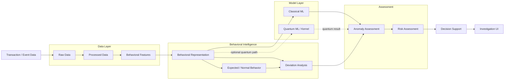

# Sentinel — Data Flow Diagram

> **Phiên bản:** V1.0  
> **Dự án:** Quantstellar Sentinel  
> **Mục đích:** Mô tả luồng dữ liệu chính từ transaction/event data đến behavioral intelligence, anomaly/risk assessment và decision support.

---

## 1. Phạm vi

Diagram này tập trung vào **data flow**, không mô tả chi tiết deployment hay internal implementation.

Luồng cốt lõi:

```text
Transaction Data
      ↓
Data Processing
      ↓
Behavioral Representation
      ↓
Model Analysis
      ↓
Anomaly / Risk Assessment
      ↓
Decision Support
```

---

## 2. Data Flow



---

## 3. Main Data Stages

| Stage | Nội dung |
|---|---|
| **Raw Data** | Dữ liệu transaction/event ban đầu. |
| **Processed Data** | Dữ liệu đã được làm sạch và chuẩn hóa. |
| **Behavioral Features** | Các đặc trưng mô tả hành vi. |
| **Behavioral Representation** | Biểu diễn hành vi dùng cho downstream analysis. |
| **Expected / Normal Behavior** | Đại diện cho behavioral pattern được xem là bình thường/expected. |
| **Deviation Analysis** | Đánh giá mức độ khác biệt giữa observed behavior và expected behavior. |
| **Model Analysis** | Classical hoặc Quantum model xử lý behavioral representation. |
| **Anomaly Assessment** | Tổng hợp evidence về mức độ bất thường. |
| **Risk Assessment** | Chuyển anomaly/evidence thành risk signal phù hợp. |
| **Decision Support** | Kết quả phục vụ investigator/analyst. |

---

## 4. Classical Path

Classical path là baseline/reference path:

```text
Behavioral Representation
          ↓
     Classical ML
          ↓
    Anomaly Score
          ↓
   Anomaly Assessment
```

Path này phải tồn tại độc lập với Quantum path.

---

## 5. Quantum Path

Quantum path là optional enhancement:

```text
Behavioral Representation
          ↓
    Quantum Encoding
          ↓
  Quantum Kernel / Model
          ↓
     Quantum Result
          ↓
   Anomaly Assessment
```

Quantum result phải được đánh giá cùng Classical baseline trước khi được sử dụng cho các research hoặc product claims.

---

## 6. Expected Behavior vs Observed Behavior

Một abstraction quan trọng của Sentinel:

```text
Historical / Contextual Behavior
              ↓
      Expected Behavior
              │
              │ compare
              ▼
       Observed Behavior
              ↓
          Deviation
              ↓
           Anomaly
```

Mục tiêu không phải coi mọi khác biệt là fraud.

```text
Deviation
   ↓
Evidence
   ↓
Assessment
   ↓
Risk
```

Fraud decision không được suy ra trực tiếp chỉ từ một anomaly score.

---

## 7. Data Contract Boundary

Các boundary chính:

```text
Data
 ↓
Feature / Representation Contract
 ↓
Model Input
 ↓
Model Output
 ↓
Assessment Contract
 ↓
Decision Support Output
```

Mỗi boundary cần schema rõ ràng khi được triển khai trong system.

Chi tiết data contracts nằm trong `SCHEMA.md`.

---

## 8. Data Integrity

Trong toàn bộ data flow cần kiểm soát:

- Schema consistency.
- Missing values.
- Invalid values.
- Duplicate records.
- Temporal consistency.
- Feature consistency.
- Data leakage.
- Temporal leakage.
- Target leakage.

Nếu phát hiện leakage:

```text
Invalid Result
      ↓
Fix Pipeline
      ↓
Re-run Evaluation
```

---

## 9. Data Flow Principle

Sentinel ưu tiên:

```text
Raw Evidence
    ↓
Structured Context
    ↓
Behavioral Representation
    ↓
Deviation
    ↓
Anomaly
    ↓
Risk
    ↓
Decision Support
```

Data flow phải bảo toàn semantic của dữ liệu qua từng stage và tránh biến một model score đơn lẻ thành một quyết định tài chính tự động.

> **Sentinel không chỉ hỏi “transaction này có fraud không?”, mà trước hết hỏi “hành vi này khác với expected behavior như thế nào, evidence là gì và mức độ đáng chú ý ra sao?”**
