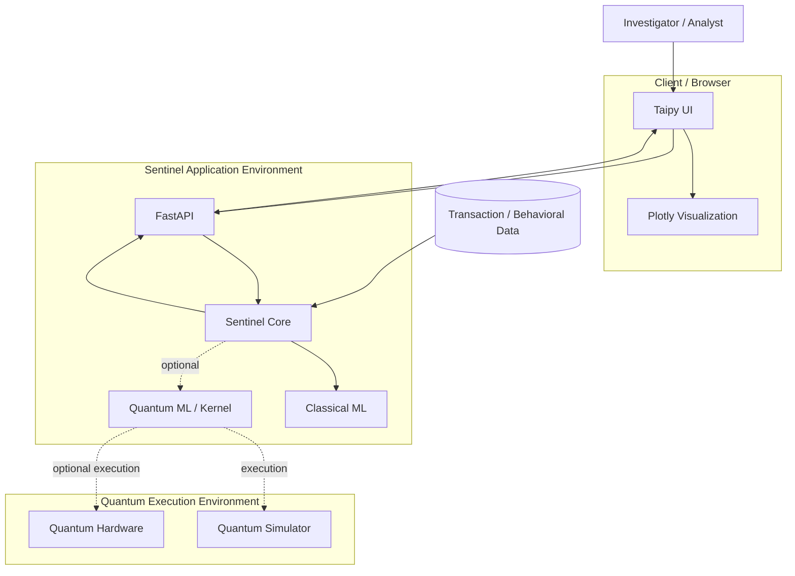

# Sentinel — Deployment Diagram

> **Phiên bản:** V1.0  
> **Dự án:** Quantstellar Sentinel  
> **Mục đích:** Mô tả deployment topology tối thiểu của Sentinel V1 và ranh giới giữa các runtime components.

---

## 1. Phạm vi

Deployment diagram mô tả:

- User/client.
- Presentation runtime.
- API runtime.
- Sentinel core/model runtime.
- Data source/storage.
- Quantum execution environment.

Diagram này không mô tả infrastructure enterprise hoặc production-scale deployment.

---

## 2. Deployment Overview



---

## 3. Deployment Nodes

| Node | Vai trò |
|---|---|
| **Client / Browser** | Nơi investigator/analyst sử dụng Sentinel UI. |
| **Sentinel Application Environment** | Runtime chính của API, application/core và model execution. |
| **Data Source / Storage** | Cung cấp transaction và behavioral data. |
| **Quantum Execution Environment** | Simulator hoặc quantum hardware được sử dụng khi Quantum path cần execution. |

---

## 4. V1 Deployment Model

V1 ưu tiên deployment đơn giản:

```text
Client
  ↓
Taipy
  ↓
FastAPI
  ↓
Sentinel Core
  ├── Classical ML
  └── Quantum ML
```

Không yêu cầu mặc định:

- Kubernetes.
- Microservices.
- Service mesh.
- Distributed orchestration.
- Dedicated model-serving cluster.

Mục tiêu là giữ deployment tương xứng với workload và giai đoạn research/product hiện tại.

---

## 5. Quantum Deployment Boundary

Quantum execution được tách khỏi application core ở mức logical boundary:

```text
Sentinel Core
      ↓
Quantum Model
      ↓
Quantum Execution
   ┌──┴───┐
   ↓      ↓
Simulator Hardware
```

Quantum backend có thể là:

- Local simulator.
- Remote simulator.
- Real quantum hardware.

Sentinel không nên giả định một backend cụ thể trong core business logic.

---

## 6. Classical Fallback

Quantum là optional execution path:

```text
                Sentinel Core
                     │
              ┌──────┴──────┐
              ↓             ↓
         Classical       Quantum
            ML              ML
              │             │
              │        Backend unavailable
              │             ↓
              └──────→ Classical Path
```

Nếu use case cho phép và Quantum backend unavailable, system nên có khả năng sử dụng Classical path thay thế.

---

## 7. Environment Separation

Khi project phát triển, deployment nên phân biệt:

```text
Development
    ↓
Experiment / Evaluation
    ↓
Demo / Staging
    ↓
Production
```

Không yêu cầu mỗi environment phải có infrastructure riêng ngay từ V1.

Điều quan trọng là giữ:

- Dependency consistency.
- Configuration consistency.
- Reproducibility.
- Clear execution context.

---

## 8. Deployment Principles

### Simple First

Infrastructure phải phù hợp với workload thực tế.

### API-first

```text
Client
 ↓
API
 ↓
Core
```

UI không truy cập trực tiếp model internals.

### Quantum-isolated

Quantum execution có boundary riêng để không khóa toàn bộ application vào một backend.

### Reproducible

Environment, dependency và execution configuration phải có thể tái tạo khi cần.

### No Premature Scaling

Chỉ introduce distributed infrastructure khi workload hoặc product requirement chứng minh cần thiết.

---

## 9. Security Boundary

Ở deployment level cần đặc biệt bảo vệ:

- API credentials.
- Quantum backend credentials.
- Dataset access.
- Environment secrets.
- Sensitive financial data.

Không commit secrets vào repository.

Production deployment sau này cần bổ sung authentication, authorization, audit logging và các controls phù hợp với threat model.

Các control này chưa được xem là fully specified trong deployment diagram V1.

---

## 10. Deployment vs Architecture

`deployment.md` trả lời:

> **Các component chạy ở đâu và giao tiếp qua deployment boundary nào?**

Trong khi:

- `system-context.md` → Sentinel tương tác với hệ thống bên ngoài.
- `architecture.md` → Logical architecture.
- `data-flow.md` → Data movement.
- `sequence.md` → Runtime interaction.
- `er.md` → Entity relationships.
- `ARCHITECTURE.md` → Architecture specification chi tiết.

---

## 11. V1 Deployment Principle

Sentinel V1 không cần một infrastructure “enterprise” để chứng minh giá trị.

Mục tiêu:

```text
Minimal Infrastructure
        +
Reproducible Runtime
        +
Clear Boundaries
        +
Classical Reliability
        +
Optional Quantum Execution
```

> **Deployment phải phục vụ Behavioral Intelligence; không xây infrastructure chỉ để làm Sentinel trông lớn hơn.**
