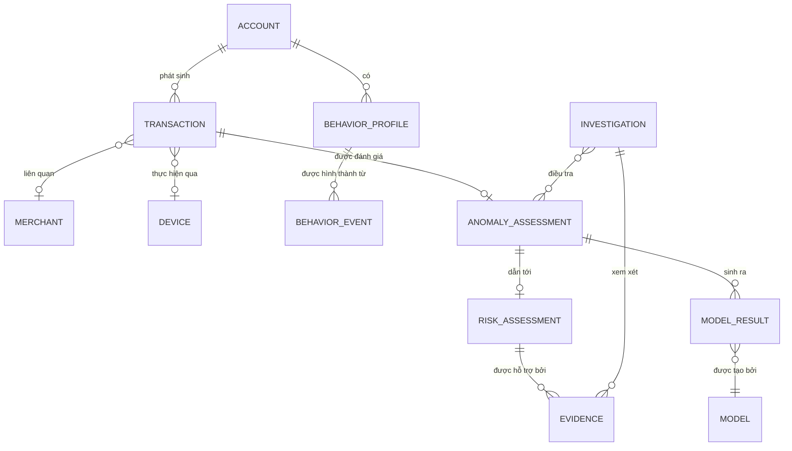

# Sentinel — Entity Relationship Diagram

> **Phiên bản:** V1.0  
> **Dự án:** Quantstellar Sentinel  
> **Mục đích:** Mô tả các entity dữ liệu cốt lõi và quan hệ logic giữa chúng trong Sentinel V1.

---

## 1. Phạm vi

ER diagram tập trung vào các entity phục vụ:

- Transaction analysis.
- Behavioral representation.
- Anomaly assessment.
- Risk assessment.
- Investigation.

Diagram này **không phải database schema vật lý**. Kiểu lưu trữ, database engine và indexing strategy sẽ được quyết định ở implementation stage.

---

## 2. Core Entity Relationship



---

## 3. Core Entities

| Entity | Vai trò |
|---|---|
| **ACCOUNT** | Entity tài chính hoặc user context gắn với transaction history. |
| **TRANSACTION** | Một transaction/event được Sentinel phân tích. |
| **MERCHANT** | Merchant/entity liên quan đến transaction khi dữ liệu có context này. |
| **DEVICE** | Device hoặc execution context liên quan đến transaction. |
| **BEHAVIOR_PROFILE** | Đại diện cho behavioral pattern/representation của một entity trong một context hoặc khoảng thời gian. |
| **BEHAVIOR_EVENT** | Các observation/event đóng góp vào behavioral profile. |
| **MODEL** | Metadata của model được sử dụng để tạo model result. |
| **MODEL_RESULT** | Output của một model cho một analysis context. |
| **ANOMALY_ASSESSMENT** | Kết quả đánh giá mức độ bất thường. |
| **RISK_ASSESSMENT** | Risk signal được xây dựng từ anomaly/evidence/context. |
| **EVIDENCE** | Evidence hỗ trợ cho assessment và investigation. |
| **INVESTIGATION** | Context điều tra do analyst/investigator thực hiện. |

---

## 4. Logical Relationships

### Account → Transaction

```text
ACCOUNT
   │
   └───< TRANSACTION
```

Một account có thể có nhiều transaction.

Transaction history là một nguồn quan trọng để xây dựng behavioral context.

### Account → Behavioral Profile

```text
ACCOUNT
   │
   └───< BEHAVIOR_PROFILE
```

Một account có thể có nhiều behavioral profile theo:

- thời gian,
- context,
- feature representation,
- hoặc behavioral state.

### Behavioral Profile → Behavioral Event

```text
BEHAVIOR_PROFILE
   │
   └───< BEHAVIOR_EVENT
```

Behavioral profile được hình thành từ các observation/event phù hợp.

### Transaction → Anomaly Assessment

```text
TRANSACTION
   │
   └─── ANOMALY_ASSESSMENT
```

Một transaction có thể được đánh giá về mức độ bất thường.

Anomaly không mặc định đồng nghĩa với fraud.

### Anomaly → Risk

```text
ANOMALY_ASSESSMENT
   │
   └─── RISK_ASSESSMENT
```

Risk assessment sử dụng anomaly cùng context/evidence phù hợp để tạo risk signal.

### Risk → Evidence

```text
RISK_ASSESSMENT
   │
   └───< EVIDENCE
```

Risk assessment phải có thể truy ngược về evidence khi use case yêu cầu investigation.

### Model → Model Result

```text
MODEL
   │
   └───< MODEL_RESULT
```

Model metadata được tách khỏi output cụ thể của từng execution.

---

## 5. Model Result

`MODEL_RESULT` có thể đại diện cho:

```text
Classical ML Result
Quantum ML Result
Behavioral Similarity Result
Anomaly Score
```

Không nên lưu mọi loại score như một field không có semantic rõ ràng.

Mỗi result cần xác định được tối thiểu:

```text
Model
Model Version
Input / Representation Version
Result Type
Score / Output
Execution Context
Timestamp
```

---

## 6. Quantum Context

Quantum không tạo ra một data model hoàn toàn tách biệt với Sentinel.

Quantum result được gắn vào cùng analysis context:

```text
Behavioral Representation
        ↓
Quantum Model
        ↓
MODEL_RESULT
        ↓
ANOMALY_ASSESSMENT
```

Khi cần, `MODEL_RESULT` phải có execution metadata phù hợp:

```text
Backend
Qubit Count
Circuit Depth
Shots
Noise Context
Runtime
```

Điều này giúp Classical và Quantum results có thể được benchmark và audit trong cùng một analysis context.

---

## 7. Investigation Relationship

Investigation không nên được coi là một phần của model computation.

```text
ANOMALY
   ↓
EVIDENCE
   ↓
INVESTIGATION
   ↓
Analyst Interpretation
```

Investigation là application/decision-support context nằm phía trên intelligence layer.

---

## 8. Data Flow vs Entity Relationship

ER diagram trả lời:

> **Các entity liên hệ với nhau như thế nào?**

Trong khi `data-flow.md` trả lời:

> **Dữ liệu di chuyển qua system như thế nào?**

Vì vậy hai diagram bổ sung cho nhau:

```text
ER
→ Entity & Relationship

Data Flow
→ Movement & Transformation
```

---

## 9. Schema Boundary

ER diagram là logical model.

Chi tiết field-level contract được quản lý trong:

`SCHEMA.md`

Không nên đưa toàn bộ fields vào ER diagram vì sẽ làm diagram khó đọc và trộn logical relationship với implementation schema.

---

## 10. Design Principles

### Behavioral-first

Transaction được đặt trong behavioral context thay vì chỉ xem xét độc lập.

### Evidence-based

Assessment nên có evidence có thể truy xuất khi cần.

### Model-agnostic

Data model không được phụ thuộc cứng vào Classical hay Quantum model.

### Quantum-compatible

Quantum result được coi là một model output có execution metadata, không phải một data universe riêng.

### Investigation-aware

Data model phải hỗ trợ trace:

```text
Transaction
   ↓
Behavior
   ↓
Model Result
   ↓
Anomaly
   ↓
Risk
   ↓
Evidence
   ↓
Investigation
```

> **ER diagram của Sentinel mô hình hóa information relationships cần thiết cho Behavioral Fraud Intelligence, không mô hình hóa database implementation cụ thể.**
