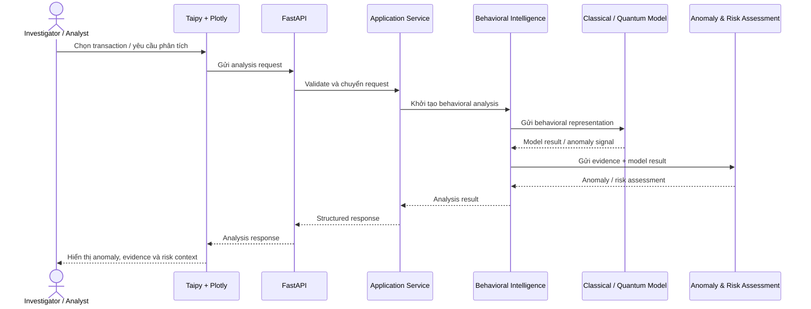
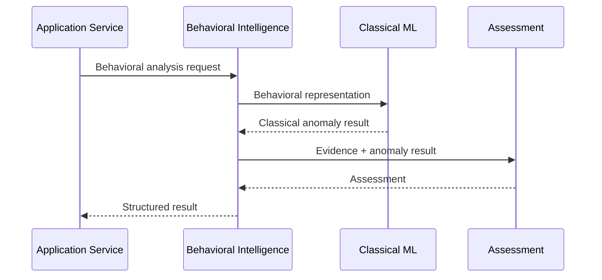
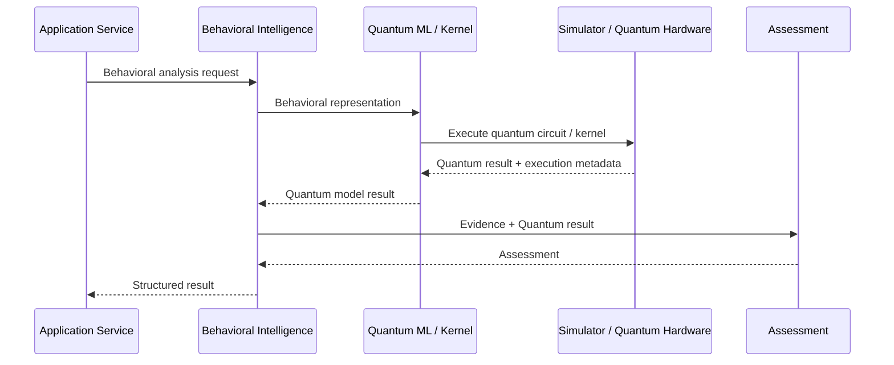

# Sentinel — Sequence Diagram

> **Phiên bản:** V1.0  
> **Dự án:** Quantstellar Sentinel  
> **Mục đích:** Mô tả trình tự tương tác chính khi Sentinel phân tích một transaction và cung cấp kết quả phục vụ investigation.

---

## 1. Phạm vi

Diagram này tập trung vào **runtime interaction flow** giữa:

- Investigator / Analyst.
- Sentinel UI.
- FastAPI.
- Application Service.
- Behavioral Intelligence Core.
- Classical / Quantum model.
- Assessment layer.

Nó không mô tả deployment hoặc infrastructure topology.

---

## 2. Main Analysis Sequence



---

## 3. Sequence Overview

Luồng chính:

```text
User
 ↓
UI
 ↓
API
 ↓
Application Service
 ↓
Behavioral Intelligence
 ↓
Model
 ↓
Assessment
 ↓
Application Service
 ↓
API
 ↓
UI
 ↓
User
```

Điểm quan trọng:

> UI không gọi trực tiếp model/core internals.

---

## 4. Classical Analysis Path



Classical path là baseline/reference path của Sentinel.

---

## 5. Quantum-Enhanced Analysis Path



Quantum path là **optional**.

Nếu Quantum backend không khả dụng, Sentinel vẫn phải có khả năng chạy Classical path khi use case cho phép.

---

## 6. Investigation Sequence

Sau khi có analysis result:

```text
Analysis Result
      ↓
Anomaly
      ↓
Evidence
      ↓
Behavioral Context
      ↓
Risk Assessment
      ↓
Investigator
```

UI trình bày thông tin để hỗ trợ investigator, không tự biến anomaly score thành final fraud decision.

---

## 7. Error / Failure Flow

Ở mức application:

```text
Request
  ↓
Validation
  ├── Invalid → Error Response
  │
  └── Valid
       ↓
    Analysis
       ├── Failure → Structured Error
       │
       └── Success → Analysis Result
```

Lỗi cần được xử lý tại boundary phù hợp và không được làm lộ implementation details không cần thiết cho user.

---

## 8. Responsibility Boundary

| Component | Trách nhiệm |
|---|---|
| **UI** | Nhận input và trình bày kết quả. |
| **FastAPI** | API boundary, validation và serialization. |
| **Application Service** | Điều phối use case. |
| **Behavioral Intelligence** | Core behavioral analysis. |
| **Model** | Classical/Quantum computation. |
| **Assessment** | Tổng hợp evidence, anomaly và risk assessment. |

---

## 9. Design Principles

### API-first

```text
UI → API → Application → Core
```

### Core độc lập với UI

Thay đổi Taipy không được yêu cầu thay đổi behavioral intelligence logic.

### Quantum optional

Quantum execution không được làm mất Classical capability khi Quantum backend unavailable.

### Assessment không đồng nghĩa với Decision

```text
Model Result
    ↓
Evidence
    ↓
Assessment
    ↓
Decision Support
```

### Không bypass boundary

Không cho phép:

```text
UI → Model
UI → Quantum Backend
UI → Database internals
```

---

## 10. Scope Boundary

Sequence diagram này mô tả **một analysis request điển hình**.

Các workflow phức tạp hơn như:

- Batch processing.
- Scheduled analysis.
- Model training.
- Experiment orchestration.
- Monitoring.
- Investigation case management.

có thể được mô tả bằng sequence diagram riêng khi các capability đó thực sự được triển khai.

> **Mục tiêu của sequence diagram V1 là làm rõ cách một analysis request đi qua Sentinel từ user interface đến behavioral intelligence và quay trở lại dưới dạng decision-support information.**
