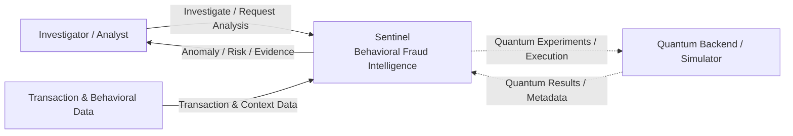

# Sentinel — System Context Diagram

> **Phiên bản:** V1.0  
> **Dự án:** Quantstellar Sentinel  
> **Mục đích:** Mô tả Sentinel ở cấp độ system context, tập trung vào các actor, hệ thống bên ngoài và luồng tương tác chính.

---

## 1. Phạm vi

Diagram này mô tả **Sentinel nhìn từ bên ngoài**, không mô tả chi tiết module nội bộ.

Mục tiêu là trả lời:

> Sentinel nhận gì, tương tác với ai/hệ thống nào, và cung cấp kết quả gì?

---

## 2. System Context



---

## 3. External Entities

| Entity | Vai trò |
|---|---|
| **Investigator / Analyst** | Sử dụng Sentinel để xem anomaly, behavioral context, evidence và risk intelligence. |
| **Transaction & Behavioral Data** | Cung cấp transaction/event data và behavioral context cho Sentinel. |
| **Quantum Backend / Simulator** | Cung cấp execution environment cho Quantum research/experiments khi được sử dụng. |
| **Sentinel** | Phân tích behavioral patterns, phát hiện deviations và cung cấp anomaly/risk intelligence cho decision support. |

---

## 4. Core Interaction

Luồng chính:

```text
Transaction / Behavioral Data
            ↓
         Sentinel
            ↓
 Behavioral Intelligence
            ↓
 Anomaly / Risk / Evidence
            ↓
 Investigator / Analyst
```

Quantum là một computational enhancement layer:

```text
Behavioral Representation
            ↓
   Quantum Experiment
            ↓
   Quantum Result
            ↓
        Sentinel
```

Quantum không phải dependency bắt buộc của toàn bộ Sentinel pipeline.

---

## 5. Context Boundary

### Bên trong Sentinel

Sentinel chịu trách nhiệm về:

- Behavioral representation.
- Anomaly detection.
- Risk assessment.
- Evidence generation.
- Decision-support output.
- Classical/Quantum evaluation.

### Bên ngoài Sentinel

Các thành phần sau được xem là external systems/data sources:

- Transaction/event sources.
- Người sử dụng hệ thống.
- Quantum backend hoặc simulator.

Chi tiết các internal components được mô tả trong `ARCHITECTURE.md`.

---

## 6. Design Principle

System Context của Sentinel tuân theo:

```text
Observe
  ↓
Understand Behavior
  ↓
Detect Deviation
  ↓
Assess Risk
  ↓
Provide Evidence
  ↓
Support Decision
```

Sentinel là **decision-support intelligence layer**, không mặc định là autonomous system quyết định cuối cùng đối với giao dịch tài chính.
