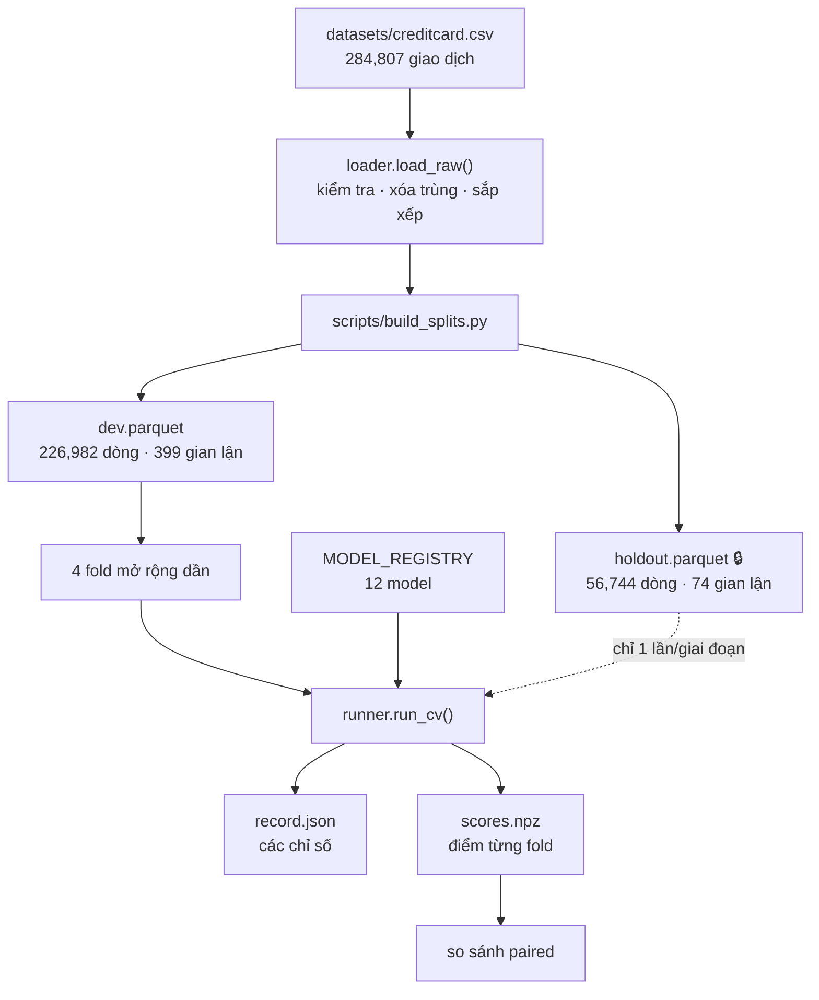

# Sentinel — Hướng dẫn toàn diện

> Tài liệu này viết cho người **chưa biết gì** về dự án, và cũng chưa cần biết gì về machine learning hay phát hiện gian lận. Đọc từ đầu đến cuối sẽ hiểu được: bài toán là gì, vì sao nó khó, dự án làm gì, chạy ra sao, và đã đo được những gì.
>
> **Không cần đọc trước tài liệu nào khác.** Mọi khái niệm chuyên môn đều được giải thích khi xuất hiện lần đầu.

---

## Mục lục

**Phần A — Hiểu bài toán**
1. [Gian lận thẻ tín dụng là gì](#1-gian-lận-thẻ-tín-dụng-là-gì)
2. [Vì sao bài toán này khó](#2-vì-sao-bài-toán-này-khó)

**Phần B — Kiến thức nền cần biết**

3. [Machine learning trong 5 phút](#3-machine-learning-trong-5-phút)
4. [Dữ liệu của chúng ta có gì](#4-dữ-liệu-của-chúng-ta-có-gì)
5. [Vì sao "độ chính xác" là cái bẫy](#5-vì-sao-độ-chính-xác-là-cái-bẫy)
6. [AUPRC — thước đo đúng](#6-auprc--thước-đo-đúng)
7. [Rò rỉ dữ liệu (data leakage)](#7-rò-rỉ-dữ-liệu-data-leakage)
8. [Khoảng tin cậy và vì sao nó quyết định mọi thứ](#8-khoảng-tin-cậy-và-vì-sao-nó-quyết-định-mọi-thứ)
9. [So sánh hai model cho đúng cách](#9-so-sánh-hai-model-cho-đúng-cách)
10. [Anomaly detection — học cái bình thường](#10-anomaly-detection--học-cái-bình-thường)
11. [Quantum computing dùng để làm gì ở đây](#11-quantum-computing-dùng-để-làm-gì-ở-đây)

**Phần C — Dự án**

12. [Sentinel là gì và muốn gì](#12-sentinel-là-gì-và-muốn-gì)
13. [Dự án gồm những file nào](#13-dự-án-gồm-những-file-nào)
14. [Chạy dự án như thế nào](#14-chạy-dự-án-như-thế-nào)

**Phần D — Kết quả**

15. [Kết quả đo được](#15-kết-quả-đo-được)
16. [Bảy phát hiện chính](#16-bảy-phát-hiện-chính)

**Phần E — Bối cảnh**

17. [Quá trình xây dựng](#17-quá-trình-xây-dựng)
18. [Hạn chế và bước tiếp theo](#18-hạn-chế-và-bước-tiếp-theo)
19. [Từ điển thuật ngữ](#19-từ-điển-thuật-ngữ)

---

# Phần A — Hiểu bài toán

## 1. Gian lận thẻ tín dụng là gì

Bạn có một thẻ tín dụng. Ai đó lấy được số thẻ của bạn — qua website bị hack, qua máy ATM bị gắn thiết bị đọc trộm, hay đơn giản là mua từ chợ đen. Họ dùng số thẻ đó để mua hàng. Đó là **gian lận** (fraud).

Ngân hàng muốn chặn giao dịch gian lận **ngay khi nó đang xảy ra** — trong vài trăm mili-giây, trước khi tiền rời khỏi tài khoản. Để làm được, họ cần một hệ thống nhìn vào từng giao dịch và trả lời: *"cái này có đáng ngờ không?"*

Kịch bản gian lận điển hình có hai giai đoạn:

| Giai đoạn | Tên gọi | Hành vi |
|---|---|---|
| 1 | **Card testing** | Mua thử vài món **rất nhỏ** ($0.5 – $2) để kiểm tra thẻ còn sống không |
| 2 | **Cash-out** | Nếu thẻ sống, quẹt ngay một khoản **lớn** trước khi bị khóa |

Chúng ta sẽ thấy chính hai giai đoạn này trong dữ liệu ở [mục 4](#4-dữ-liệu-của-chúng-ta-có-gì).

## 2. Vì sao bài toán này khó

### 2.1 Gian lận cực kỳ hiếm

Trong bộ dữ liệu của dự án: **284,807 giao dịch, chỉ 492 là gian lận**. Tỷ lệ 0.17%, tức **cứ 578 giao dịch hợp lệ mới có 1 giao dịch gian lận**.

Hãy hình dung: bạn phải tìm 492 người trong một sân vận động 284,807 người, và bạn không biết mặt họ.

### 2.2 Sai lầm nào cũng đắt, nhưng đắt theo hai kiểu khác nhau

| Loại sai | Tên kỹ thuật | Hậu quả |
|---|---|---|
| Bỏ sót gian lận | **False Negative** | Ngân hàng mất tiền, khách hàng mất niềm tin |
| Chặn nhầm giao dịch thật | **False Positive** | Khách hàng bị từ chối thẻ giữa siêu thị, gọi tổng đài, có thể đổi ngân hàng |

Điểm mấu chốt: vì gian lận quá hiếm, **chỉ cần chặn nhầm 1% giao dịch hợp lệ là đã chặn 2,848 người vô tội** — gấp gần 6 lần tổng số gian lận trong toàn bộ dữ liệu.

### 2.3 Kẻ gian lận thay đổi chiến thuật

Đây là điểm khiến bài toán khác hẳn nhận diện chữ viết tay hay phân loại ảnh mèo. Chữ số "7" năm nay giống hệt "7" năm ngoái. Nhưng **kẻ gian lận đọc được là mình đang bị chặn và đổi cách làm**.

Hệ quả: một model học rất giỏi các kiểu gian lận trong quá khứ có thể hoàn toàn mù trước kiểu gian lận mới. Dự án này đã **đo được** chi phí đó — xem [mục 15.4](#154-thí-nghiệm-fraud-kiểu-mới).

---

# Phần B — Kiến thức nền cần biết

## 3. Machine learning trong 5 phút

**Machine learning** = dạy máy tính tìm quy luật từ ví dụ, thay vì viết luật thủ công.

Thay vì lập trình viên viết *"nếu số tiền > $5000 và ở nước ngoài thì báo động"*, ta đưa cho máy 200,000 giao dịch kèm nhãn "gian lận / hợp lệ" và để nó tự tìm quy luật.

### Hai kiểu học

| Kiểu | Cách hoạt động | Ví dụ trong dự án |
|---|---|---|
| **Supervised** (có giám sát) | Học từ dữ liệu **đã có nhãn**. "Đây là 400 ca gian lận, hãy học xem chúng giống nhau ở điểm gì" | Logistic Regression, XGBoost, LightGBM |
| **Unsupervised** (không giám sát) | Học **chỉ từ dữ liệu bình thường**, không dùng nhãn. "Đây là hành vi bình thường, cái gì lệch khỏi đây thì báo" | Isolation Forest, Autoencoder |

Sự phân biệt này là **trung tâm của toàn bộ dự án Sentinel**. Xem [mục 10](#10-anomaly-detection--học-cái-bình-thường) và [mục 12](#12-sentinel-là-gì-và-muốn-gì).

### Ba khái niệm sẽ gặp liên tục

- **Feature** (đặc trưng): một cột dữ liệu mô tả giao dịch. Ví dụ: số tiền, thời gian.
- **Label / Target** (nhãn): thứ ta muốn đoán. Ở đây là `Class` = 0 (hợp lệ) hoặc 1 (gian lận).
- **Train / Test**: ta dạy model trên tập **train**, rồi kiểm tra nó trên tập **test** mà nó chưa từng thấy. Nếu chấm điểm trên chính dữ liệu đã dạy thì giống như cho học sinh làm lại đúng đề đã ôn — điểm cao nhưng vô nghĩa.

## 4. Dữ liệu của chúng ta có gì

**Nguồn:** Worldline + nhóm Machine Learning, Đại học Libre de Bruxelles (Bỉ). Giao dịch thẻ tín dụng thật ở châu Âu, tháng 9/2013, trong **2 ngày liên tục (48 giờ)**.

File: `datasets/creditcard.csv` — 150 MB, 284,807 dòng, 31 cột.

### 31 cột đó là gì

| Cột | Ý nghĩa |
|---|---|
| `Time` | Số **giây** trôi qua kể từ giao dịch đầu tiên. Từ 0 đến 172,792 (= 48 giờ) |
| `V1` … `V28` | 28 cột số — **không ai biết chúng là gì** (giải thích bên dưới) |
| `Amount` | Số tiền giao dịch |
| `Class` | **Nhãn**: 0 = hợp lệ, 1 = gian lận |

### Vì sao V1–V28 vô nghĩa: PCA là gì

Dữ liệu gốc chứa thông tin nhạy cảm — số thẻ, tên cửa hàng, quốc gia, thiết bị. Ngân hàng không được phép công bố. Nên trước khi công bố, họ chạy một phép biến đổi toán học gọi là **PCA** (Principal Component Analysis).

Hãy hình dung bạn có một đám mây điểm trong không gian 3 chiều. PCA xoay hệ trục tọa độ sao cho trục mới thứ nhất hứng được nhiều "độ trải rộng" của dữ liệu nhất, trục thứ hai hứng nhiều thứ nhì, v.v.

Kết quả: mỗi cột mới là một **tổ hợp tuyến tính** của tất cả cột gốc. Ví dụ (bịa để minh họa):

```
V1 = 0.3 × (số tiền) − 0.7 × (khoảng cách địa lý) + 0.2 × (giờ trong ngày) + ...
```

Vì không ai công bố các hệ số đó, **V1 không diễn giải được sang ngôn ngữ kinh doanh**. Nhưng nó vẫn mang thông tin thống kê hữu ích — model vẫn học được từ nó.

> **Hệ quả quan trọng cho dự án:** ta có thể xây model đoán đúng, nhưng **không thể giải thích** "giao dịch này bị chặn vì nó đến từ một quốc gia lạ". Ta chỉ nói được "vì V17 rất thấp". Điều này giới hạn nghiêm trọng mục tiêu "explainability" của README.

### Vài con số đáng chú ý

| Chỉ số | Giá trị |
|---|---|
| Tổng giao dịch | 284,807 |
| Gian lận | 492 (**0.17%**) |
| Dòng trùng lặp hoàn toàn | 1,081 (trong đó 19 là gian lận) |
| Giá trị thiếu | 0 |
| Số tiền trung bình | $88.35 |
| Số tiền lớn nhất | $25,691.16 |

### Phát hiện thú vị nhất về số tiền

| | Hợp lệ | Gian lận |
|---|---:|---:|
| Trung bình | $88.29 | **$122.21** |
| Trung vị | $22.00 | **$9.25** |

Gian lận có **trung bình cao hơn** nhưng **trung vị thấp hơn**. Nghe mâu thuẫn, nhưng đây chính là dấu vết của hai giai đoạn ở [mục 1](#1-gian-lận-thẻ-tín-dụng-là-gì): rất nhiều giao dịch nhỏ (card testing) kéo trung vị xuống, cộng vài giao dịch lớn (cash-out) kéo trung bình lên.

Dự án đã kiểm chứng bằng biểu đồ (trong `notebooks/01_eda.ipynb`): phân bố số tiền của gian lận có **hai đỉnh** — khoảng 26% quanh mốc $1 và khoảng 12% quanh mốc $100.

### Điều dữ liệu này KHÔNG có

Đây là hạn chế then chốt, ảnh hưởng đến toàn bộ kết luận của dự án:

- ❌ **Không có ID khách hàng** — không biết giao dịch nào của ai
- ❌ **Không có ID cửa hàng, thiết bị, địa điểm**
- ❌ **Chỉ 48 giờ** — không đủ để thấy xu hướng thay đổi theo mùa
- ❌ **Dữ liệu năm 2013** — kiểu gian lận đã khác nhiều

Không có ID khách hàng nghĩa là **không thể xây dựng "hồ sơ hành vi"** cho từng người. Ta không thể nói "anh A thường tiêu $50/lần, hôm nay tiêu $3000 là bất thường" — vì ta không biết giao dịch nào là của anh A.

Đây chính là lý do dự án kết luận cần một bộ dữ liệu khác. Xem [mục 18](#18-hạn-chế-và-bước-tiếp-theo).

## 5. Vì sao "độ chính xác" là cái bẫy

**Accuracy (độ chính xác)** = tỷ lệ đoán đúng trên tổng số.

Nghe hợp lý. Nhưng với dữ liệu này nó vô dụng hoàn toàn.

Hãy viết một "model" ngu ngốc nhất có thể:

```python
def model(giao_dich):
    return "hợp lệ"     # luôn luôn trả lời như vậy
```

Model này **không bao giờ** bắt được gian lận. Nó hoàn toàn vô dụng. Nhưng độ chính xác của nó là:

```
284,315 / 284,807 = 99.83%
```

**99.83% chính xác, và bắt được 0 ca gian lận.**

Đây là lý do mọi tài liệu nghiêm túc về bài toán này đều nói: **không dùng accuracy**. Ta cần thước đo khác.

## 6. AUPRC — thước đo đúng

### 6.1 Precision và Recall

Model không trả lời "có/không" mà trả lời một **điểm số** từ 0 đến 1: *"tôi nghĩ giao dịch này đáng ngờ ở mức 0.83"*. Ta chọn một **ngưỡng** (threshold), ví dụ 0.5, và báo động mọi thứ trên ngưỡng.

Với một ngưỡng cho trước, có 4 khả năng:

|  | Model nói "gian lận" | Model nói "hợp lệ" |
|---|---|---|
| **Thực tế gian lận** | ✅ True Positive (TP) | ❌ False Negative (FN) — bỏ sót |
| **Thực tế hợp lệ** | ❌ False Positive (FP) — báo động giả | ✅ True Negative (TN) |

Hai chỉ số quan trọng:

```
Precision = TP / (TP + FP)     "Trong những cái tôi báo động, bao nhiêu % là gian lận thật?"
Recall    = TP / (TP + FN)     "Trong tất cả gian lận có thật, tôi bắt được bao nhiêu %?"
```

Chúng **đánh đổi lẫn nhau**. Hạ ngưỡng xuống → báo động nhiều hơn → bắt được nhiều gian lận hơn (recall tăng) nhưng cũng báo nhầm nhiều hơn (precision giảm).

### 6.2 AUPRC

Nếu ta thử **mọi ngưỡng có thể** và vẽ precision theo recall, ta được **đường cong Precision-Recall**. Diện tích dưới đường cong đó gọi là **AUPRC** (Area Under the Precision-Recall Curve).

AUPRC từ 0 đến 1, càng cao càng tốt. Ưu điểm: nó tóm tắt chất lượng model ở **mọi ngưỡng** cùng lúc, nên không phụ thuộc vào việc ta chọn ngưỡng nào.

**Con số quan trọng nhất cần nhớ:** một model đoán bừa hoàn toàn sẽ có AUPRC bằng đúng **tỷ lệ gian lận**, tức **0.0017**. Không phải 0.5.

Nên khi thấy AUPRC = 0.77, hãy hiểu là **gấp khoảng 450 lần đoán bừa**.

### 6.3 Vì sao không dùng ROC-AUC

**ROC-AUC** là thước đo phổ biến hơn nhiều. Nhưng ở đây nó **gây hiểu lầm nghiêm trọng**.

ROC-AUC dựa trên tỷ lệ báo động giả: `FPR = FP / (FP + TN)`. Vấn đề nằm ở mẫu số: ta có **226,583 giao dịch hợp lệ**. Nên ngay cả khi model báo nhầm 2,000 giao dịch:

```
FPR = 2,000 / 226,583 = 0.9%     ← nhìn rất đẹp
```

Nhưng nếu trong 2,000 báo động đó chỉ có 70 ca gian lận thật:

```
Precision = 70 / 2,070 = 3.4%    ← thảm họa cho đội vận hành
```

Đội phân tích phải mở 2,070 hồ sơ để tìm được 70 ca thật.

**Dự án này đã bắt được đúng một trường hợp như vậy trong thực tế.** Một cấu hình LightGBM cho ROC-AUC = 0.80 (trông ổn) trong khi AUPRC = 0.0148 (gần như đoán bừa). Chi tiết ở [mục 16](#16-bảy-phát-hiện-chính), phát hiện #5.

### 6.4 Precision@k — thước đo mà đội vận hành thực sự cảm nhận

Trong thực tế, một đội phân tích chỉ xem được khoảng 100 cảnh báo mỗi ngày. Nên câu hỏi thiết thực là:

> *"Trong 100 giao dịch mà model cho là đáng ngờ nhất, bao nhiêu là gian lận thật?"*

Đó là **Precision@100**. Dự án đo P@50, P@100, P@200, P@500.

Ví dụ thật từ dự án: XGBoost đạt P@100 = 0.57 ở fold 0 — tức trong 100 cảnh báo hàng đầu, 57 là gian lận thật.

## 7. Rò rỉ dữ liệu (data leakage)

**Rò rỉ dữ liệu** là khi model vô tình biết được thông tin mà lẽ ra nó không được biết lúc dự đoán. Kết quả: điểm số cao đẹp trên giấy, nhưng **hoàn toàn sụp đổ khi triển khai thật**.

Đây là lỗi nguy hiểm nhất trong ML ứng dụng, vì nó **không báo lỗi** — mọi thứ chạy trơn tru, chỉ có con số là dối trá.

### 7.1 Rò rỉ thời gian — nghiêm trọng nhất ở bài toán này

Cách chia dữ liệu phổ biến là **chia ngẫu nhiên**: bốc ngẫu nhiên 80% làm train, 20% làm test.

Với dữ liệu có yếu tố thời gian, đây là **sai lầm**. Vì nó cho phép model học từ giao dịch giờ thứ 40 để dự đoán giao dịch giờ thứ 10 — tức **học từ tương lai để đoán quá khứ**.

Thực tế không bao giờ như vậy. Hôm nay bạn chỉ có dữ liệu đến hôm nay.

Nghiêm trọng hơn: kẻ gian lận thường thực hiện **nhiều giao dịch liên tiếp** trong vài phút. Chia ngẫu nhiên sẽ đặt giao dịch #1 vào train và giao dịch #2 (gần như giống hệt) vào test. Model chỉ cần "nhớ" là đã đoán đúng.

**Cách làm đúng:** chia **theo thời gian**. Train trên quá khứ, test trên tương lai.

```
Thời gian ────────────────────────────────────────►
├──────────── TRAIN ────────────┤├──── TEST ────┤
     (giờ 0 → 40)                  (giờ 40 → 48)
```

### 7.2 Bốn loại rò rỉ khác

| # | Loại | Mô tả | Cách dự án chặn |
|---|---|---|---|
| 2 | **Rò rỉ chuẩn hóa** | Tính trung bình/độ lệch chuẩn trên **toàn bộ** dữ liệu rồi mới chia → thống kê của test lọt vào train | `Preprocessor.fit()` chỉ nhận tập train; `transform()` không bao giờ tính lại |
| 3 | **Rò rỉ resampling** | Nhân bản dữ liệu thiểu số **trước** khi chia → bản sao lọt sang test | Dự án không dùng resampling; xử lý mất cân bằng bằng trọng số |
| 4 | **Rò rỉ chọn feature** | Chọn feature dựa trên toàn bộ dữ liệu (gồm cả test) | Chưa dùng đến; đã ghi vào protocol |
| 5 | **Rò rỉ ngưỡng** | Chọn ngưỡng tối ưu **trên chính tập test** rồi báo cáo kết quả tại ngưỡng đó | Ngưỡng luôn lấy từ tập validation, không bao giờ từ holdout |

### 7.3 Một chi tiết tinh vi: các giao dịch cùng một giây

Dự án phát hiện: 284,807 giao dịch nhưng chỉ có **124,592 mốc thời gian khác nhau**. Nghĩa là rất nhiều giao dịch được ghi **cùng một giây**.

Nếu ta chia theo **vị trí dòng** (`lấy 80% dòng đầu`), ta có thể cắt ngang một nhóm giao dịch cùng giây — một nửa vào train, một nửa vào test. Đó là rò rỉ.

Giải pháp của dự án: cắt theo **giá trị** của `Time`, không theo vị trí dòng.

```python
cut = <một mốc thời gian có thật>
train = df[df.Time <= cut]    # mọi giao dịch tại thời điểm cut đều vào train
test  = df[df.Time >  cut]
```

Có một hàm `assert_no_temporal_leakage()` chạy tự động **trước khi bất kỳ tập dữ liệu nào được ghi ra đĩa**, để một split hỏng không thể lọt qua.

## 8. Khoảng tin cậy và vì sao nó quyết định mọi thứ

Đây là phần quan trọng nhất của tài liệu này. Nếu chỉ đọc một mục, hãy đọc mục này.

### 8.1 Vấn đề

Sau khi chia theo thời gian, tập kiểm thử cuối cùng (**holdout**) chỉ chứa **74 ca gian lận**.

Bảy mươi tư.

Bây giờ giả sử ta đo được model A đạt AUPRC 0.77 và model B đạt 0.75. Model A tốt hơn phải không?

**Chưa chắc.** Với chỉ 74 mẫu dương, nếu ta lấy một nhóm 74 ca gian lận khác, kết quả có thể đảo ngược hoàn toàn.

### 8.2 Bootstrap — cách ước lượng độ bất định

**Bootstrap** là kỹ thuật trả lời câu hỏi: *"nếu tôi có một mẫu dữ liệu khác, kết quả sẽ dao động bao nhiêu?"*

Cách làm rất đơn giản:

1. Từ tập test có N dòng, bốc ngẫu nhiên **có hoàn lại** N dòng (một số dòng bị bốc nhiều lần, một số không được bốc)
2. Tính AUPRC trên tập vừa bốc
3. Lặp lại **2,000 lần** → có 2,000 giá trị AUPRC
4. Lấy phân vị 2.5% và 97.5% → được **khoảng tin cậy 95%**

Ý nghĩa: *"nếu lặp lại thí nghiệm nhiều lần, 95% số lần AUPRC sẽ rơi vào khoảng này."*

### 8.3 Kết quả thực tế — và nó thay đổi cách đọc mọi con số

Baseline Logistic Regression của dự án:

```
Fold 0:  AUPRC 0.6014   khoảng tin cậy [0.4765, 0.7286]
Fold 1:  AUPRC 0.5687   khoảng tin cậy [0.4097, 0.7199]
Fold 2:  AUPRC 0.8294   khoảng tin cậy [0.7509, 0.8982]
Fold 3:  AUPRC 0.7732   khoảng tin cậy [0.6528, 0.8748]

Độ rộng khoảng tin cậy trung bình: 0.2329
```

**Khoảng tin cậy rộng 0.23, trong khi giá trị đo được chỉ là 0.69.** Độ bất định bằng một phần ba giá trị.

Điều này có hệ quả trực tiếp và nghiêm trọng: các tài liệu tham khảo của dự án trích dẫn XGBoost đạt AUPRC khoảng 0.80–0.87. Khoảng cách giữa 0.69 và 0.87 là **0.18** — **nhỏ hơn** độ rộng khoảng tin cậy 0.23.

> **Nghĩa là: chỉ nhìn con số trần thì không thể kết luận XGBoost thắng Logistic Regression trên dữ liệu này.**

Đây chính là lý do dự án được xây dựng theo cách nó đang có: **thước đo phải được dựng và khóa lại TRƯỚC khi có model nào**. Nếu không, không cách nào phân biệt "cải thiện thật" với "gặp may".

### 8.4 Giải pháp một phần: nhiều fold

Thay vì một lần chia duy nhất, dự án dùng **4 lần chia mở rộng dần** (expanding window):

```
Khối:      [0][1][2][3][4]        thời gian ─────►
Fold 0:    train│val                   69 ca gian lận để đánh giá
Fold 1:    train────│val               47 ca
Fold 2:    train───────│val            89 ca
Fold 3:    train──────────│val         52 ca
                                       ────
                                       257 ca tổng cộng
```

Mỗi fold chỉ train trên quá khứ, đánh giá trên tương lai kề. Tổng cộng **257 ca gian lận** được dùng để chọn model — nhiều hơn hẳn 74 của một lần chia đơn.

Tập **holdout 74 ca vẫn bị khóa**, chỉ được chấm một lần duy nhất khi kết thúc một giai đoạn. Trong code, phải truyền cờ `--touch-holdout` tường minh mới chạm được — đây là rào cản cố ý.

## 9. So sánh hai model cho đúng cách

### 9.1 Cách sai (mà rất nhiều người làm)

> "Model A: 0.77 ± 0.10. Model B: 0.69 ± 0.12. Hai khoảng chồng lấn nhau → không khác biệt."

**Sai.** Cách này quá bảo thủ và bỏ sót hiệu ứng có thật.

### 9.2 Vì sao sai

Hai model được chấm trên **cùng một tập test**. Chúng cùng gặp đúng những ca khó đó, cùng gặp đúng những ca dễ đó. Sai số của chúng **tương quan với nhau**.

Công thức phương sai của hiệu số:

```
Var(A − B) = Var(A) + Var(B) − 2·Cov(A, B)
                                 ↑
                    số hạng này triệt tiêu phần lớn phương sai
                    khi hai model tương quan dương
```

Khi hai model xây trên cùng bộ feature, chúng đồng ý với nhau ở đa số trường hợp → `Cov` lớn → phương sai của **hiệu số** nhỏ hơn nhiều so với phương sai của từng cái.

### 9.3 Cách đúng: paired bootstrap

Thay vì bootstrap riêng từng model, ta bootstrap **hiệu số**:

1. Bốc ngẫu nhiên có hoàn lại một tập mẫu
2. Chấm **cả hai** model trên **đúng tập mẫu đó**
3. Ghi lại `AUPRC_B − AUPRC_A`
4. Lặp 2,000 lần → khoảng tin cậy của **hiệu số**
5. Nếu khoảng đó **không chứa số 0** → khác biệt có ý nghĩa thống kê

Trong dự án, hàm này tên `compare_auprc()`, và có một script riêng để chạy:

```bash
uv run python scripts/compare_models.py logreg xgboost
```

### 9.4 Nó đã thay đổi kết luận như thế nào

Áp dụng vào câu hỏi ở [mục 8.3](#83-kết-quả-thực-tế--và-nó-thay-đổi-cách-đọc-mọi-con-số):

| Fold | Hiệu số | Khoảng tin cậy 95% | Kết luận |
|---|---:|---|---|
| 0 | +0.2153 | [+0.1171, +0.3095] | **có ý nghĩa** |
| 1 | +0.0981 | [+0.0306, +0.1782] | **có ý nghĩa** |
| 2 | −0.0081 | [−0.0510, +0.0307] | không |
| 3 | +0.0184 | [−0.0032, +0.0452] | không |

**Kết luận: XGBoost thắng Logistic Regression ở 2/4 fold, không thua fold nào.**

So sánh bằng cách nhìn hai khoảng chồng lấn sẽ kết luận "không khác biệt". Paired test phân giải được 2 fold.

### 9.5 Giới hạn trung thực của phương pháp

Paired bootstrap **chỉ chặt hơn khi hai model tương quan dương**. Nếu hai model mắc lỗi hoàn toàn không liên quan đến nhau, phương sai hiệu số là **tổng** hai phương sai, và khoảng tin cậy sẽ **rộng hơn**.

Dự án có test cho cả hai chiều, để tính chất này không bao giờ bị giả định vô điều kiện.

## 10. Anomaly detection — học cái bình thường

### 10.1 Ý tưởng

Cách tiếp cận supervised nói: *"đây là 400 ca gian lận, hãy học xem chúng giống nhau ở điểm gì."*

Anomaly detection nói ngược lại: *"đây là 226,000 giao dịch bình thường, hãy học xem thế nào là bình thường. Cái gì lệch khỏi đó thì báo."*

Điểm mạnh về lý thuyết: nó **không cần biết trước kiểu gian lận nào**. Một kiểu gian lận hoàn toàn mới vẫn "lệch khỏi bình thường", nên về nguyên tắc vẫn bị bắt.

Đây chính là luận điểm trung tâm của Sentinel: **"Learn the normal world first; detect deviations from it second."**

### 10.2 Isolation Forest

Ý tưởng rất thanh lịch: **điểm bất thường thì dễ bị cô lập hơn**.

Hãy tưởng tượng bạn chơi trò "20 câu hỏi" để khoanh vùng một điểm dữ liệu. Nếu điểm đó nằm giữa đám đông, bạn cần rất nhiều câu hỏi để tách riêng nó ra. Nếu nó nằm lẻ loi ở rìa, chỉ vài câu là xong.

Thuật toán:
1. Chọn ngẫu nhiên một feature, chọn ngẫu nhiên một điểm cắt → chia đôi dữ liệu
2. Lặp lại cho tới khi mỗi điểm bị cô lập
3. Điểm nào cần **ít bước** để cô lập → càng bất thường

Ưu điểm: rất nhanh, không cần nhãn.

### 10.3 Autoencoder

Một mạng nơ-ron có hình dạng **đồng hồ cát**:

```
29 feature → 20 → 14 → 7 → 14 → 20 → 29 feature
             (nén)   ↑    (giải nén)
                  "nút cổ chai"
```

Nhiệm vụ của nó: **tái tạo lại chính đầu vào**. Đầu vào 29 số, đầu ra phải là 29 số đó.

Nghe vô nghĩa — cho tới khi ta nhìn vào nút cổ chai chỉ có **7 con số**. Mạng buộc phải nén 29 số xuống 7 rồi bung ra lại. Muốn làm được, nó phải học **cấu trúc cốt lõi** của dữ liệu.

Mẹo nằm ở đây: ta **chỉ huấn luyện nó trên giao dịch hợp lệ**. Nó trở nên rất giỏi tái tạo giao dịch bình thường. Khi gặp một giao dịch gian lận — thứ nó chưa từng thấy — nó tái tạo sai nhiều hơn.

**Sai số tái tạo (reconstruction error) chính là điểm bất thường.**

> Con số 7 ở nút cổ chai không tùy tiện: nó là đối ứng classical của việc nén xuống 7 qubit trong Quantum Autoencoder ở giai đoạn sau. Giữ hai kiến trúc cùng hình dạng là điều kiện để so sánh chúng có ý nghĩa.

### 10.4 Một chi tiết thiết kế quan trọng: bỏ cột `Time`

Dự án **loại `Time` khỏi đầu vào của mọi anomaly model**. Lý do rất cụ thể:

Trong sơ đồ expanding window, **mọi mốc thời gian của tập validation đều nằm ngoài dải thời gian của tập train**. Đó là bản chất của việc chia theo thời gian.

Nên nếu autoencoder nhận cả `Time`, nó sẽ tái tạo sai cột đó cho **mọi** dòng validation — và sai càng nhiều với dòng càng về sau. Sai số tái tạo trở thành hàm của "cách tương lai bao xa", chứ không phải "đáng ngờ đến mức nào".

`Time` là **tọa độ dùng để chia tập dữ liệu**, không phải đặc trưng hành vi.

Điều này không chỉ được lập luận mà còn được **đo**: registry có sẵn phiên bản `isolation_forest_with_time` để so sánh. Kết quả: bỏ `Time` tốt hơn ở 3/4 fold.

## 11. Quantum computing dùng để làm gì ở đây

Đây là mục tiêu **dài hạn** của dự án, chưa được triển khai. Giải thích ngắn gọn để hiểu bối cảnh.

### 11.1 Ý tưởng

Máy tính lượng tử biểu diễn dữ liệu trong một không gian toán học có số chiều **tăng theo hàm mũ** với số qubit. Ý tưởng: mã hóa giao dịch vào trạng thái lượng tử, và có thể các mối quan hệ khó nắm bắt trong không gian thường sẽ trở nên dễ tách hơn ở đó.

Hai hướng cụ thể:

| Hướng | Nội dung |
|---|---|
| **Quantum kernel** | Mã hóa dữ liệu thành trạng thái lượng tử, đo độ "chồng lấn" giữa hai trạng thái để làm thước đo tương đồng, rồi đưa vào SVM cổ điển |
| **Quantum Autoencoder** | Giống autoencoder ở [mục 10.3](#103-autoencoder), nhưng nén qubit thay vì nén nơ-ron. "Độ trung thực" (fidelity) đóng vai trò như sai số tái tạo |

### 11.2 Ràng buộc thực tế

- Máy tính lượng tử hiện tại chỉ xử lý được **4–8 feature**, trong khi ta có 30
- Giả lập trên máy thường chậm theo hàm mũ, giới hạn thực tế khoảng 16 qubit
- Nhiễu trên phần cứng thật có thể phá hủy tín hiệu

### 11.3 Lập trường của dự án

README nêu rõ: **không giả định quantum sẽ tốt hơn**. Mọi tuyên bố cải thiện phải được chứng minh bằng so sánh có kiểm soát với baseline cổ điển mạnh, **cùng số feature, cùng cách chia dữ liệu, cùng thước đo**.

Đó chính là lý do hạ tầng hiện tại được xây như vậy: `compare_auprc()` cho so sánh có kiểm soát, và khai báo `feature_columns` cho phép giới hạn model cổ điển xuống đúng 4–8 feature để so công bằng.

---

# Phần C — Dự án

## 12. Sentinel là gì và muốn gì

### 12.1 Tầm nhìn

Hầu hết hệ thống chống gian lận đặt bài toán trực tiếp:

```
Giao dịch  →  Gian lận / Không gian lận
```

Sentinel đặt bài toán rộng hơn:

```
Sự kiện hệ thống
    → Bối cảnh hành vi
    → Biểu diễn trạng thái
    → Hành vi kỳ vọng
    → Độ lệch giữa quan sát và kỳ vọng
    → Tín hiệu bất thường và rủi ro
```

Nguyên tắc trung tâm: **"Học thế giới bình thường trước; phát hiện độ lệch khỏi nó sau."**

Vì sao phân biệt này quan trọng:
- Hành vi bất thường **không phải lúc nào cũng là gian lận** (khách hàng đi du lịch, mua sắm dịp lễ)
- Gian lận kiểu mới **có thể không giống** bất kỳ gian lận nào đã được gán nhãn

Nên Sentinel tách riêng **phát hiện bất thường** khỏi **quyết định gian lận cuối cùng**.

### 12.2 Tham vọng dài hạn

Phát hiện gian lận thanh toán chỉ là ứng dụng đầu tiên. Mục tiêu là xây một **tầng trí tuệ hành vi tái sử dụng được**, áp dụng cho: an ninh mạng, chống rửa tiền, giám sát trung tâm dữ liệu, viễn trắc hàng không vũ trụ, lưới điện thông minh.

### 12.3 Lộ trình 5 giai đoạn

| Phase | Nội dung | Trạng thái |
|---|---|---|
| **0** | Research Contract — định nghĩa schema, chia dữ liệu an toàn, thiết lập protocol đánh giá | ✅ ~3.5/4 |
| **1** | Classical baseline — pipeline dữ liệu, model supervised và unsupervised, điểm bất thường | ⚠️ **2/4** |
| **2** | Hybrid anomaly layer — quantum kernel, quantum autoencoder, so sánh có kiểm soát | ⬜ Chưa |
| **3** | Behavioral State Intelligence — mô hình hóa trạng thái khách hàng/cửa hàng/thiết bị theo thời gian | ⬜ **Bị chặn** — cần dữ liệu khác |
| **4** | Sentinel Platform — đóng gói thành service/SDK, adapter cho lĩnh vực mới | ⬜ Chưa |

Đối chiếu chi tiết theo đúng bốn hạng mục README đặt ra mỗi phase:

| Hạng mục | Trạng thái |
|---|---|
| **Phase 0** — Define the canonical data schema | ✅ |
| **Phase 0** — Define anomaly, risk, and fraud labels **separately** | ⚠️ Một nửa — anomaly và fraud đã tách, nhưng chưa có khái niệm "risk" hay tầng quyết định |
| **Phase 0** — Establish leakage-safe temporal splits | ✅ |
| **Phase 0** — Document the baseline and evaluation protocol | ✅ |
| **Phase 1** — Implement a reproducible data pipeline | ✅ |
| **Phase 1** — Build temporal and **behavioral features** | ❌ **Chưa làm** — không có `src/features/`, không có feature dẫn xuất nào |
| **Phase 1** — Establish classical supervised and unsupervised baselines | ✅ 12 model |
| **Phase 1** — Add anomaly scores **and basic explanations** | ⚠️ Một nửa — anomaly score có, **explainability hoàn toàn chưa có** |

Hai hạng mục còn thiếu của Phase 1 được ghi rõ ở [mục 18.1](#181-sáu-hạn-chế-đã-biết) và có kế hoạch xử lý trong [`PIPELINE_V2.md`](../PIPELINE_V2.md) (tầng 4 và tầng 10).

### 12.4 Điều khiến dự án này khác một notebook Kaggle

Đây là điểm đáng chú ý nhất về mặt kỹ thuật. Một notebook Kaggle điển hình sẽ: load dữ liệu → chia ngẫu nhiên → train XGBoost → khoe AUPRC 0.85 → hết.

Dự án này làm ngược lại về thứ tự ưu tiên:

| Nguyên tắc | Cụ thể trong code |
|---|---|
| **Thước đo được khóa trước khi có model** | Toàn bộ Phase 0 không tạo model nào |
| **Một đường code, một bản ghi** | Mọi model chạy qua cùng `runner.run_cv()`; không script riêng lẻ |
| **Chống rò rỉ bằng cấu trúc, không bằng kiểm tra** | `Preprocessor.fit()` chỉ nhận train — không có chỗ để rò rỉ, chứ không phải có chỗ rồi đi kiểm tra |
| **Điểm số sống lâu hơn lần chạy sinh ra nó** | Lưu `scores.npz` để so sánh paired về sau |
| **Quyết định phải được đo, không khẳng định suông** | Mỗi lựa chọn gây tranh cãi đều có một biến thể trong registry để đo |

Điểm cuối cùng đáng nói thêm. Có 4 câu hỏi thiết kế gây tranh cãi, và thay vì chọn theo kinh nghiệm, dự án tạo ra một biến thể để **đo**:

| Câu hỏi | Cặp model để đo |
|---|---|
| Có cần chuẩn hóa V1–V28 không? | `logreg` vs `logreg_full_scale` |
| Có nên đánh trọng số lớp thiểu số không? | `xgboost` vs `xgboost_unweighted` |
| Có nên bỏ cột `Time` khỏi anomaly model? | `isolation_forest` vs `isolation_forest_with_time` |
| Autoencoder có cần chuẩn hóa toàn bộ không? | `autoencoder` vs `autoencoder_minimal_scale` |

Bốn câu hỏi, bốn phép đo, không câu nào là ý kiến chủ quan.

## 13. Dự án gồm những file nào

### 13.1 Sơ đồ luồng dữ liệu



### 13.2 Cấu trúc thư mục

```text
sentinel/
├── README.md                 Tầm nhìn dự án
├── history.md                Nhật ký xây dựng chi tiết
├── pyproject.toml            Khai báo thư viện
│
├── datasets/                 (không đưa lên git — file 150 MB)
│   ├── creditcard.csv
│   └── processed/            Dữ liệu đã chia, sinh tự động
│
├── docs/
│   ├── project_guide.md          ← tài liệu bạn đang đọc
│   ├── dataset_field_documentation.md   Chi tiết 31 cột
│   ├── research_synthesis.md            Tổng hợp phương pháp
│   └── evaluation_protocol.md           Hợp đồng nghiên cứu
│
├── notebooks/
│   └── 01_eda.ipynb          Khám phá dữ liệu, đã có sẵn kết quả
│
├── src/                      Mã nguồn thư viện
├── scripts/                  Các lệnh chạy
├── tests/                    150 bài kiểm thử tự động
└── experiments/results/      Kết quả (không đưa lên git)
```

### 13.3 Vai trò từng module

**`src/config.py`** — Mọi hằng số định nghĩa một thí nghiệm nằm ở đây: đường dẫn, seed ngẫu nhiên (42), tỷ lệ holdout (20%), số fold (4), số lần bootstrap (2,000). Không được hardcode ở nơi khác — để mọi kết quả đều truy vết ngược được về đúng cấu hình sinh ra nó.

**`src/data/loader.py`** — Đọc file CSV và **kiểm tra hợp đồng dữ liệu**: đúng 31 cột đúng thứ tự, không giá trị thiếu, nhãn nhị phân, đúng 284,807 dòng và 492 ca gian lận. Nếu file trên đĩa lệch khỏi tài liệu, chương trình **dừng ngay** thay vì âm thầm cho ra kết quả sai. Cũng tính mã băm SHA-256 của file nguồn để ghi vào bản ghi kết quả.

**`src/data/splitter.py`** — Chia dữ liệu theo thời gian, và cắt theo **giá trị** `Time` chứ không theo vị trí dòng (lý do ở [mục 7.3](#73-một-chi-tiết-tinh-vi-các-giao-dịch-cùng-một-giây)). Hàm `assert_no_temporal_leakage()` chạy tự động trước khi ghi bất kỳ tập nào ra đĩa.

**`src/data/preprocessor.py`** — Chuẩn hóa dữ liệu bằng RobustScaler (dùng trung vị và khoảng tứ phân vị thay vì trung bình và độ lệch chuẩn, vì dữ liệu có nhiều giá trị cực đoan). Quan trọng: `fit()` **chỉ nhận tập train**.

**`src/evaluation/metrics.py`** — Tính AUPRC, ROC-AUC, precision@k, và **khoảng tin cậy bootstrap**. Chứa hàm `compare_auprc()` — paired bootstrap để so sánh hai model.

**`src/models/`** — Định nghĩa 12 model. Mỗi model **tự khai báo nhu cầu của mình**:

```python
class SentinelModel:
    scale_columns: list[str]        # cột nào cần chuẩn hóa; [] = không cần
    feature_columns: list[str]      # dùng cột nào; None = tất cả 30 cột
    trains_on_normal_only: bool     # True = chỉ học từ giao dịch hợp lệ
```

Ba khai báo này không phải trang trí:
- `scale_columns` — so sánh quantum-vs-classical mà hai bên chuẩn hóa khác nhau thì **không phải so sánh**
- `feature_columns` — giai đoạn quantum sẽ chỉ dùng 4–8 feature; model cổ điển đối chứng phải bị giới hạn cùng ngân sách
- `trains_on_normal_only` — runner tự động gỡ bỏ ca gian lận trước khi huấn luyện anomaly model

**`src/evaluation/runner.py`** — Điều phối: nạp dữ liệu, dựng lại các fold từ manifest, áp dụng chuẩn hóa theo khai báo của từng model, huấn luyện, chấm điểm, đo thời gian, lưu kết quả.

Hai điều runner làm mà một script riêng lẻ sẽ không làm:
1. **Giữ lại điểm số thô** (`scores.npz`) — so sánh paired phải chấm trên đúng những dòng đó; tính lại sau này sẽ kéo theo mọi khác biệt phiên bản/seed
2. **Dựng lại fold từ manifest mỗi lần** — không thí nghiệm nào được tự định nghĩa cách chia của riêng mình

### 13.4 Mười hai model

| Tên | Loại | Mô tả |
|---|---|---|
| `logreg` | supervised | Hồi quy logistic — baseline đơn giản nhất |
| `logreg_full_scale` | supervised | Như trên, chuẩn hóa toàn bộ 30 cột |
| `xgboost` | supervised | Gradient boosting — **model tốt nhất hiện tại** |
| `xgboost_unweighted` | supervised | XGBoost không đánh trọng số lớp |
| `lightgbm` | supervised | Gradient boosting khác |
| `lightgbm_unweighted` | supervised | LightGBM không đánh trọng số |
| `isolation_forest` | anomaly | Cô lập ngẫu nhiên, chỉ học từ giao dịch hợp lệ |
| `isolation_forest_with_time` | anomaly | Như trên nhưng giữ cột `Time` (để so sánh) |
| `autoencoder` | anomaly | Mạng nơ-ron 29→7→29 |
| `autoencoder_minimal_scale` | anomaly | Như trên, chuẩn hóa tối thiểu (để so sánh) |
| `xgboost_hybrid` | hybrid | XGBoost + điểm bất thường từ cả 2 anomaly model |
| `xgboost_hybrid_iforest` | hybrid | XGBoost + điểm từ Isolation Forest |

## 14. Chạy dự án như thế nào

### 14.1 Yêu cầu

- **Python 3.14** trở lên
- **uv** — công cụ quản lý thư viện Python ([cài đặt](https://docs.astral.sh/uv/))
- File `datasets/creditcard.csv` — tải từ [Kaggle](https://www.kaggle.com/datasets/mlg-ulb/creditcardfraud)

### 14.2 Cài đặt

```bash
cd sentinel
uv sync
```

Lệnh này đọc `pyproject.toml` và cài đúng các thư viện cần: pandas, numpy, scikit-learn, xgboost, lightgbm, torch, pyarrow, matplotlib, pytest.

### 14.3 Bước 1 — Tạo các tập dữ liệu

```bash
uv run python scripts/build_splits.py
```

Kết quả in ra:

```text
reading datasets/creditcard.csv
  284,807 rows -> 283,726 after dropping 1,081 exact duplicates (19 of them fraud)
  473 fraud remain (0.16671%)

dev/holdout cut at Time=145,234s
  dev      n=226,982  fraud= 399  rate=0.17578%
  holdout  n= 56,744  fraud=  74  rate=0.13041%

4 expanding-window folds over dev:
  fold 0  train n= 45,397 fraud= 142   |   val n=45,397 fraud= 69
  fold 1  train n= 90,794 fraud= 211   |   val n=45,396 fraud= 47
  fold 2  train n=136,190 fraud= 258   |   val n=45,396 fraud= 89
  fold 3  train n=181,586 fraud= 347   |   val n=45,396 fraud= 52

holdout is locked: 74 fraud cases, to be scored once at the end of a phase.
```

**Đọc hiểu kết quả:**
- 1,081 dòng trùng lặp bị xóa (một dòng trùng nằm trong tập test sẽ được chấm điểm hai lần, làm thổi phồng mọi chỉ số)
- Dữ liệu cắt tại giây thứ 145,234 → **dev** (để phát triển) và **holdout** (khóa lại)
- Holdout chỉ có 74 ca gian lận — con số quyết định toàn bộ cách đọc kết quả về sau

### 14.4 Bước 2 — Chạy các model

```bash
# Chạy một model
uv run python scripts/run_experiment.py --model xgboost

# Chạy tất cả 12 model
uv run python scripts/run_experiment.py --all
```

Kết quả cho `xgboost`:

```text
xgboost: mean AUPRC 0.7741
  fold 0  AUPRC 0.8168 [0.7278, 0.8975]  ROC-AUC 0.9679  P@100 0.570  (69 positives)
  fold 1  AUPRC 0.6668 [0.5145, 0.8158]  ROC-AUC 0.9276  P@100 0.350  (47 positives)
  fold 2  AUPRC 0.8213 [0.7396, 0.8911]  ROC-AUC 0.9863  P@100 0.740  (89 positives)
  fold 3  AUPRC 0.7916 [0.6780, 0.8914]  ROC-AUC 0.9815  P@100 0.410  (52 positives)

holdout not touched (pass --touch-holdout to score it).
```

**Đọc hiểu:**
- `AUPRC 0.8168` — điểm chính. Nhớ rằng đoán bừa là 0.0017
- `[0.7278, 0.8975]` — khoảng tin cậy 95%. **Luôn đọc kèm, không bao giờ đọc riêng con số**
- `P@100 0.570` — trong 100 cảnh báo hàng đầu, 57 là gian lận thật
- Dòng cuối xác nhận holdout vẫn nguyên vẹn

### 14.5 Bước 3 — So sánh hai model (bước quan trọng nhất)

```bash
uv run python scripts/compare_models.py logreg xgboost
```

```text
fold 0  (69 positives)
  logreg: 0.6014   xgboost: 0.8168
  delta +0.2153  [+0.1171, +0.3095]  P(better) 1.000   -> SIGNIFICANT

fold 2  (89 positives)
  logreg: 0.8294   xgboost: 0.8213
  delta -0.0081  [-0.0510, +0.0307]  P(better) 0.367   -> not significant

VERDICT: xgboost beats logreg on 2 of 4 folds and loses on none.
```

**Đây mới là thứ quyết định**, không phải bảng xếp hạng theo điểm trung bình. Bảng xếp hạng chỉ là số liệu thô; paired test mới trả lời được câu hỏi "có thật sự tốt hơn không".

### 14.6 Bước 4 — Thí nghiệm gian lận kiểu mới

```bash
uv run python scripts/novel_fraud_experiment.py
```

Thí nghiệm này trả lời câu hỏi mà benchmark thông thường **về nguyên tắc không thể** trả lời. Giải thích chi tiết ở [mục 15.4](#154-thí-nghiệm-fraud-kiểu-mới).

### 14.7 Chạy kiểm thử

```bash
uv run pytest
# 150 passed
```

150 bài kiểm thử, tất cả chạy trên **dữ liệu tổng hợp** — không cần file dữ liệu thật. Chúng kiểm tra: không có rò rỉ thời gian, bộ chuẩn hóa chỉ học từ train, các chỉ số tính đúng, mỗi model tuân thủ hợp đồng interface.

### 14.8 Chạm vào holdout (chỉ một lần mỗi giai đoạn)

```bash
uv run python scripts/run_experiment.py --model xgboost --touch-holdout
```

Cần cờ tường minh. Đây là **rào cản cố ý** — không phải sự bất tiện do sơ suất. Mục đích là ngăn việc vô tình tối ưu hóa dần trên tập kiểm thử cuối cùng, làm nó mất giá trị.

---

# Phần D — Kết quả

## 15. Kết quả đo được

### 15.1 Bảng tổng hợp 12 model

Cùng cách chia dữ liệu, cùng seed 42, cùng 4 fold.

| Model | AUPRC trung bình | Độ rộng CI | Loại |
|---|---:|---:|---|
| **xgboost** | **0.7741** | 0.2090 | supervised |
| lightgbm_unweighted | 0.7694 | 0.2096 | supervised |
| xgboost_hybrid_iforest | 0.7677 | 0.2159 | hybrid |
| xgboost_unweighted | 0.7673 | 0.2138 | supervised |
| xgboost_hybrid | 0.7549 | 0.2216 | hybrid |
| logreg_full_scale | 0.6968 | 0.2350 | supervised |
| logreg | 0.6932 | 0.2329 | supervised |
| lightgbm | 0.5011 | 0.2326 | supervised |
| autoencoder | 0.2116 | 0.1059 | anomaly |
| autoencoder_minimal_scale | 0.1106 | 0.1044 | anomaly |
| isolation_forest | 0.0871 | 0.0744 | anomaly |
| isolation_forest_with_time | 0.0711 | 0.0594 | anomaly |

> ⚠️ **Bảng này KHÔNG phải kết luận.** Độ rộng khoảng tin cậy (~0.21–0.24) lớn hơn hầu hết khoảng cách giữa các dòng. Kết luận phải đến từ paired test ở mục sau.

### 15.2 Tám phép so sánh paired

| So sánh | Hiệu số TB | Fold thắng | Fold thua | Kết luận |
|---|---:|---:|---:|---|
| logreg → xgboost | +0.0809 | **2/4** | 0/4 | XGBoost thắng, nhưng yếu |
| logreg → logreg_full_scale | +0.0036 | 1/4 | 0/4 | Chuẩn hóa không quan trọng |
| lightgbm → lightgbm_unweighted | **+0.2683** | **4/4** | 0/4 | Bỏ trọng số thắng áp đảo |
| xgboost → xgboost_unweighted | −0.0069 | 0/4 | 0/4 | Không khác biệt |
| iforest_with_time → iforest | +0.0160 | 3/4 | 1/4 | Bỏ `Time` — ủng hộ nhẹ |
| ae_minimal_scale → autoencoder | +0.1010 | 1/4 | 0/4 | Chuẩn hóa toàn bộ giúp ích |
| xgboost → xgboost_hybrid_iforest | −0.0064 | 0/4 | 0/4 | Không khác biệt |
| xgboost → xgboost_hybrid | −0.0192 | 0/4 | **1/4** | Hybrid đầy đủ hơi có hại |

### 15.3 Tầng anomaly không đóng góp gì

Đây là kết quả gây thất vọng nhất — và đáng chú ý nhất.

Ý tưởng theo Carcillo et al. (2019): lấy điểm bất thường từ anomaly model, **đưa vào làm feature bổ sung** cho XGBoost. Kỳ vọng là hai nguồn thông tin bổ trợ nhau.

Kết quả: **không cải thiện gì**, và phiên bản đầy đủ còn hơi có hại.

Lý do mang tính cấu trúc, và đã được dự đoán trước khi chạy: **anomaly model nhìn đúng những feature mà XGBoost đã có**. Không có thông tin mới nào để đóng góp.

Nhưng kết luận này **hẹp**. Nó chỉ nói rằng anomaly layer không thêm gì trên benchmark mà gian lận trong tập kiểm thử cùng phân phối với gian lận trong tập huấn luyện. Nó **không nói gì** về gian lận kiểu mới — thứ mà tầng này sinh ra để xử lý.

Benchmark thông thường **về nguyên tắc không thể** đo được điều đó. Nên dự án thiết kế một thí nghiệm riêng.

### 15.4 Thí nghiệm fraud kiểu mới

**Câu hỏi:** khi xuất hiện một kiểu gian lận mà model chưa từng được dạy, chuyện gì xảy ra?

**Thiết kế:**

1. Phân cụm 399 ca gian lận trong tập dev thành **4 nhóm hành vi** (thuật toán KMeans) — coi mỗi nhóm là một "kiểu gian lận". Phân bố: 164 / 91 / 137 / 7 ca.
2. Với mỗi nhóm `c`: **gán lại nhãn toàn bộ gian lận thuộc nhóm đó thành "hợp lệ" trong tập huấn luyện**. Model supervised giờ hoàn toàn mù với kiểu đó. Và — đúng như thực tế — dữ liệu "bình thường" mà anomaly model học bị nhiễm gian lận chưa phát hiện.
3. Đánh giá trên tập validation, **chỉ giữ lại các giao dịch hợp lệ + gian lận thuộc nhóm `c`**.
4. So sánh với phiên bản *oracle* — được thấy đầy đủ nhãn.

Khoảng cách giữa oracle và blind chính là **chi phí của tính mới**.

**Kết quả:**

| Model | Oracle | Blind (mù) | Giữ lại được |
|---|---:|---:|---:|
| isolation_forest | 0.0929 | 0.1084 | **116.7%** |
| xgboost | 0.7145 | 0.4575 | 64.0% |
| xgboost_hybrid_iforest | 0.7009 | 0.4521 | 64.5% |

Chi phí theo từng nhóm, với XGBoost:

| Nhóm | Oracle | Blind | Sụt |
|---|---:|---:|---:|
| 0 (164 ca) | 0.5288 | 0.3434 | −0.1854 |
| 1 (91 ca) | 0.9220 | 0.3030 | **−0.6190** |
| 2 (137 ca) | 0.9493 | 0.6470 | −0.3023 |
| 3 (7 ca) | 0.3103 | 0.3103 | 0.0000 |

**Ba điều đọc ra, theo thứ tự quan trọng:**

**1. Chi phí của tính mới là có thật và rất lớn.**
XGBoost mất **36%** hiệu năng khi kiểu gian lận chưa từng được gán nhãn. Với nhóm 1, nó sụp từ 0.9220 xuống 0.3030 — gần như mù hoàn toàn. Đây là bằng chứng định lượng cho luận điểm trung tâm của README: **nhãn quá khứ không đủ**.

**2. Anomaly layer bền hơn — nhưng bền không có nghĩa là tốt hơn.**
Isolation Forest giữ được 116.7% (thực chất là không bị ảnh hưởng, vì nó vốn không dùng nhãn). Nhưng mức tuyệt đối của nó chỉ là **0.1084**, trong khi XGBoost **dù bị làm mù** vẫn đạt **0.4575**.

Nói cách khác: nó ổn định vì nó vốn đã kém, **không phải** vì nó nhận ra được gian lận mới.

**3. Hybrid không cứu được gì.**
0.4521 so với 0.4575 — thậm chí kém hơn một chút.

**Kết luận tổng thể:** trên bộ dữ liệu này, tầng anomaly như đang có **không đóng góp gì** — cả ở điều kiện bình thường lẫn điều kiện gian lận kiểu mới.

**Nhưng điều này KHÔNG bác bỏ kiến trúc Sentinel.** Nó chỉ ra rằng phát hiện bất thường trên **cùng một không gian feature tĩnh** mà model supervised đã có thì không thêm được gì.

Giá trị thật của "học cái bình thường trước" nằm ở việc mô hình hóa **hành vi của từng thực thể qua thời gian** — khách hàng này thường tiêu bao nhiêu, cửa hàng kia thường có bao nhiêu giao dịch mỗi giờ. Mà `creditcard.csv` **không có ID thực thể nào cả**.

Đây là bằng chứng thực nghiệm cho khuyến nghị ở [mục 18](#18-hạn-chế-và-bước-tiếp-theo).

**Một cảnh báo về thiết kế, cần nói rõ:** việc phân cụm được thực hiện trên toàn bộ gian lận của tập dev, tức dùng nhãn mà model bị làm mù không được thấy. Điều này hợp lệ vì phân cụm định nghĩa *thí nghiệm*, không phải đầu vào của model nào. Nhưng nó có nghĩa các "kiểu gian lận" được định nghĩa với lợi thế nhìn lại, nên chúng tách bạch hơn một kiểu gian lận mới thật sự ngoài đời.

## 16. Bảy phát hiện chính

| # | Phát hiện | Vì sao quan trọng |
|---|---|---|
| **1** | Holdout chỉ có **74 ca gian lận** → khoảng tin cậy rộng ~0.23, lớn hơn hầu hết khoảng cách giữa các model | Quyết định toàn bộ kiến trúc dự án: thước đo phải khóa trước khi có model |
| **2** | Tài liệu dataset của dự án **chính xác tuyệt đối** (23/23 chỉ số kiểm chứng khớp) | Notebook EDA tự động đối chiếu; nếu file bị thay thế, chương trình sẽ báo lỗi |
| **3** | XGBoost thắng Logistic Regression nhưng **chỉ ở 2/4 fold**, và chỉ khi ít dữ liệu huấn luyện | Lợi thế của model phức tạp biến mất khi có nhiều dữ liệu hơn |
| **4** | `scale_pos_weight` **có hại nghiêm trọng** với LightGBM (+0.2683 khi bỏ đi, thắng 4/4 fold), nhưng vô hại với XGBoost | **Mâu thuẫn với khuyến nghị trong tài liệu tham khảo của chính dự án.** Đó không phải quy tắc chung |
| **5** | ROC-AUC che giấu được một model hỏng hoàn toàn: ROC-AUC 0.80 trong khi AUPRC 0.0148 | Bằng chứng cụ thể cho việc xếp ROC-AUC là thước đo phụ |
| **6** | Chi phí của gian lận kiểu mới với supervised model là **36%**; nhóm 1 sụp từ 0.9220 → 0.3030 | Bằng chứng định lượng cho luận điểm "nhãn quá khứ không đủ" |
| **7** | Tầng anomaly trên feature tĩnh **không đóng góp gì** — cả điều kiện thường lẫn gian lận mới | Chỉ ra chính xác thứ còn thiếu: chiều thực-thể-qua-thời-gian |

### Chi tiết phát hiện #5 — model hỏng mà nhìn vẫn đẹp

Đáng kể lại vì nó minh họa hoàn hảo vì sao dự án được xây theo cách này.

Lần chạy LightGBM đầu tiên cho AUPRC **0.0204** — gần như đoán bừa. Nhưng ROC-AUC vẫn là **0.80**, trông hoàn toàn bình thường.

Điều tra:

```text
Số giá trị điểm khác nhau: 65        (trên 45,397 dòng!)
Số dòng có điểm đúng bằng 1.0: 2,062
  trong đó gian lận thật:        45
```

Model đã sụp về đầu ra gần như nhị phân: hoặc 0.0, hoặc 1.0. Trong khối 2,062 dòng cùng điểm 1.0, thứ tự là **ngẫu nhiên** — nên precision@100 chỉ còn 0.04.

**Nguyên nhân:** LightGBM mặc định không phạt L2 (`reg_lambda=0`), trong khi XGBoost mặc định có (`reg_lambda=1`). Không có phạt, trọng số 578× đẩy giá trị đầu ra tăng vô hạn cho tới khi hàm sigmoid bão hòa.

ROC-AUC không phát hiện được vì các **khối** vẫn được sắp đúng thứ tự — nó chỉ không phân biệt được gì bên trong mỗi khối.

**Cách dự án phản ứng:** không chỉ sửa cấu hình, mà thêm một hàng rào tự động. Runner giờ cảnh báo khi tỷ lệ điểm số khác nhau trên tổng số dòng thấp hơn 1%, và ghi `n_distinct_scores` vào mọi bản ghi. Kèm 4 bài kiểm thử, trong đó có một bài chạy cho **mọi** model trong registry.

---

# Phần E — Bối cảnh

## 17. Quá trình xây dựng

Toàn bộ dự án được xây trong 3 giai đoạn. Nhật ký chi tiết ở [history.md](../history.md) — dưới đây là tóm tắt.

### Phase 0 — Research Contract

**Điểm xuất phát:** repo chỉ có README và file dữ liệu. **Không một dòng code nào.**

**Bước đầu tiên không phải là train model, mà là chạy một phép đo chẩn đoán** — đếm xem sau khi chia theo thời gian còn bao nhiêu ca gian lận trong tập test. Kết quả (50–75 ca) quyết định toàn bộ kiến trúc về sau.

Sản phẩm: bộ khung đo lường hoàn chỉnh — loader kiểm tra hợp đồng dữ liệu, splitter chống rò rỉ, metrics có khoảng tin cậy, 47 bài kiểm thử, notebook EDA tự kiểm chứng tài liệu.

**Không có model nào được tạo ra ở giai đoạn này** — đó là điểm mấu chốt.

### Phase 1a — Tầng model và các baseline supervised

Xây `MODEL_REGISTRY` và `runner` — một đường code duy nhất cho mọi thí nghiệm. Chạy 6 cấu hình, trả lời 4 câu hỏi bằng paired test.

Phát hiện lỗi LightGBM bão hòa ([mục 16](#chi-tiết-phát-hiện-5--model-hỏng-mà-nhìn-vẫn-đẹp)) và thêm hàng rào phòng ngừa.

Test: 47 → 90.

### Phase 1b — Tầng anomaly

Thêm Isolation Forest, Autoencoder, hai model hybrid, và thí nghiệm gian lận kiểu mới.

**Giữa chừng xảy ra sự cố rollback** — một phần code bị mất (`anomaly.py`, khai báo `feature_columns`, khai báo `torch`). Đã kiểm tra trạng thái thực trên đĩa và làm lại toàn bộ phần mất trước khi tiếp tục.

Test: 90 → 150.

### Đặc điểm chung của cả ba giai đoạn

Điều đáng chú ý là **số lỗi được ghi nhận và sửa công khai**. `history.md` liệt kê 12 lỗi, bao gồm cả lỗi của chính người xây dựng:

- Một kết luận thống kê sai trong script baseline (so sánh hai khoảng tin cậy riêng lẻ thay vì paired test)
- Một bài kiểm thử dựa trên giả định sai về paired bootstrap, và nó **fail** khi chạy
- Một biểu đồ hỏng hoàn toàn do dùng sai tham số `density=True` với thang logarit
- Một bài kiểm thử bỏ qua hợp đồng interface, che mất chính hiệu ứng đã được dự đoán

Việc ghi lại những lỗi này không phải để tự phê bình, mà vì **cách một lỗi được phát hiện thường có giá trị hơn bản thân lỗi đó**. Lỗi LightGBM chẳng hạn: nó dẫn tới một hàng rào tự động giờ bảo vệ mọi model tương lai.

## 18. Hạn chế và bước tiếp theo

### 18.1 Sáu hạn chế đã biết

| # | Hạn chế | Ảnh hưởng |
|---|---|---|
| 1 | **Chỉ 74 ca gian lận trong holdout** | Không khắc phục được trong phạm vi dữ liệu này. Chỉ có thể báo cáo trung thực độ bất định |
| 2 | **Không có ID thực thể** | Không xây được hồ sơ hành vi. **Phase 3 của lộ trình không khả thi** trên dữ liệu này |
| 3 | **Chỉ 48 giờ dữ liệu** | Không đánh giá được xu hướng thay đổi dài hạn, dù đó là rủi ro chính của bài toán |
| 4 | **V1–V28 là PCA** | Giải thích được feature nào quan trọng, nhưng không dịch sang ngôn ngữ nghiệp vụ được |
| 5 | **Chưa tối ưu siêu tham số** | Kết quả là so sánh *cấu hình mặc định*, không phải tiềm năng tối đa của từng model |
| 6 | **CP@k chưa cài đặt được** | Thước đo chuẩn của ngành cần ID thẻ, dữ liệu không có |

### 18.2 Khuyến nghị chiến lược

Kết quả thí nghiệm gian lận kiểu mới ([mục 15.4](#154-thí-nghiệm-fraud-kiểu-mới)) là bằng chứng thực nghiệm cho một khuyến nghị quan trọng:

> **Nên đưa một bộ dữ liệu có ID thực thể vào sớm hơn kế hoạch trong README.**

Lý do: README xếp "Behavioral State Intelligence" vào Phase 3. Nhưng giờ đã có số liệu cho thấy tầng anomaly **không thể đóng góp gì** nếu thiếu chiều thực-thể-qua-thời-gian. Càng để muộn, càng phải viết lại nhiều.

Các bộ dữ liệu ứng viên:
- **IEEE-CIS Fraud Detection** (Kaggle) — có thông tin thiết bị, trình duyệt, loại thẻ
- **ULB Fraud Simulator** — trình sinh dữ liệu của chính nhóm tác giả dataset hiện tại
- **Sparkov / BankSim** — dữ liệu tổng hợp

### 18.3 Hai hướng đi

| Hướng | Nội dung | Sẵn sàng chưa |
|---|---|---|
| **A. Phase 2 — Quantum** | Quantum kernel + Quantum Autoencoder trên dữ liệu hiện tại | ✅ Hạ tầng đã sẵn: `feature_columns` giới hạn được xuống 4–8 feature, `compare_auprc` cho so sánh có kiểm soát, autoencoder nút cổ chai 7 làm đối ứng cổ điển |
| **B. Đổi dữ liệu trước** | Đưa IEEE-CIS hoặc ULB simulator vào, thiết kế behavioral engine đối chiếu với dữ liệu thật sự nuôi được nó | Cần tải và tích hợp dữ liệu mới |

---

## 19. Từ điển thuật ngữ

| Thuật ngữ | Giải thích |
|---|---|
| **Anomaly detection** | Phát hiện bất thường — học "thế nào là bình thường", báo động cái gì lệch khỏi đó |
| **AUPRC** | Diện tích dưới đường cong Precision-Recall. Thước đo chính của dự án. Đoán bừa = 0.0017 |
| **Autoencoder** | Mạng nơ-ron hình đồng hồ cát, học nén rồi bung lại dữ liệu. Nén sai nhiều = bất thường |
| **Bootstrap** | Kỹ thuật bốc lại mẫu có hoàn lại để ước lượng độ bất định của một con số |
| **Class imbalance** | Mất cân bằng lớp — một lớp hiếm hơn lớp kia rất nhiều. Ở đây tỷ lệ 578:1 |
| **Confidence interval (CI)** | Khoảng tin cậy — dải giá trị mà con số thật nhiều khả năng nằm trong |
| **Cross-validation** | Chia dữ liệu nhiều lần để đánh giá ổn định hơn. Dự án dùng biến thể theo thời gian |
| **Data leakage** | Rò rỉ dữ liệu — model biết thông tin nó không nên biết. Cho điểm cao giả tạo |
| **Expanding window** | Cửa sổ mở rộng — mỗi lần chia lại thêm dữ liệu quá khứ vào tập train |
| **Feature** | Đặc trưng — một cột dữ liệu mô tả đối tượng |
| **Fold** | Một lần chia train/validation trong cross-validation |
| **Gradient boosting** | Kỹ thuật ghép nhiều cây quyết định, mỗi cây sửa lỗi của cây trước. XGBoost, LightGBM |
| **Holdout** | Tập kiểm thử cuối cùng, bị khóa, chỉ chấm một lần |
| **Isolation Forest** | Thuật toán anomaly detection dựa trên "điểm lạ thì dễ bị cô lập" |
| **Overfitting** | Học thuộc lòng dữ liệu train, không tổng quát hóa được |
| **Paired bootstrap** | Bootstrap trên **hiệu số** giữa hai model chấm trên cùng mẫu. Cách so sánh đúng |
| **PCA** | Phân tích thành phần chính — xoay hệ trục để nén dữ liệu. Làm mất ý nghĩa gốc |
| **Precision** | Trong số cái model báo động, bao nhiêu % đúng |
| **Precision@k** | Trong k cảnh báo hàng đầu, bao nhiêu % đúng. Thước đo vận hành thực tế |
| **Recall** | Trong tổng số gian lận thật, model bắt được bao nhiêu % |
| **Regularization** | Chính quy hóa — phạt model quá phức tạp để tránh overfitting. `reg_lambda` |
| **ROC-AUC** | Thước đo phổ biến nhưng **gây hiểu lầm** khi dữ liệu mất cân bằng nặng |
| **Seed** | Số khởi tạo bộ sinh ngẫu nhiên. Cố định seed → kết quả lặp lại được. Dự án dùng 42 |
| **Supervised learning** | Học có giám sát — học từ dữ liệu đã gán nhãn |
| **Temporal split** | Chia theo thời gian — train trên quá khứ, test trên tương lai |
| **Threshold** | Ngưỡng — điểm cắt để biến điểm số thành quyết định có/không |
| **Unsupervised learning** | Học không giám sát — học không dùng nhãn |

---

## Tài liệu liên quan

| File | Nội dung |
|---|---|
| [`README.md`](../README.md) | Tầm nhìn và lộ trình dự án |
| [`history.md`](../history.md) | Nhật ký xây dựng chi tiết — mọi quyết định, lệnh, lỗi |
| [`docs/evaluation_protocol.md`](evaluation_protocol.md) | Hợp đồng nghiên cứu — quy tắc bắt buộc cho mọi thí nghiệm |
| [`docs/dataset_field_documentation.md`](dataset_field_documentation.md) | Chi tiết 31 cột dữ liệu |
| [`docs/research_synthesis.md`](research_synthesis.md) | Tổng hợp các phương pháp trong lĩnh vực |
| [`notebooks/01_eda.ipynb`](../notebooks/01_eda.ipynb) | Khám phá dữ liệu, đã có sẵn kết quả và biểu đồ |
