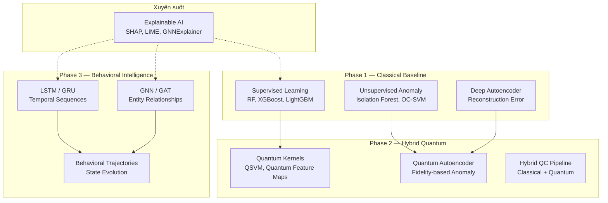
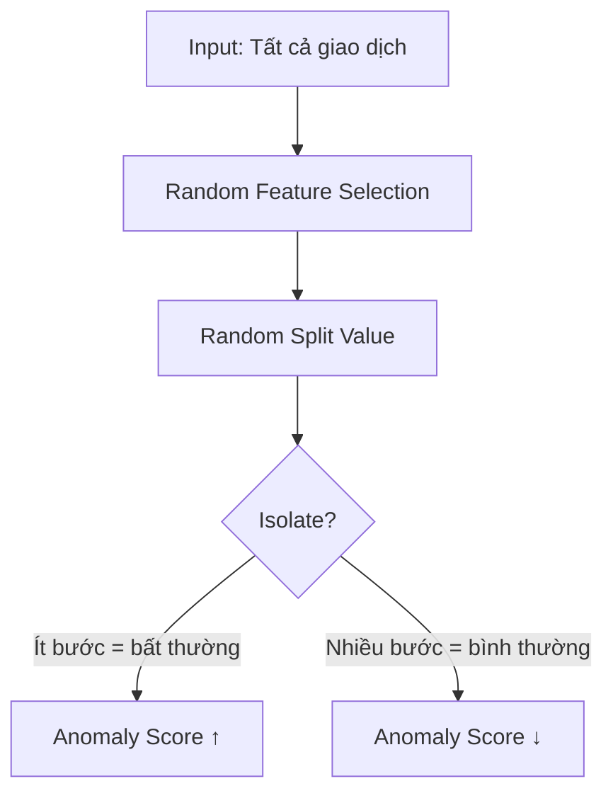
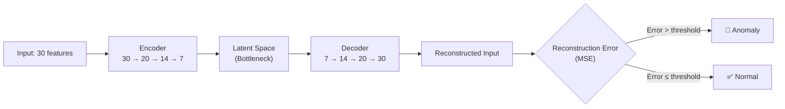
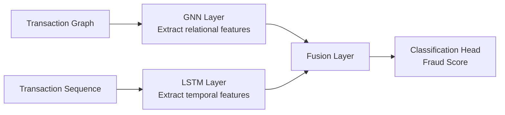
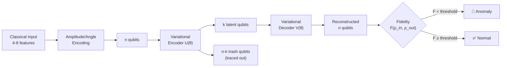
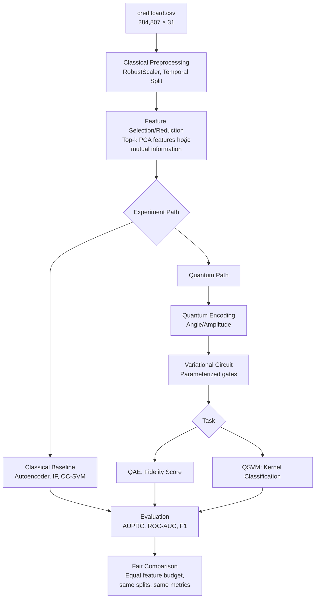
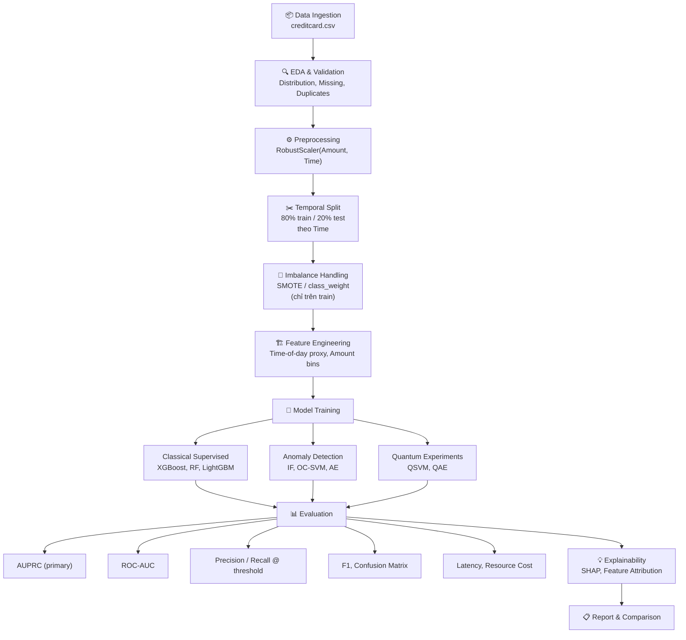

# Research Synthesis: Credit Card Fraud Detection

> Tổng hợp các phương pháp, pipeline, và cấu trúc dự án liên quan đến phát hiện gian lận thẻ tín dụng trên bộ dữ liệu Kaggle `creditcard.csv`, ánh xạ theo roadmap của dự án [Sentinel](file:///d:/uni/AIfraud/sentinel/README.md).

---

## Mục lục

1. [Tổng quan phương pháp](#1-tổng-quan-phương-pháp)
2. [Classical Supervised Baselines](#2-classical-supervised-baselines)
3. [Unsupervised & Anomaly Detection](#3-unsupervised--anomaly-detection)
4. [Deep Learning Approaches](#4-deep-learning-approaches)
5. [Quantum & Hybrid Methods](#5-quantum--hybrid-methods)
6. [Explainable AI (XAI)](#6-explainable-ai-xai)
7. [Pipeline & Evaluation Protocol](#7-pipeline--evaluation-protocol)
8. [Cấu trúc dự án khuyến nghị](#8-cấu-trúc-dự-án-khuyến-nghị)
9. [Ánh xạ với Sentinel Roadmap](#9-ánh-xạ-với-sentinel-roadmap)
10. [Tài liệu tham khảo](#10-tài-liệu-tham-khảo)

---

## 1. Tổng quan phương pháp



| Nhóm phương pháp | Mục tiêu | Ưu điểm | Hạn chế | Sentinel Phase |
|---|---|---|---|---|
| **Supervised Ensemble** | Phân loại fraud/non-fraud | Hiệu suất cao, dễ triển khai | Phụ thuộc nhãn, không phát hiện fraud mới | Phase 1 |
| **Unsupervised Anomaly** | Phát hiện bất thường | Không cần nhãn, phát hiện fraud chưa biết | False positive cao | Phase 1 |
| **Deep Learning** | Temporal + relational patterns | Nắm bắt pattern phức tạp | Cần nhiều dữ liệu, khó giải thích | Phase 3 |
| **Quantum/Hybrid** | Biểu diễn không gian Hilbert | Tiềm năng nắm bắt phi tuyến sâu | Hạn chế phần cứng, chưa chứng minh advantage | Phase 2 |
| **Explainable AI** | Giải thích quyết định | Audit, compliance, trust | Chi phí tính toán thêm | Xuyên suốt |

---

## 2. Classical Supervised Baselines

### 2.1 Các thuật toán phổ biến nhất

#### Random Forest
- **Cơ chế**: Ensemble nhiều decision trees, mỗi cây huấn luyện trên random subset
- **Hiệu suất trên creditcard.csv**: ROC-AUC ~0.95–0.97, AUPRC ~0.75–0.85
- **Ưu điểm**: Ổn định, ít overfit, có feature importance tích hợp
- **Tham số chính**: `n_estimators`, `max_depth`, `class_weight='balanced'`

#### XGBoost / LightGBM / CatBoost
- **Cơ chế**: Gradient boosting — xây cây tuần tự, mỗi cây sửa lỗi của cây trước
- **Hiệu suất**: Thường cao nhất trong các classical methods
  - XGBoost: ROC-AUC ~0.97–0.98, AUPRC ~0.80–0.87
  - LightGBM: Tốc độ nhanh hơn XGBoost 2–5x, hiệu suất tương đương
- **Tham số chính**: `scale_pos_weight` (= n_negative/n_positive ≈ 578), `learning_rate`, `max_depth`

#### Logistic Regression
- **Vai trò**: Baseline đơn giản nhất, dùng để so sánh
- **Hiệu suất**: ROC-AUC ~0.93–0.95
- **Ưu điểm**: Interpretable, nhanh, probabilistic output

### 2.2 Xử lý Class Imbalance

| Kỹ thuật | Mô tả | Ưu điểm | Nhược điểm |
|---|---|---|---|
| **SMOTE** | Tạo mẫu tổng hợp minority bằng interpolation giữa k-nearest neighbors | Chuẩn mực phổ biến nhất | Có thể tạo noise ở biên |
| **SMOTE-Tomek** | SMOTE + loại bỏ Tomek links (cặp gần nhất khác class) | Sạch biên hơn SMOTE | Chi phí tính toán cao hơn |
| **SMOTE-ENN** | SMOTE + Edited Nearest Neighbors (loại bỏ mẫu bị misclassify bởi k-NN) | Giảm overlap giữa classes | Mất thêm dữ liệu majority |
| **Random Undersampling** | Giảm majority class ngẫu nhiên | Đơn giản, nhanh | Mất thông tin |
| **Class Weight** | Điều chỉnh trọng số loss function (ví dụ: `scale_pos_weight=578`) | Không thay đổi dữ liệu | Chỉ hiệu quả với một số model |
| **Cost-Sensitive** | Trọng số theo giá trị giao dịch (`Amount`) | Phản ánh thực tế kinh doanh | Cần thiết kế cost matrix phù hợp |

> [!TIP]
> **Khuyến nghị cho Sentinel Phase 1**: Bắt đầu với `class_weight='balanced'` hoặc `scale_pos_weight`. Sau đó thử SMOTE-ENN nếu cần cải thiện recall. Kaggle gợi ý dùng `Amount` cho cost-sensitive learning — rất phù hợp với vision "anomaly is not fraud" của Sentinel.

### 2.3 Pipeline mẫu (Supervised)

```python
# Pseudocode — Classical Supervised Pipeline
# ==========================================

# 1. Load & Validate
df = pd.read_csv("datasets/creditcard.csv")
assert df.isnull().sum().sum() == 0

# 2. Preprocessing
from sklearn.preprocessing import RobustScaler
scaler = RobustScaler()
df['Amount_scaled'] = scaler.fit_transform(df[['Amount']])
df['Time_scaled'] = scaler.fit_transform(df[['Time']])
df.drop(['Amount', 'Time'], axis=1, inplace=True)

# 3. Temporal Split (KHÔNG dùng random split — leakage risk)
split_time = df['Time_scaled'].quantile(0.80)
train = df[df['Time_scaled'] <= split_time]
test  = df[df['Time_scaled'] > split_time]

# 4. Handle Imbalance (chỉ trên train set!)
from imblearn.over_sampling import SMOTE
smote = SMOTE(random_state=42)
X_train_res, y_train_res = smote.fit_resample(X_train, y_train)

# 5. Train
from xgboost import XGBClassifier
model = XGBClassifier(
    scale_pos_weight=len(y_train[y_train==0]) / len(y_train[y_train==1]),
    eval_metric='aucpr'
)
model.fit(X_train_res, y_train_res)

# 6. Evaluate
from sklearn.metrics import average_precision_score, roc_auc_score
y_pred_proba = model.predict_proba(X_test)[:, 1]
auprc = average_precision_score(y_test, y_pred_proba)
auroc = roc_auc_score(y_test, y_pred_proba)
```

> [!WARNING]
> **Temporal Split rất quan trọng!** Random train/test split gây temporal leakage — model "nhìn thấy tương lai" → kết quả lạc quan giả. Handbook của ULB nhấn mạnh phải dùng split theo thời gian.

---

## 3. Unsupervised & Anomaly Detection

Đây là nhóm phương pháp **quan trọng nhất** với vision của Sentinel: *"Learn the normal world first; detect deviations from it second."*

### 3.1 Isolation Forest



- **Cơ chế**: Cô lập điểm dữ liệu bằng random partitions; anomalies dễ cô lập hơn → path ngắn hơn
- **Ưu điểm**: Nhanh (O(n log n)), không cần nhãn, scalable cho dữ liệu lớn
- **Tham số chính**: `contamination` (≈ 0.00173 cho dataset này), `n_estimators`, `max_features`
- **Hiệu suất trên creditcard.csv**: ROC-AUC ~0.94–0.96

### 3.2 One-Class SVM (OC-SVM)

- **Cơ chế**: Học boundary quanh dữ liệu "bình thường" (chỉ train trên class 0). Điểm nằm ngoài boundary → anomaly
- **Kernel phổ biến**: RBF kernel
- **Ưu điểm**: Mạnh về lý thuyết, kernel trick cho phi tuyến
- **Nhược điểm**: Chậm trên dataset lớn (O(n²–n³)), nhạy cảm với hyperparameters
- **Liên quan Sentinel**: Tiền thân trực tiếp của Quantum SVM → có thể so sánh OC-SVM classical vs QSVM

### 3.3 Classical Autoencoder (Deep)



- **Cơ chế**: Train chỉ trên non-fraud → học nén và tái tạo "hành vi bình thường". Fraud → reconstruction error cao
- **Kiến trúc phổ biến**: 30 → 20 → 14 → 7 → 14 → 20 → 30 (với ReLU/tanh)
- **Loss function**: MSE hoặc Binary Cross-Entropy
- **Threshold**: Percentile trên reconstruction error (ví dụ: P95 hoặc P99 của validation set)
- **Hiệu suất**: ROC-AUC ~0.95–0.97, AUPRC phụ thuộc threshold selection

**Biến thể nâng cao:**

| Biến thể | Đặc điểm | Ưu điểm |
|---|---|---|
| **Variational AE (VAE)** | Latent space tuân theo phân phối, KL divergence loss | Tốt hơn cho anomaly scoring liên tục |
| **Sparse AE** | Thêm L1 penalty để ép sparsity | Nổi bật features quan trọng |
| **Denoising AE** | Thêm noise vào input, buộc model học robust representation | Chống overfitting |
| **Convolutional AE** | Dùng Conv1D cho temporal patterns | Nắm bắt local patterns |

> [!IMPORTANT]
> **Liên quan trực tiếp Sentinel**: Autoencoder classical là baseline so sánh cho Quantum Autoencoder (Phase 2). Kiến trúc bottleneck → tương đương qubit compression trong QAE. Reconstruction error → tương đương (1 − Fidelity) trong quantum.

### 3.4 So sánh phương pháp Anomaly Detection

| Phương pháp | Cần nhãn | Scalability | Interpretability | Phát hiện fraud mới | ROC-AUC (ước lượng) |
|---|---|---|---|---|---|
| Isolation Forest | ❌ | ⭐⭐⭐ | ⭐⭐ | ⭐⭐⭐ | 0.94–0.96 |
| One-Class SVM | ❌ | ⭐ | ⭐ | ⭐⭐ | 0.92–0.95 |
| Autoencoder | ❌ | ⭐⭐⭐ | ⭐ | ⭐⭐⭐ | 0.95–0.97 |
| LOF | ❌ | ⭐⭐ | ⭐⭐ | ⭐⭐ | 0.90–0.94 |
| DBSCAN | ❌ | ⭐⭐ | ⭐⭐ | ⭐⭐ | 0.88–0.92 |

---

## 4. Deep Learning Approaches

### 4.1 Feedforward Neural Networks

- **Kiến trúc**: Fully Connected layers (30 → 64 → 32 → 16 → 1)
- **Activation**: ReLU (hidden), Sigmoid (output)
- **Xử lý imbalance**: Class weights trong loss function hoặc SMOTE trước training
- **Hiệu suất**: Tương đương ensemble methods (ROC-AUC ~0.96–0.98)

### 4.2 LSTM / GRU (Temporal Sequence)

> [!NOTE]
> Với dataset `creditcard.csv`, LSTM **không phát huy tối đa** do không có customer ID để tạo transaction sequences. Tuy nhiên, đây là phương pháp quan trọng cho Sentinel Phase 3.

**Cơ chế trên creditcard.csv:**
- Sắp xếp giao dịch theo `Time`
- Tạo sliding window (ví dụ: 10 giao dịch liên tiếp) → mỗi window = 1 sequence
- LSTM học pattern temporal: "sau một chuỗi giao dịch nhỏ liên tục → giao dịch lớn bất thường"

**Kiến trúc phổ biến:**
```
Input (sequence_length × 30) → LSTM(64) → LSTM(32) → Dense(16) → Dense(1, sigmoid)
```

**Khi có customer ID (Phase 3 vision):**
```
Per-customer transaction sequence → LSTM → Behavioral State → Expected Next State
Observed Transaction → Compare with Expected → Deviation Score
```

### 4.3 Graph Neural Networks (GNN)

> [!NOTE]
> GNN **không áp dụng trực tiếp** cho `creditcard.csv` vì thiếu entity relationships. Nhưng đây là hướng quan trọng cho Sentinel Phase 3.

**Cách xây dựng transaction graph:**
- **Nodes**: Customers, Merchants, Devices, Cards
- **Edges**: Transactions (với features: amount, time, location)
- **GNN types**: 
  - **GCN** (Graph Convolutional Network) — aggregation đơn giản
  - **GAT** (Graph Attention Network) — weighted attention trên neighbors
  - **GraphSAGE** — inductive learning, xử lý nodes mới

**Ứng dụng fraud detection:**
- Phát hiện **fraud rings**: nhóm accounts phối hợp gian lận
- **Money laundering patterns**: chuỗi transactions qua nhiều nodes
- **Device fingerprint sharing**: nhiều cards dùng chung device

### 4.4 Hybrid: GNN + LSTM



Kết hợp **spatial** (ai giao dịch với ai) + **temporal** (diễn biến theo thời gian) → state-of-the-art cho fraud detection ở quy mô sản xuất.

---

## 5. Quantum & Hybrid Methods

### 5.1 Quantum Feature Maps & Quantum Kernels

**Cơ chế:**
1. Encode classical data vào quantum states qua parameterized circuit (feature map)
2. Tính kernel matrix K(x_i, x_j) = |⟨φ(x_i)|φ(x_j)⟩|² (inner product trong Hilbert space)
3. Dùng kernel matrix với classical SVM

**Feature Map phổ biến:**

| Feature Map | Mô tả | Qubits | Circuit Depth |
|---|---|---|---|
| **ZZFeatureMap** | Entanglement-based, captures pairwise interactions | n_features | O(n²) |
| **ZFeatureMap** | Rotation-only, no entanglement | n_features | O(n) |
| **PauliFeatureMap** | Generalized Pauli rotations | n_features | Configurable |

**Thực tế trên creditcard.csv:**
- 28 PCA features → cần ≥28 qubits (hiện tại quá nhiều cho NISQ hardware)
- **Giải pháp**: Giảm xuống 4–8 features bằng PCA thêm hoặc feature selection → 4–8 qubits
- **Framework**: Qiskit (`qiskit-machine-learning`), PennyLane

```python
# Pseudocode — Quantum Kernel SVM
from qiskit.circuit.library import ZZFeatureMap
from qiskit_machine_learning.kernels import FidelityQuantumKernel
from sklearn.svm import SVC

# Feature map (4 qubits = 4 selected features)
feature_map = ZZFeatureMap(feature_dimension=4, reps=2)

# Quantum kernel
quantum_kernel = FidelityQuantumKernel(feature_map=feature_map)

# Classical SVM with quantum kernel
qsvm = SVC(kernel=quantum_kernel.evaluate)
qsvm.fit(X_train_reduced, y_train)
```

### 5.2 Quantum Autoencoder (QAE)

**Cơ chế:**
1. Encode data vào n qubits
2. Variational circuit nén thông tin vào k < n qubits (trash qubits bị traced out)
3. Train bằng fidelity maximization: max F(ρ_in, ρ_out) trên dữ liệu bình thường
4. Anomaly detection: F(fraud) < F(normal) → low fidelity = anomaly



**Encoding strategies:**

| Strategy | Mô tả | Qubits cần | Ưu điểm | Nhược điểm |
|---|---|---|---|---|
| **Angle Encoding** | 1 feature → 1 rotation (Ry hoặc Rz) | n_features | Đơn giản, robust với noise | 1 qubit/feature |
| **Amplitude Encoding** | Encode 2^n features vào n qubits | log₂(n_features) | Data-dense | Circuit sâu, nhạy noise |

**Fidelity-based Anomaly Scoring (FiD-QAE):**
- Dùng **SWAP test** hoặc **destructive SWAP** để estimate fidelity
- Anomaly score = 1 − Fidelity
- Train bằng cost function: C(θ) = 1 − E[F(ρ_in, U†(θ)V(θ)ρ_in)]

### 5.3 Hybrid Classical-Quantum Pipeline



### 5.4 Những điều cần lưu ý

> [!WARNING]
> **Giới hạn thực tế của quantum trên creditcard.csv:**
> - 28 PCA features → phải reduce xuống 4–8 cho NISQ devices
> - Simulator chậm exponentially: ~16 qubits là giới hạn thực tế
> - Noise trên hardware thật có thể phá hủy tín hiệu anomaly
> - Chưa có bằng chứng quantum advantage cho dataset này

**Controlled comparison checklist** (từ README Sentinel):
- [ ] Cùng feature budget (cùng số features cho cả classical và quantum)
- [ ] Cùng temporal split
- [ ] Cùng imbalance handling
- [ ] Cùng evaluation metrics
- [ ] Document qubit count, circuit depth, parameter count
- [ ] Document noise model nếu có
- [ ] Random seeds reproducible

---

## 6. Explainable AI (XAI)

### 6.1 SHAP (SHapley Additive exPlanations)

**Cơ chế**: Dựa trên game theory — tính contribution của mỗi feature cho từng prediction

- **Global explanation**: Feature importance trung bình trên toàn dataset
- **Local explanation**: Tại sao giao dịch cụ thể X bị flag là fraud?

```python
import shap

# TreeSHAP cho ensemble models (nhanh)
explainer = shap.TreeExplainer(xgboost_model)
shap_values = explainer.shap_values(X_test)

# Summary plot — global
shap.summary_plot(shap_values, X_test)

# Force plot — local (1 giao dịch)
shap.force_plot(explainer.expected_value, shap_values[0], X_test.iloc[0])
```

**Output mẫu cho 1 giao dịch fraud:**
```
Base value: 0.0017 (population fraud rate)
→ V14 = -5.2  pushes toward fraud (+0.35)
→ V17 = -4.8  pushes toward fraud (+0.28)
→ V12 = -3.1  pushes toward fraud (+0.15)
→ Amount = $1.98  pushes toward fraud (+0.08)
→ V4 = 3.2   pushes toward fraud (+0.06)
Final prediction: 0.92 (high fraud probability)
```

### 6.2 LIME (Local Interpretable Model-agnostic Explanations)

**Cơ chế**: Tạo perturbation quanh 1 sample, fit model tuyến tính cục bộ → giải thích locally

- Model-agnostic: hoạt động với bất kỳ model nào
- Nhanh cho single prediction
- Nhưng: không ổn định (khác nhau giữa các lần chạy)

### 6.3 So sánh SHAP vs LIME

| Tiêu chí | SHAP | LIME |
|---|---|---|
| Lý thuyết | Game theory (Shapley values) — consistent | Linear approximation — có thể inconsistent |
| Scope | Global + Local | Chỉ Local |
| Tốc độ | TreeSHAP nhanh; KernelSHAP chậm | Nhanh cho single sample |
| Stability | Deterministic | Stochastic (thay đổi mỗi lần chạy) |
| **Khuyến nghị** | **✅ Ưu tiên cho Sentinel** | Bổ trợ khi cần giải thích nhanh |

> [!TIP]
> **Cho Sentinel**: SHAP phù hợp nhất vì:
> 1. Consistent với lý thuyết → đáp ứng "explainability by design"
> 2. Global + Local → vừa hiểu hệ thống, vừa giải thích từng case
> 3. TreeSHAP tích hợp tốt với XGBoost/LightGBM
> 4. Tuy V1–V28 là PCA (không có ý nghĩa kinh doanh), SHAP vẫn cho biết *feature nào quan trọng nhất* cho từng quyết định

---

## 7. Pipeline & Evaluation Protocol

### 7.1 End-to-End Pipeline



### 7.2 Evaluation Metrics (Chi tiết)

| Metric | Công thức / Ý nghĩa | Tại sao quan trọng | Ưu tiên |
|---|---|---|---|
| **AUPRC** | Area under Precision-Recall curve | Robust cho extreme imbalance; Kaggle recommended | ⭐⭐⭐ Primary |
| **ROC-AUC** | Area under ROC curve | Tổng quan khả năng phân biệt | ⭐⭐ Secondary |
| **Precision @ K** | Trong top-K alerts, bao nhiêu đúng? | Thực tế: analyst chỉ review ~100 alerts/ngày | ⭐⭐ |
| **Recall** | TP / (TP + FN) | Bắt được bao nhiêu % fraud? | ⭐⭐ |
| **F1-Score** | 2 × P × R / (P + R) | Balance giữa precision và recall | ⭐ |
| **CP@k** | Card Precision top-k (ULB metric) | Số cards trong top-k alerts là thực sự fraud | ⭐⭐ |

### 7.3 Temporal Split Protocol

```
┌──────────────────────────────────────────────────────────┐
│                    Time (0 → 172,792s)                    │
│                                                          │
│  ◄──── 80% Train ────►│◄── 20% Test ──►                │
│  t=0              t=~138,000     t=172,792               │
│                                                          │
│  ⚠️ SMOTE chỉ áp dụng          Không SMOTE!             │
│     trên train set               Giữ nguyên              │
│                                  phân bố thật             │
└──────────────────────────────────────────────────────────┘
```

> [!CAUTION]
> **Data leakage traps to avoid:**
> 1. ❌ Random train/test split → model thấy giao dịch "tương lai"
> 2. ❌ SMOTE trước split → synthetic samples leak vào test
> 3. ❌ Scaling fit trên toàn dataset → test statistics leak vào train
> 4. ❌ Feature selection dựa trên toàn dataset → target leakage

### 7.4 ULB Fraud Detection Handbook

Tài liệu tham khảo chính thức từ nhóm tác giả dataset:
- **URL**: https://fraud-detection-handbook.github.io/fraud-detection-handbook/
- **Nội dung**: Jupyter notebooks reproducible, covering:
  - Simulated transaction data generator
  - Feature engineering methodology
  - Model training & evaluation
  - Temporal validation strategies
  - CP@k metric definition
  - Adversarial non-stationarity discussion

---

## 8. Cấu trúc dự án khuyến nghị

### 8.1 Cookiecutter Data Science (Chuẩn công nghiệp)

```text
sentinel/
├── README.md                    # Project vision & documentation
├── pyproject.toml               # Dependencies (uv)
├── .gitignore                   # Exclude datasets/, models/, .venv/
│
├── datasets/                    # 📦 Data (gitignored)
│   ├── raw/
│   │   └── creditcard.csv       # Original, immutable
│   └── processed/
│       ├── train.parquet        # After preprocessing + temporal split
│       └── test.parquet
│
├── src/                         # 🔧 Core source code
│   ├── __init__.py
│   ├── data/
│   │   ├── loader.py            # Data ingestion & validation
│   │   ├── preprocessor.py      # Scaling, cleaning
│   │   └── splitter.py          # Temporal split logic
│   ├── features/
│   │   ├── classical.py         # Feature engineering
│   │   └── quantum_encoding.py  # Quantum feature maps
│   ├── models/
│   │   ├── baselines.py         # RF, XGBoost, LR
│   │   ├── anomaly.py           # IF, OC-SVM, AE
│   │   ├── deep.py              # NN, LSTM
│   │   └── quantum.py           # QSVM, QAE
│   ├── evaluation/
│   │   ├── metrics.py           # AUPRC, ROC-AUC, CP@k
│   │   ├── comparison.py        # Fair comparison framework
│   │   └── explainability.py    # SHAP, LIME wrappers
│   └── config.py                # Hyperparameters, paths, seeds
│
├── notebooks/                   # 📓 Exploration & prototyping
│   ├── 01_eda.ipynb
│   ├── 02_classical_baseline.ipynb
│   ├── 03_anomaly_detection.ipynb
│   ├── 04_quantum_experiments.ipynb
│   └── 05_explainability.ipynb
│
├── experiments/                 # 🧪 Experiment tracking
│   └── results/
│       ├── classical/
│       ├── anomaly/
│       └── quantum/
│
├── models/                      # 💾 Saved models (gitignored)
│   └── .gitkeep
│
├── tests/                       # ✅ Unit tests
│   ├── test_preprocessor.py
│   ├── test_metrics.py
│   └── test_splitter.py
│
└── docs/                        # 📚 Documentation
    ├── architecture.md
    ├── evaluation_protocol.md
    └── quantum_research.md
```

### 8.2 Design Principles cho Code

| Nguyên tắc | Mô tả | Ví dụ |
|---|---|---|
| **Separation of Concerns** | Mỗi module 1 trách nhiệm | `preprocessor.py` không chứa model code |
| **Config-Driven** | Hyperparams trong config, không hardcode | `config.py` hoặc `config.yaml` |
| **Reproducible** | Fixed seeds, versioned data, logged experiments | `random_state=42` everywhere |
| **Leakage-Safe** | Transform fit chỉ trên train | `scaler.fit(X_train)` rồi `scaler.transform(X_test)` |
| **Testable** | Unit tests cho preprocessing & metrics | `assert temporal_split_no_leakage(train, test)` |

---

## 9. Ánh xạ với Sentinel Roadmap

### Phase 0 → Research Contract

| Task | Phương pháp tham khảo | Ghi chú |
|---|---|---|
| Canonical data schema | Cookiecutter DS | Xem Section 8.1 |
| Define anomaly vs risk vs fraud labels | OC-SVM, Autoencoder literature | Anomaly score ≠ fraud probability |
| Leakage-safe temporal splits | ULB Handbook | Xem Section 7.3 |
| Evaluation protocol | AUPRC + CP@k | Xem Section 7.2 |

### Phase 1 → Classical Behavioral Baseline

| Task | Phương pháp | Priority |
|---|---|---|
| Data pipeline | RobustScaler + temporal split | ⭐⭐⭐ |
| Temporal features | Time-of-day proxy, velocity | ⭐⭐⭐ |
| Supervised baselines | XGBoost, LightGBM, RF | ⭐⭐⭐ |
| Unsupervised baselines | Isolation Forest, Autoencoder | ⭐⭐⭐ |
| Anomaly scores | Reconstruction error, isolation depth | ⭐⭐⭐ |
| Explainability | SHAP (TreeSHAP) | ⭐⭐ |

### Phase 2 → Hybrid Anomaly Layer

| Task | Phương pháp | Framework |
|---|---|---|
| Quantum kernels | ZZFeatureMap + SVM | Qiskit / PennyLane |
| QAE fidelity anomaly | Angle Encoding + VQC | PennyLane |
| Classical vs Quantum comparison | Equal feature budget | Custom evaluation |
| Noise-aware evaluation | Noise models | Qiskit Aer |

### Phase 3 → Behavioral State Intelligence

| Task | Phương pháp | Yêu cầu dữ liệu |
|---|---|---|
| Temporal modeling | LSTM / GRU sequences | Customer ID (cần dataset mới) |
| Entity relationships | GNN / GAT | Customer-Merchant graph |
| Behavioral trajectories | State evolution + deviation | Lịch sử giao dịch dài hạn |
| Hybrid GNN-LSTM | Spatial + temporal fusion | Rich relational dataset |

> [!IMPORTANT]
> **Phase 3 không thể thực hiện đầy đủ trên `creditcard.csv`** do thiếu entity IDs. Cần bổ sung dataset như:
> - **ULB Fraud Simulator**: https://fraud-detection-handbook.github.io/fraud-detection-handbook/Chapter_3_GettingStarted/SimulatedDataset.html
> - **IEEE-CIS Fraud Detection** (Kaggle): Có deviceType, browser, card info
> - **Synthetic datasets**: Sparkov, BankSim

---

## 10. Tài liệu tham khảo

### Sách & Handbook
1. Le Borgne, Bontempi — *Reproducible Machine Learning for Credit Card Fraud Detection - Practical Handbook* (ULB)
2. Dal Pozzolo — *Adaptive Machine Learning for Credit Card Fraud Detection* (PhD Thesis, ULB)

### Papers gốc (ULB dataset)
3. Dal Pozzolo et al. — *Calibrating Probability with Undersampling for Unbalanced Classification* (CIDM, IEEE, 2015)
4. Dal Pozzolo et al. — *Credit card fraud detection: a realistic modeling and a novel learning strategy* (IEEE TNNLS, 2018)
5. Carcillo et al. — *Combining Unsupervised and Supervised Learning in Credit Card Fraud Detection* (Information Sciences, 2019)

### Quantum ML & Fraud
6. CERN — Quantum-enhanced feature selection for fraud detection (quantum.cern)
7. Fraunhofer — Quantum Autoencoder for anomaly detection in financial data
8. FiD-QAE — Fidelity-based Quantum Autoencoder for anomaly detection (arXiv)
9. CSIRO — Quantum ML for credit card fraud detection survey (research.csiro.au)

### Deep Learning & GNN
10. NVIDIA — GNN for fraud detection at scale (nvidia.com)
11. Various — LSTM + Attention for sequential transaction modeling

### Explainability
12. Lundberg & Lee — *A Unified Approach to Interpreting Model Predictions* (SHAP, NeurIPS 2017)
13. Ribeiro et al. — *"Why Should I Trust You?": Explaining the Predictions of Any Classifier* (LIME, KDD 2016)

### Frameworks
14. **Qiskit**: https://qiskit.org/ (IBM, quantum circuits + ML)
15. **PennyLane**: https://pennylane.ai/ (Xanadu, hybrid quantum-classical)
16. **imbalanced-learn**: https://imbalanced-learn.org/ (SMOTE, resampling)
17. **SHAP**: https://shap.readthedocs.io/
