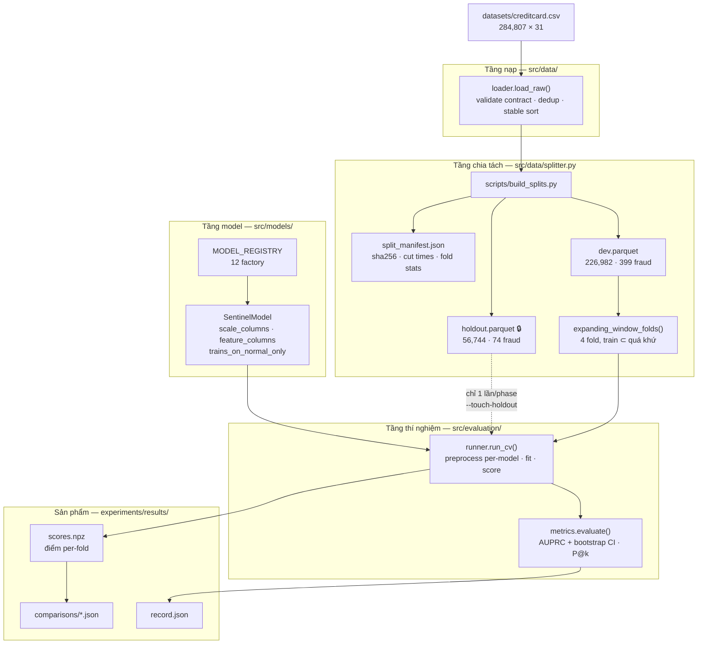

# Nhật ký xây dựng Sentinel

> Ghi lại toàn bộ quá trình: khảo sát, quyết định thiết kế, kiến trúc, code đã viết, lệnh đã chạy, lỗi đã sửa và kết quả đo được.
>
> | Giai đoạn | Ngày | Nội dung | Mục |
> |---|---|---|---|
> | **Phase 0** | 2026-07-31 | Research contract — dựng bộ khung đo lường | 3–13 |
> | **Phase 1a** | 2026-08-01 | Model layer + supervised baselines | 14–20 |
> | **Phase 1b** | 2026-08-01 | Anomaly layer + novel-fraud experiment | 21–27 |
> | **Audit & Design** | 2026-08-05 | Kiểm toán trạng thái, dataset thứ hai, thiết kế kiến trúc tầng | 28–36 |
>
> Trạng thái hiện tại: **150 test pass**, 12 model đã chạy qua protocol, 8 paired comparison, 1 thí nghiệm novel-fraud. Holdout **chưa bị chạm**.
>
> **Phase 1 thực chất mới xong 2/4 hạng mục** — xem [mục 29](#29-kiểm-toán-2--đang-ở-phase-nào-thật-sự).

---

## Mục lục

**Tổng quan**
1. [Timeline hội thoại](#1-timeline-hội-thoại)
2. [Kiến trúc dự án](#2-kiến-trúc-dự-án)

**Phần I — Phase 0: Research Contract**

3. [Trạng thái ban đầu](#3-trạng-thái-ban-đầu) ·
4. [Khảo sát repo](#4-khảo-sát-repo) ·
5. [Phép đo chẩn đoán](#5-phép-đo-chẩn-đoán-quyết-định-toàn-bộ-hướng-đi) ·
6. [Ba quyết định chốt](#6-ba-quyết-định-chốt) ·
7. [Code đã viết](#7-code-đã-viết-phase-0) ·
8. [Lệnh đã chạy](#8-lệnh-đã-chạy-phase-0) ·
9. [Lỗi đã sửa](#9-lỗi-đã-sửa-phase-0) ·
10. [Tác dụng phụ](#10-tác-dụng-phụ-ngoài-ý-muốn) ·
11. [Kiểm chứng](#11-kết-quả-kiểm-chứng-phase-0) ·
12. [Tồn đọng](#12-tồn-đọng-sau-phase-0) ·
13. [Bước tiếp](#13-bước-tiếp-theo-ghi-cuối-phase-0)

**Phần II — Phase 1a: Model layer**

14. [Kiểm tra ràng buộc](#14-kiểm-tra-ràng-buộc-trước-khi-bắt-đầu) ·
15. [Code đã viết](#15-code-đã-viết-phase-1a) ·
16. [Lệnh đã chạy](#16-lệnh-đã-chạy-phase-1a) ·
17. [Lỗi đã sửa](#17-lỗi-đã-sửa-phase-1a) ·
18. [Kết quả](#18-kết-quả-phase-1a) ·
19. [Tồn đọng](#19-tồn-đọng-sau-phase-1a) ·
20. [Bước tiếp](#20-bước-tiếp-theo-ghi-cuối-phase-1a)

**Phần III — Phase 1b: Anomaly layer**

21. [Sự cố rollback](#21-sự-cố-rollback-giữa-chừng) ·
22. [Code đã viết](#22-code-đã-viết-phase-1b) ·
23. [Lỗi đã sửa](#23-lỗi-đã-sửa-phase-1b) ·
24. [Novel-fraud holdout](#24-novel-fraud-holdout-thiết-kế) ·
25. [Kết quả](#25-kết-quả-phase-1b) ·
26. [Tồn đọng](#26-tồn-đọng-sau-phase-1b) ·
27. [Bước tiếp](#27-bước-tiếp-theo)

**Phần IV — Audit & Design (2026-08-05)**

28. [Kiểm toán 1 — feature engineering](#28-kiểm-toán-1--feature-engineering) ·
29. [Kiểm toán 2 — đang ở phase nào](#29-kiểm-toán-2--đang-ở-phase-nào-thật-sự) ·
30. [Phân tích khả thi quantum](#30-phân-tích-khả-thi-quantum) ·
31. [Dataset thứ hai — IEEE-CIS](#31-dataset-thứ-hai--ieee-cis) ·
32. [Rà soát PURE_PIPELINE.md](#32-rà-soát-pure_pipelinemd) ·
33. [Tranh luận về trục track A/B/C](#33-tranh-luận-về-trục-track-abc) ·
34. [Phán quyết EWC](#34-phán-quyết-ewc) ·
35. [Tài liệu đã tạo](#35-tài-liệu-đã-tạo) ·
36. [Tồn đọng & bước tiếp](#36-tồn-đọng--bước-tiếp)

**Phụ lục**

- [A. Cây thư mục](#phụ-lục-a--cây-thư-mục-đầy-đủ) ·
- [B. Bảng kết quả tổng hợp](#phụ-lục-b--bảng-kết-quả-tổng-hợp) ·
- [C. Sổ tay lệnh](#phụ-lục-c--sổ-tay-lệnh) ·
- [D. Thống kê codebase](#phụ-lục-d--thống-kê-codebase)

---

## 1. Timeline hội thoại

| # | Yêu cầu | Kết quả |
|---|---|---|
| 1 | *"Đọc README cùng các file khác để hiểu dự án, cho tôi biết bước đầu tiên là gì"* | Khảo sát + [phép đo chẩn đoán](#5-phép-đo-chẩn-đoán-quyết-định-toàn-bộ-hướng-đi) → đề xuất Phase 0 |
| 2 | *"ok tiến hành"* | Dựng toàn bộ evaluation harness (47 test) |
| 3 | *"note lại toàn bộ những gì bạn đã làm"* | Tạo `history.md` |
| 4 | *"công việc tiếp theo là gì"* | Đề xuất model layer + supervised baselines |
| 5 | *"ok tôi đồng ý, tiến hành đi"* | Phase 1a (90 test) |
| 6 | *"vậy công việc tiếp theo là gì"* | Đề xuất anomaly layer 4 bước |
| 7 | *"tôi đồng ý, tiến hành đi"* | Bắt đầu Phase 1b → **rollback giữa chừng** |
| 8 | *"tiến hành làm theo đề xuất công việc ở trên đi"* | Làm lại + hoàn tất Phase 1b (150 test) |
| 9 | *"update thật chi tiết... vào history.md"* | Viết lại toàn bộ tài liệu này |
| 10 | *"coi tôi là người chả biết gì... viết details toàn bộ dự án"* | Tạo [`docs/project_guide.md`](docs/project_guide.md) |
| 11 | *"có đang làm theo dự án Kaggle nào không"* | Không — chưa truy cập internet lần nào; nguồn ảnh hưởng là `research_synthesis.md` của chính dự án |
| 12 | *"feature engineering xây dựng như nào"* | [Kiểm toán](#28-kiểm-toán-1--feature-engineering) → **gần như không có** |
| 13 | *"đã làm đến phase nào rồi"* | [Kiểm toán](#29-kiểm-toán-2--đang-ở-phase-nào-thật-sự) → **Phase 1 mới 2/4**, đính chính project_guide |
| 14 | *"dataset không phù hợp phase 3 phải không"* | [Ba phán quyết khác nhau](#30-phân-tích-khả-thi-quantum) cho quantum / behavior / anomaly |
| 15 | *"xem PURE_PIPELINE có ổn không + áp dụng 2 dataset thế nào"* | [Rà soát](#32-rà-soát-pure_pipelinemd) + đo IEEE-CIS |
| 16 | *"cấu trúc model sẽ như nào cho cả 2 dataset"* | Thiết kế kiến trúc 5 tầng |
| 17 | *"viết vào PIPELINE.md"* | Tạo [`PIPELINE.md`](PIPELINE.md) |
| 18 | *"đọc kĩ phase 3 PURE_PIPELINE, vì sao không dùng được"* | [Ba phát hiện sâu hơn](#32-rà-soát-pure_pipelinemd) — Elkan-Noto vô hiệu, nnPU không cài đặt, Rademacher là nhãn dán |
| 19 | *"muốn cả supervised, unsupervised, và kết hợp; dataset chỉ là adapter"* | [Trục track A/B/C](#33-tranh-luận-về-trục-track-abc) + phản biện nửa sau |
| 20 | *"tạo pipeline v2 + có nên dùng EWC"* | [Phán quyết EWC](#34-phán-quyết-ewc) + tạo [`PIPELINE_V2.md`](PIPELINE_V2.md) |
| 21 | *"ghi nhật ký session này"* | Phần IV của tài liệu này |

---

## 2. Kiến trúc dự án

### 2.1 Luồng dữ liệu



### 2.2 Trách nhiệm từng tầng

| Tầng | Module | Trách nhiệm | Bất biến được bảo đảm |
|---|---|---|---|
| **Contract** | `config.py` | Mọi hằng số định nghĩa một thí nghiệm | Không hardcode ở call site |
| **Ingest** | `data/loader.py` | Nạp, validate schema, dedup, sort | Fail sớm nếu file lệch tài liệu |
| **Split** | `data/splitter.py` | Cắt theo *giá trị* `Time`, expanding window | Không dòng train nào cùng/sau dòng val |
| **Preprocess** | `data/preprocessor.py` | RobustScaler theo khai báo per-model | Thống kê **chỉ** từ train |
| **Model** | `models/` | Fit + score, khai báo nhu cầu của mình | Factory mới mỗi fold, không state rò rỉ |
| **Runner** | `evaluation/runner.py` | Điều phối, đo thời gian, giữ điểm số | Fold tái dựng từ manifest, không tự định nghĩa |
| **Metrics** | `evaluation/metrics.py` | AUPRC + CI, paired comparison | Mọi AUPRC đi kèm khoảng tin cậy |

### 2.3 Hợp đồng model — ba khai báo

Mọi model kế thừa `SentinelModel` và **tự khai báo nhu cầu** thay vì dựa vào mặc định toàn cục:

```python
class SentinelModel(ABC):
    name: str
    scale_columns: list[str] = []          # cột cần rescale; [] = bất biến với scale
    feature_columns: list[str] | None = None  # None = toàn bộ 30 cột
    trains_on_normal_only: bool = False     # True = runner gỡ fraud trước khi fit
    supervised: bool = True

    def fit(self, X, y) -> Self: ...
    def risk_score(self, X) -> np.ndarray: ...   # lớn hơn = khả nghi hơn
    def params(self) -> dict: ...                 # cho experiment record
```

Ba khai báo này không phải trang trí — mỗi cái giải quyết một vấn đề cụ thể:

| Khai báo | Vì sao tồn tại |
|---|---|
| `scale_columns` | So sánh quantum-vs-classical mà hai bên scale khác nhau thì **không phải so sánh**. Tree ensemble khai `[]` — một tuyên bố bất biến, không phải sơ suất |
| `feature_columns` | Phase 2 chạy quantum circuit trên 4–8 feature; classical đối chứng phải bị giới hạn cùng ngân sách. "Equal feature budget" là điều kiện tiên quyết của protocol |
| `trains_on_normal_only` | Anomaly model học lớp bình thường, không bao giờ thấy nhãn fraud. Runner tôn trọng cờ này nên anomaly layer **không cần sửa runner** |

Thực tế 12 model trong registry khai báo:

| Model | supervised | normal_only | n_feat | n_scale |
|---|---|---|---:|---:|
| `logreg` | ✓ | | 30 | 2 |
| `logreg_full_scale` | ✓ | | 30 | 30 |
| `xgboost` | ✓ | | 30 | 0 |
| `xgboost_unweighted` | ✓ | | 30 | 0 |
| `lightgbm` | ✓ | | 30 | 0 |
| `lightgbm_unweighted` | ✓ | | 30 | 0 |
| `isolation_forest` | | ✓ | **29** | 0 |
| `isolation_forest_with_time` | | ✓ | 30 | 0 |
| `autoencoder` | | ✓ | **29** | 29 |
| `autoencoder_minimal_scale` | | ✓ | **29** | 1 |
| `xgboost_hybrid` | ✓ | | 30 → **32** | 0 |
| `xgboost_hybrid_iforest` | ✓ | | 30 → **31** | 0 |

### 2.4 Năm nguyên tắc kiến trúc

**1. Thước đo được khóa trước khi có model.**
Toàn bộ Phase 0 không tạo ra model nào. Lý do ở [mục 5](#5-phép-đo-chẩn-đoán-quyết-định-toàn-bộ-hướng-đi): holdout chỉ có 74 ca fraud, nên nếu thước đo được dựng sau khi nhìn thấy kết quả thì không cách nào phân biệt "cải thiện thật" với "chọn được split may mắn".

**2. Một code path, một record.**
Mỗi model là một entry trong registry; mọi thí nghiệm chạy qua `runner.run_cv()`. Phương án thay thế — mỗi model một script riêng — cho ra những con số không so sánh được với nhau, vì thứ khác biệt giữa hai script không bao giờ chỉ là model.

**3. Chống rò rỉ bằng cấu trúc, không bằng assert.**
`Preprocessor.fit()` chỉ nhận train. Anomaly component trong hybrid được fit **bên trong** `fit()`, mà `fit()` theo định nghĩa chỉ nhận training fold. Không có chỗ nào để rò rỉ, chứ không phải có chỗ rò rỉ rồi kiểm tra.

**4. Điểm số sống lâu hơn lần chạy sinh ra nó.**
`scores.npz` giữ điểm validation từng fold. So sánh hai model phải paired trên **đúng những dòng đó**; tính lại từ model đã lưu không tương đương vì kéo theo mọi khác biệt version/seed mà pairing sinh ra để loại bỏ.

**5. Quyết định thiết kế phải được đo, không được khẳng định suông.**
Mỗi lựa chọn gây tranh cãi đều có một biến thể trong registry để đo: `logreg_full_scale` (scaling), `*_unweighted` (class weight), `isolation_forest_with_time` (bỏ `Time`), `autoencoder_minimal_scale` (scaling cho AE). Bốn câu hỏi, bốn phép đo, không câu nào là ý kiến.

### 2.5 Ba hàng rào kỷ luật được cài vào code

| Hàng rào | Cơ chế | Ngăn điều gì |
|---|---|---|
| Holdout khóa | Cần cờ `--touch-holdout` tường minh | Tối ưu ngầm trên tập test cuối |
| Threshold từ validation | `score_holdout()` lấy threshold từ fold cuối | *Threshold leakage* — chọn ngưỡng trên holdout rồi báo cáo metric tại đó |
| Cảnh báo bão hòa | `MIN_DISTINCT_SCORE_RATIO = 0.01` | Model sụp về đầu ra gần nhị phân mà ROC-AUC vẫn đẹp ([mục 17.1](#171-lightgbm-bão-hòa-điểm-số)) |

---

# Phần I — Phase 0: Research Contract

## 3. Trạng thái ban đầu

Repo chỉ có tài liệu, **chưa có một dòng code nào**.

```text
sentinel/
├── .gitignore          # nội dung: /docs, /datasets
├── .venv/
├── README.md
├── pyproject.toml      # chưa track trong git
├── uv.lock             # chưa track trong git
├── datasets/
│   └── creditcard.csv  # 150,828,752 bytes
└── docs/
    ├── dataset_field_documentation.md
    └── research_synthesis.md
```

`git ls-files` chỉ trả về **2 file**: `.gitignore` và `README.md`. Toàn bộ `docs/` và `datasets/` bị gitignore.

Python trong venv: **3.14.3**. `pyproject.toml` gốc khai báo `jupyter`, `matplotlib`, `numpy`, `pandas`, `scikit-learn`, `seaborn`, `requires-python >=3.14`.

## 4. Khảo sát repo

| File | Nội dung chính rút ra |
|---|---|
| `README.md` | Vision "learn normal first, detect deviation second"; roadmap Phase 0→4; nguyên tắc "Evidence over hype", "Leakage-safe evaluation" |
| `docs/dataset_field_documentation.md` | Thống kê chi tiết 31 trường; cảnh báo imbalance 578:1; khuyến nghị AUPRC |
| `docs/research_synthesis.md` | Tổng hợp phương pháp classical/quantum/XAI; cấu trúc dự án khuyến nghị; 4 bẫy leakage |

```bash
head -c 2000 datasets/creditcard.csv   # header: Time,V1..V28,Amount,Class
wc -l datasets/creditcard.csv          # 284,808 dòng (284,807 bản ghi + header)
```

Ghi nhận: cột `Class` được bọc trong dấu nháy kép trong file gốc → pandas có thể đọc thành string, cần ép kiểu.

## 5. Phép đo chẩn đoán (quyết định toàn bộ hướng đi)

Trước khi đề xuất bất cứ điều gì, đã chạy một script tính trực tiếp trên dataset để kiểm chứng giả định. **Đây là bước quyết định toàn bộ phiên làm việc.**

```python
df = pd.read_csv('datasets/creditcard.csv')
print(df.duplicated().sum(), df[df.duplicated()].Class.sum())
for cuts in ([0.8], [0.6, 0.8], [0.7, 0.85]):
    ...  # đếm fraud rơi vào từng phân đoạn thời gian
```

```text
rows 284807   frauds 492
exact duplicate rows: 1081   of which fraud: 19

80/20    -> n=227845 fraud=417 | n=56962 fraud=75
60/20/20 -> n=170888 fraud=360 | n=56957 fraud=57 | n=56962 fraud=75
70/15/15 -> n=199368 fraud=384 | n=42718 fraud=56 | n=42721 fraud=52

fraud theo bucket 6 giờ (8 bucket):
size  12340  35061  46850  50535  11594  35851  49585  42991
sum      55     91     71     64     69     27     63     52
```

**Hai phát hiện:**

1. **Sau khi cắt theo thời gian, test set chỉ còn ~50–75 mẫu dương.** Ở cỡ mẫu đó, chênh lệch AUPRC dưới ~0.05 là nhiễu thống kê. Mọi so sánh classical-vs-quantum ở Phase 2 — mục tiêu trung tâm của dự án — sẽ không có giá trị chứng minh nếu không tính đến điều này.

2. **1,081 dòng trùng lặp hoàn toàn, trong đó 19 là fraud** (3.9% tổng fraud).

## 6. Ba quyết định chốt

**Bước đầu tiên không phải EDA hay train model, mà là dựng bộ khung đo lường và khóa nó lại trước khi bất kỳ model nào được huấn luyện.**

| # | Quyết định | Phương án chốt | Lý do |
|---|---|---|---|
| 1 | Duplicates | **Xóa toàn bộ 1,081 dòng** | Dòng trùng trong test được chấm hai lần; cặp trùng nằm hai bên ranh giới split là rò rỉ trực tiếp |
| 2 | Chiến lược split | **Expanding-window multi-fold** | Một split đơn cho 74 fraud là quá mỏng để kết luận bất cứ điều gì |
| 3 | `.gitignore` | Bỏ `/docs` khỏi ignore | Phase 0 mà sản phẩm chính *là* tài liệu thì không nên nằm ngoài version control |

Ghi chú: người dùng đã tự sửa `.gitignore` giữa hai lượt trao đổi, trước khi tôi kịp sửa.

## 7. Code đã viết (Phase 0)

### 7.1 Cấu hình dự án

| File | Thay đổi |
|---|---|
| `.gitignore` | Ignore `/datasets`, `/models`, `/experiments/results`, `.venv/`, `__pycache__/`, `.pytest_cache/`, `.ipynb_checkpoints/` |
| `pyproject.toml` | Thêm `pyarrow`; `[dependency-groups] dev` (`pytest`, `jupytext`, `kaggle`); `[build-system]` hatchling + `packages = ["src"]` để `src` cài editable; `[tool.pytest.ini_options]` |

### 7.2 `src/config.py` — 110 dòng

Mọi hằng số định nghĩa một thí nghiệm, tập trung một chỗ để mọi kết quả truy vết ngược được:

- Paths, `SEED = 42`
- **Data contract**: `EXPECTED_COLUMNS` (31 cột đúng thứ tự), `RAW_N_ROWS = 284_807`, `RAW_N_FRAUD = 492`, `RAW_N_DUPLICATES = 1_081`, `DROP_EXACT_DUPLICATES = True`
- **Split contract**: `HOLDOUT_FRACTION = 0.20`, `N_CV_FOLDS = 4`
- **Preprocessing**: `SCALE_COLUMNS = ["Time", "Amount"]`
- **Evaluation**: `N_BOOTSTRAP = 2_000`, `BOOTSTRAP_ALPHA = 0.05`, `PRECISION_AT_K = (50, 100, 200, 500)`

### 7.3 `src/data/loader.py` — 182 dòng

- `DataContractError` — raise khi file trên đĩa lệch khỏi tài liệu
- `sha256_of()` — hash file nguồn, ghi vào manifest để truy vết
- `validate_raw(df, strict=)` — kiểm tra tên cột **và thứ tự cột**, null, kiểu số, nhãn nhị phân, `Time`/`Amount` không âm
- `load_raw()` → `(DataFrame, LoadReport)`; ép `Class` về `int64`, xóa duplicates, sort theo `Time` bằng **stable sort**
- `split_xy()`, `load_split()`, `read_manifest()`

### 7.4 `src/data/splitter.py` — 194 dòng

Hai điều khiến module này không chỉ là `train_test_split`:

- **`find_cut_time()` — cắt theo *giá trị* `Time`, không theo vị trí dòng.** 284,807 dòng chỉ có 124,592 mốc thời gian phân biệt; cắt theo vị trí sẽ đẩy giao dịch ghi cùng một giây sang hai phía ranh giới.
- **`expanding_window_folds()`** — chia dev thành `n_folds + 1` khối đều; fold `i` train trên khối `0..i`, validate trên khối `i+1`.

```text
khối:     [0][1][2][3][4]        (thời gian →)
fold 0:   train│val
fold 1:   train────│val
fold 2:   train───────│val
fold 3:   train──────────│val
```

Kèm `temporal_split()`, `dev_holdout_split()`, `describe()`, `assert_no_temporal_leakage()`, dataclass `SplitStats` / `Fold`.

### 7.5 `src/data/preprocessor.py` — 62 dòng

RobustScaler (median/IQR — chịu được kurtosis tới 933 như tài liệu ghi nhận). `fit()` chỉ nhận train; `transform()` raise `NotFittedError` nếu chưa fit và **không bao giờ refit**. Property `fitted_on_n_rows` để test khẳng định thống kê đến từ đâu.

### 7.6 `src/evaluation/metrics.py` — 372 dòng

- `EvaluationResult` — AUPRC + CI + `lift_over_random`, ROC-AUC, confusion matrix, P@k, R@k; `.summary()` và `.to_dict()` JSON-safe
- `auprc_bootstrap_ci()` — percentile bootstrap; **bỏ qua** (không tính là 0) resample không có mẫu dương
- `_top_k()` — stable sort thay `argpartition`, để P@k không dao động khi có điểm trùng
- **`compare_auprc()`** — paired bootstrap trên *hiệu số* AUPRC, kèm `ComparisonResult.significant`
- `best_f1_threshold()` — kèm cảnh báo: chỉ dùng trên validation
- `evaluate()`

### 7.7 Tests — 47 test

| File | Trọng tâm |
|---|---|
| `test_splitter.py` | Train đứng trước test tuyệt đối; **mốc thời gian trùng không bị tách hai phía**; scaler chỉ lấy thống kê từ train |
| `test_metrics.py` | AUPRC ngẫu nhiên ≈ prevalence; P@k xác định khi có điểm trùng; CI **rộng ra khi mẫu dương ít đi**; paired comparison đối xứng và **không giúp gì khi hai model không tương quan** |
| `test_loader.py` | Từ chối thiếu cột / sai thứ tự / null / nhãn phi nhị phân / sai kích thước |

Tất cả chạy trên dữ liệu tổng hợp, **không cần dataset thật**.

### 7.8 Scripts

**`build_splits.py`** — Load → validate → dedup → dev/holdout → expanding folds → **kiểm tra leakage trước khi ghi ra đĩa** → ghi `dev.parquet`, `holdout.parquet`, `split_manifest.json`. Cảnh báo tự động khi fold validation nhỏ nhất có dưới 20 ca fraud.

**`baseline_sanity_check.py`** — Logistic Regression qua 4 fold. Mục đích **không phải** đạt điểm cao mà xác nhận harness chạy thông.

### 7.9 `notebooks/01_eda.ipynb`

Viết ở định dạng jupytext percent rồi convert + execute, nên notebook **đã có sẵn output**.

Nhiệm vụ chính: **kiểm chứng tự động** rằng `dataset_field_documentation.md` vẫn mô tả đúng file trong `datasets/`. 18 check số học có `assert` + 5 check tương quan.

Ba biểu đồ (palette validate bằng `validate_palette.js`, pass toàn bộ 5 check ở light mode).

### 7.10 `docs/evaluation_protocol.md`

Hợp đồng nghiên cứu: data contract, split protocol, thứ tự ưu tiên metric, quy tắc paired comparison, **5 quy tắc chống leakage** (4 từ research_synthesis + quy tắc thứ 5 về *threshold leakage*), checklist ghi chép, giới hạn đã biết.

## 8. Lệnh đã chạy (Phase 0)

```bash
uv sync                                   # xem mục 10 về tác dụng phụ
uv run python scripts/build_splits.py
uv run python scripts/baseline_sanity_check.py
uv run jupytext --to notebook --output notebooks/01_eda.ipynb <scratchpad>/01_eda.py
uv run jupyter nbconvert --to notebook --execute --inplace notebooks/01_eda.ipynb
node scripts/validate_palette.js "#2a78d6,#eb6834" --mode light --pairs all
uv run pytest -q                          # 41 → 1 failed/45 → 47 passed
```

**Kết quả `build_splits.py`:**

```text
284,807 rows -> 283,726 after dropping 1,081 exact duplicates (19 of them fraud)
473 fraud remain (0.16671%)

dev/holdout cut at Time=145,234s
  dev      n=226,982  fraud= 399  rate=0.17578%  t=[0, 145,234]
  holdout  n= 56,744  fraud=  74  rate=0.13041%  t=[145,235, 172,792]

  fold 0  train n= 45,397 fraud= 142   |   val n=45,397 fraud= 69
  fold 1  train n= 90,794 fraud= 211   |   val n=45,396 fraud= 47
  fold 2  train n=136,190 fraud= 258   |   val n=45,396 fraud= 89
  fold 3  train n=181,586 fraud= 347   |   val n=45,396 fraud= 52
```

SHA-256 nguồn: `76274b691b16a6c49d3f159c883398e0...`

## 9. Lỗi đã sửa (Phase 0)

### 9.1 Kết luận thống kê sai trong script baseline

Bản đầu in: *"a model whose mean AUPRC beats 0.6932 by less than ~0.233 has not been shown to beat logistic regression"*

**Sai — quá bảo thủ.** Khi so hai model trên *cùng* test set, độ rộng CI của từng model riêng lẻ không phải thước đo đúng. Hai model cùng gặp đúng những mẫu khó đó, nên phần phương sai dùng chung triệt tiêu trong hiệu số.

→ Bổ sung `compare_auprc()`. Đây hóa ra là bổ sung có giá trị nhất của Phase 0 — chính là primitive mà mục tiêu "controlled comparison classical vs quantum" của README cần.

### 9.2 Giả định sai trong chính test tôi viết

`test_pairing_is_tighter_than_comparing_two_intervals` **fail**:

```text
assert 0.28523870023964004 < 0.2086481935009662
```

Nguyên nhân: tôi dựng hai vector điểm bằng hai lần rút nhiễu **độc lập**. Paired bootstrap chỉ chặt hơn khi hai model **tương quan dương**; với hai model độc lập, phương sai hiệu số là **tổng** hai phương sai → CI *rộng hơn*.

→ Tách thành hai test phản ánh cả hai chiều, và sửa docstring để nêu rõ điều kiện.

### 9.3 Biểu đồ phân bố `Amount` hỏng hoàn toàn

`density=True` với bin logarit: density chuẩn hóa theo bề rộng bin **tuyến tính** nên bin nhỏ ở đầu thang log bị đội lên khổng lồ. Cộng `+0.01` để đưa 1,825 giao dịch $0 lên thang log → biểu đồ chỉ còn **một cột**.

→ Chuẩn hóa bằng `weights` theo kích thước từng lớp, loại giao dịch $0 và báo cáo riêng, dùng step outline cho fraud để tránh vùng chồng lấn nhòe màu.

Biểu đồ sau khi sửa cho thấy rõ tính bimodal: fraud có đỉnh **~26% quanh $1** và đỉnh **~12% quanh $100**.

### 9.4 Nhãn biểu đồ tương quan bị đè và bị cắt

`-0.326` đè lên tick `V17`; `+0.155` bị cắt mép phải. → Thêm padding 16% span vào `set_xlim`.

### 9.5 `precision_at_k` không xác định khi có điểm trùng

`np.argpartition` cho thứ tự tùy ý với phần tử trùng điểm. → Thay bằng `_top_k()` dùng `np.argsort(kind="stable")`.

### 9.6 Comment sai trong `find_cut_time`

Comment cũ mô tả một hành vi mà code không làm và không cần làm. → Viết lại cho đúng.

## 10. Tác dụng phụ ngoài ý muốn

**`uv sync` lần đầu gỡ 11 package khỏi venv:** `jupytext`, `kaggle`, `kagglesdk`, `markdown-it-py`, `mdit-py-plugins`, `mdurl`, `protobuf`, `python-dotenv`, `python-slugify`, `text-unidecode`, `tqdm`.

Nguyên nhân: chúng được cài trực tiếp chứ không khai báo trong `pyproject.toml`, nên `uv sync` coi là thừa và prune.

→ Khắc phục: khai báo `jupytext` và `kaggle` vào `[dependency-groups] dev`. Toàn bộ 12 package khôi phục, và giờ reproducible thay vì phụ thuộc trạng thái venv cục bộ.

## 11. Kết quả kiểm chứng (Phase 0)

**Tests: 47/47 pass.**

**Documentation khớp dữ liệu: 23/23.** Notebook tái tạo chính xác mọi con số headline:

```text
rows 284,807 · fraud 492 · duplicates 1,081 · nulls 0 · fraud rate 0.1727%
Time  max 172,792 · mean 94,813.86 · median 84,692.0
Amount mean 88.35 · median 22.00 · std 250.12 · max 25,691.16 · zeros 1,825 · skew 16.98
fraud Amount mean 122.21 · median 9.25   |   non-fraud mean 88.29 · median 22.00
corr: V17 -0.3265 · V14 -0.3025 · V12 -0.2606 · V11 +0.1549 · V4 +0.1334
```

**Tài liệu của dự án viết đúng, không sai lệch nào.**

**Phát hiện EDA bổ sung:**

| Quan sát | Số liệu |
|---|---|
| Chu kỳ ngày/đêm rõ rệt trong volume | đáy giờ 4, đỉnh giờ 21 |
| **Fraud không đi theo chu kỳ volume** | nhiều fraud nhất ở giờ 11 (43 ca); fraud xuất hiện ở 46/48 giờ |
| Fraud dưới $1 | 13.8% của fraud vs 5.9% của non-fraud |
| Bimodal trong lớp fraud | đỉnh ~26% quanh $1, đỉnh ~12% quanh $100 |

**Phát hiện quan trọng nhất:** độ rộng CI trung bình (0.2329) **lớn hơn** khoảng cách giữa baseline logistic regression (0.6932) và mức XGBoost ~0.80–0.87 mà `research_synthesis.md` trích dẫn. Các fold còn chênh nhau **0.26 AUPRC** — bằng chứng thực nghiệm cho quyết định dùng multi-fold.

## 12. Tồn đọng sau Phase 0

1. VS Code báo `Cannot find module src` — thuần túy IDE, runtime bình thường
2. `SCALE_COLUMNS` chỉ gồm `Time` và `Amount` — cần xem lại cho model distance-based
3. CP@k của ULB chưa cài được (không có card ID)
4. Quy tắc chống leakage #3, #4 mới ở dạng văn bản

## 13. Bước tiếp theo (ghi cuối Phase 0)

Hai ứng viên đúng tinh thần *"learn normal first"*: Isolation Forest và Autoencoder.

---

# Phần II — Phase 1a: Model layer + supervised baselines

## 14. Kiểm tra ràng buộc trước khi bắt đầu

Python 3.14 còn mới nên kiểm tra wheel availability trước khi lên kế hoạch:

```bash
for p in xgboost lightgbm imbalanced-learn shap torch pennylane qiskit qiskit-machine-learning; do
  uv pip install --dry-run --python .venv/Scripts/python.exe "$p"; done
```

**Tất cả đều có wheel cho 3.14**, kể cả `qiskit` và `pennylane`. Không blocker cho Phase 1–2.

## 15. Code đã viết (Phase 1a)

### 15.1 `src/models/` — package mới

| File | Dòng | Nội dung |
|---|---:|---|
| `base.py` | 122 | `SentinelModel` ABC + `SklearnModel` helper |
| `supervised.py` | 169 | `LogisticRegressionBaseline`, `XGBoostBaseline`, `LightGBMBaseline` |
| `__init__.py` | 88 | `MODEL_REGISTRY` + `get_model()` |

Registry là **factory**, không phải instance: runner tạo model mới cho mỗi fold, không state nào sống sót từ fold trước.

Cả ba model xử lý imbalance bằng **trọng số loss**, không resampling — SMOTE thêm một bước tổng hợp có hyperparameter riêng phải search, và `research_synthesis.md` liệt kê "SMOTE trước split" là bẫy leakage. Trọng số không thay đổi dữ liệu nên không thể rò rỉ.

Không model nào dùng early stopping: cắt một lát validation ra khỏi mỗi training fold sẽ làm mỏng thêm fold vốn đã ít fraud, và tạo ra một split thứ hai không được ghi lại.

### 15.2 `src/evaluation/runner.py` — 386 dòng

Hai điều runner làm mà một script riêng cho từng model sẽ không làm:

1. **Giữ lại raw validation scores** (`scores.npz`)
2. **Tái dựng fold từ manifest mỗi lần chạy** — không thí nghiệm nào được tự định nghĩa split

API: `run_cv()`, `score_holdout()`, `save()`/`load_scores()`/`load_record()`, `run_and_report()`, `score_resolution_warning()`.

`ExperimentRecord` ghi đúng checklist §5 của protocol: manifest timestamp, SHA-256 nguồn, seed, số feature, per-fold AUPRC + CI, thời gian fit và **microseconds/row khi score**.

### 15.3 Scripts

| Script | Dòng | Vai trò |
|---|---:|---|
| `run_experiment.py` | 63 | `--model <name>` hoặc `--all`; `--touch-holdout` |
| `compare_models.py` | 128 | Paired comparison; **verify hai run được chấm trên đúng cùng dòng** trước khi tính |
| `baseline_sanity_check.py` | 42 | Alias mỏng gọi `runner.run_and_report("logreg")` |

`baseline_sanity_check.py` được rewire vì nó và runner sẽ là hai code path song song có thể trôi khỏi nhau. Bản đầu tôi viết `from scripts.run_experiment import main` — sai, vì `scripts/` không phải package. Giải pháp: chuyển phần báo cáo vào `runner.run_and_report()`.

### 15.4 `tests/test_models.py`

Conformance interface cho từng model trong registry, factory trả instance mới mỗi lần gọi, `risk_score` đúng shape và chiều, **runner không bao giờ train trên khối validation** (spy model ghi lại timestamp fit vs score), runner tôn trọng `trains_on_normal_only`, từ chối score sai shape/NaN, scores round-trip qua npz.

## 16. Lệnh đã chạy (Phase 1a)

```bash
uv add xgboost lightgbm                    # lightgbm 4.7.0, xgboost 3.3.0
uv run pytest -q                           # 73 → 80 → 90 passed
uv run python scripts/run_experiment.py --all
uv run python scripts/compare_models.py logreg xgboost
uv run python scripts/compare_models.py logreg logreg_full_scale
uv run python scripts/compare_models.py lightgbm lightgbm_unweighted
uv run python scripts/compare_models.py xgboost xgboost_unweighted
```

## 17. Lỗi đã sửa (Phase 1a)

### 17.1 LightGBM bão hòa điểm số

Lần chạy đầu, LightGBM cho **AUPRC 0.0204** — gần sàn ngẫu nhiên 0.0017 — trong khi **ROC-AUC vẫn 0.80**.

Điều tra:

```text
score stats fold0: min 0.0  max 1.0  unique 65        (trên 45,397 dòng)
rows scoring exactly 1.0: 2,062   of which fraud: 45
score 0.000000  n=43,271  fraud=24
score 1.000000  n= 2,062  fraud=45
```

Model sụp về đầu ra gần như nhị phân. Xếp hạng bên trong khối trùng là ngẫu nhiên → P@100 = 0.04.

**Nguyên nhân:** LightGBM mặc định `reg_lambda=0`, XGBoost mặc định `reg_lambda=1`. Không có phạt L2, `scale_pos_weight=578` đẩy leaf value tăng không giới hạn tới khi sigmoid bão hòa.

Kiểm chứng bằng thực nghiệm trên fold 0 thay vì đoán:

| Cấu hình | AUPRC | ROC | P@100 | unique |
|---|---:|---:|---:|---:|
| current (reg_lambda=0, spw=578) | 0.0148 | 0.8036 | 0.040 | 65 |
| **reg_lambda=1, spw** | **0.7604** | 0.9218 | 0.530 | 43,024 |
| reg_lambda=10, spw | 0.7997 | 0.9662 | 0.550 | 42,940 |
| **no weighting, reg_lambda=1** | **0.8181** | 0.9724 | 0.570 | 42,329 |
| is_unbalance, reg_lambda=1 | 0.7604 | 0.9218 | 0.530 | 43,024 |

Sửa: `reg_lambda=1.0` — bằng mặc định XGBoost, đồng thời giữ hai model boosting **cùng mức phạt** để chúng chỉ khác nhau ở implementation.

**Thêm hàng rào:** `runner.score_resolution_warning()` cảnh báo khi tỷ lệ điểm phân biệt / số dòng < `MIN_DISTINCT_SCORE_RATIO = 0.01`, và `n_distinct_scores` ghi vào mọi record. ROC-AUC không phát hiện được vì các *khối* vẫn sắp đúng thứ tự.

Kèm 4 test regression, trong đó `test_registered_models_produce_usable_score_resolution` chạy cho **mọi** model trong registry.

### 17.2 Test viết còn sót code rác

`test_run_cv_never_trains_on_the_validation_block` bản đầu có placeholder chưa xóa, khiến test không kiểm tra được điều nó tuyên bố. Viết lại: spy model ghi lại khoảng timestamp lúc `fit` và lúc `risk_score`, assert `train_max < val_min` cho từng fold.

### 17.3 Không tune trên một fold rồi báo cáo

Thí nghiệm 17.1 cho thấy "no weighting" thắng trên fold 0. Nhận cấu hình đó dựa trên **một** fold chính là selection error mà protocol sinh ra để ngăn. Thay vào đó: thêm `xgboost_unweighted` và `lightgbm_unweighted` vào registry và chạy paired test trên cả 4 fold.

## 18. Kết quả Phase 1a

### 18.1 Bảng tổng hợp

| Model | mean AUPRC | CI width | per-fold |
|---|---:|---:|---|
| **xgboost** | **0.7741** | 0.2090 | 0.817 / 0.667 / 0.821 / 0.792 |
| lightgbm_unweighted | 0.7694 | 0.2096 | 0.818 / 0.694 / 0.804 / 0.762 |
| xgboost_unweighted | 0.7673 | 0.2138 | 0.814 / 0.668 / 0.800 / 0.787 |
| logreg_full_scale | 0.6968 | 0.2350 | 0.615 / 0.570 / 0.830 / 0.773 |
| logreg | 0.6932 | 0.2329 | 0.601 / 0.569 / 0.829 / 0.773 |
| lightgbm | 0.5011 | 0.2326 | 0.760 / 0.525 / 0.436 / 0.283 |

### 18.2 Bốn câu trả lời từ paired test

**1. XGBoost có thắng logistic regression không? — Có, nhưng yếu.** Thắng có ý nghĩa ở **2/4 fold**, không thua fold nào. Mean delta +0.0809.

| Fold | delta | 95% CI | |
|---|---:|---|---|
| 0 (69 pos) | +0.2153 | [+0.1171, +0.3095] | có ý nghĩa |
| 1 (47 pos) | +0.0981 | [+0.0306, +0.1782] | có ý nghĩa |
| 2 (89 pos) | −0.0081 | [−0.0510, +0.0307] | không |
| 3 (52 pos) | +0.0184 | [−0.0032, +0.0452] | không |

Hai fold thắng là hai fold **ít dữ liệu train nhất**. Lợi thế biến mất khi cửa sổ mở rộng. Nếu chỉ nhìn hai CI riêng lẻ (chồng lấn nặng) thì kết luận sẽ là "không khác biệt" — minh chứng trực tiếp cho `compare_auprc`.

**2. Scaling V1–V28 với model tuyến tính? — Không quan trọng.** Mean delta +0.0036, có ý nghĩa ở 1/4 fold. Tồn đọng #2 của Phase 0 giải quyết **bằng đo đạc**.

**3. `scale_pos_weight` có giúp không? — Tùy model, và với LightGBM thì có hại nghiêm trọng.**

| So sánh | Mean delta | Fold có ý nghĩa |
|---|---:|---|
| lightgbm → lightgbm_unweighted | **+0.2683** | **4/4** |
| xgboost → xgboost_unweighted | −0.0069 | 0/4 |

Với LightGBM, mức thắng *tăng dần* theo lượng dữ liệu: +0.058 → +0.169 → +0.368 → **+0.479**. **Kết quả này mâu thuẫn với khuyến nghị `research_synthesis.md` §2.2.**

**4. ROC-AUC có đáng tin không? — Không.** LightGBM bão hòa cho ROC-AUC 0.80 trong khi AUPRC là 0.0148.

### 18.3 Sàn mới

**XGBoost, mean AUPRC 0.7741.**

## 19. Tồn đọng sau Phase 1a

1. VS Code báo `Cannot find module src` — vẫn thuần túy IDE
2. Scaling cho model distance-based — §18.2 chỉ giải quyết cho tuyến tính
3. CP@k — vẫn không cài được
4. **Hyperparameter chưa search** — kết quả là so sánh *cấu hình mặc định*
5. Quy tắc chống leakage #3, #4 vẫn ở dạng văn bản

## 20. Bước tiếp theo (ghi cuối Phase 1a)

Anomaly layer. Runner đã hỗ trợ sẵn qua cờ `trains_on_normal_only`.

---

# Phần III — Phase 1b: Anomaly layer

## 21. Sự cố rollback giữa chừng

Một phần công việc bị mất và phải làm lại. Khi kiểm tra lại đĩa:

```text
src/models/anomaly.py          -> mất hoàn toàn
feature_columns (base.py)      -> 0 kết quả grep
feature_columns (runner.py)    -> 0 kết quả grep
torch trong pyproject.toml     -> mất (nhưng torch 2.13.0+cpu vẫn còn trong venv)
```

Phase 0 và Phase 1a nguyên vẹn (90 test pass, mọi script còn nguyên). Đã làm lại toàn bộ phần bị mất trước khi tiếp tục.

**Bài học vận hành:** kiểm tra trạng thái thực trên đĩa trước khi viết tiếp, không tin vào giả định về những gì đã ghi thành công.

## 22. Code đã viết (Phase 1b)

### 22.1 `feature_columns` — khai báo thứ ba trong interface

Runner subset `X` đúng theo khai báo và ghi số feature vào record. Không phải scope creep — Phase 2 sẽ chạy quantum circuit trên 4–8 feature đối chọi với classical model phải bị giới hạn cùng ngân sách.

### 22.2 `src/models/anomaly.py` — 198 dòng

| Class | Ghi chú |
|---|---|
| `IsolationForestAnomaly` | `risk_score = -score_samples` (sklearn trả cao = bình thường). `contamination` để mặc định vì nó chỉ dịch offset của `predict`, mà mọi metric ở đây đều dựa trên thứ hạng |
| `AutoencoderAnomaly` | 29→20→14→7→14→20→29, torch. Bottleneck 7 là đối ứng classical của qubit compression ở Phase 2 (reconstruction error ↔ 1 − fidelity) |

**Quyết định: loại `Time` khỏi input của mọi anomaly model.** Dưới expanding window, mọi timestamp validation nằm ngoài dải train. Model nào tái tạo hoặc cô lập theo `Time` sẽ phạt các dòng càng về sau càng nặng — nhiễu thuần túy với fraud. `Time` là tọa độ chia tách, không phải feature hành vi.

Quyết định này được **đo** chứ không khẳng định suông: registry có `isolation_forest_with_time`.

### 22.3 `src/models/hybrid.py` — 138 dòng

`AnomalyAugmentedModel` — bọc một model supervised, thêm một cột điểm cho mỗi anomaly component. Theo Carcillo et al. 2019.

An toàn khỏi rò rỉ **nhờ cấu trúc lồng nhau**, không nhờ một câu assert: component được fit bên trong `fit()`, mà `fit()` theo định nghĩa chỉ nhận training fold; `risk_score()` tái dùng component đã fit mà không fit lại.

Mỗi component giữ preprocessing riêng — wrapper fit một `Preprocessor` riêng cho từng component. Đưa cùng một frame đã scale toàn cục cho mọi component sẽ âm thầm ghi đè hợp đồng scaling per-model.

`describe()` báo cáo `n_features_after_augmentation` — wrapper nhận 30 cột và đưa cho model supervised 32. So sánh với XGBoost thuần **không phải equal-budget**, record phải nói rõ.

### 22.4 `scripts/novel_fraud_experiment.py` — 329 dòng

Xem [mục 24](#24-novel-fraud-holdout-thiết-kế).

### 22.5 Tests mới

`tests/test_anomaly.py` (20 test) + `tests/test_novel_fraud.py` (10 test).

Trọng tâm là đảm bảo chống rò rỉ bên trong hybrid, và tính đúng đắn của cơ chế làm mù: taxonomy chỉ phân hoạch fraud, blinding gỡ đúng những nhãn nó tuyên bố gỡ. Lỗi ở một trong hai sẽ cho câu trả lời tự tin nhưng sai cho câu hỏi trung tâm của dự án.

## 23. Lỗi đã sửa (Phase 1b)

### 23.1 Test cũ bỏ qua contract, che mất chính hiệu ứng đã dự đoán

`test_risk_score_ranks_and_has_the_right_shape` (viết ở Phase 1a) truyền thẳng `config.FEATURE_COLUMNS` cho mọi model thay vì `model.input_columns()`, và không tôn trọng `trains_on_normal_only`.

Hệ quả: autoencoder nhận cả `Time` → reconstruction error tăng đơn điệu qua fold và lấn át hoàn toàn tín hiệu fraud → fail với `158.13 > 159.52`.

Đây chính là cơ chế tôi đã mô tả trong docstring của `anomaly.py`. **Test có lỗi, không phải model.**

### 23.2 Tên biến phi ASCII lọt vào test

Trong `test_blinding_contaminates_the_normal_set_on_purpose` có một định danh bị gõ nhầm thành ký tự CJK. Đã đổi thành `true_labels`.

## 24. Novel-fraud holdout (thiết kế)

`scripts/run_experiment.py` **về nguyên tắc không thể** trả lời câu hỏi trung tâm của README. Benchmark của nó lấy fraud validation từ đúng phân phối mà model supervised đã train, nên nó thưởng đúng thứ supervised learning vốn giỏi.

Thiết kế tạo ra tình huống đó một cách chủ động:

1. Phân cụm fraud dev thành 4 nhóm (KMeans trên PCA components) — đại diện "loại fraud". Phân bố: **164 / 91 / 137 / 7** ca.
2. Với mỗi cụm `c`: **gán lại nhãn toàn bộ fraud thuộc `c` thành hợp lệ trong tập train**. Model supervised mù với loại đó; dữ liệu "bình thường" của anomaly model bị nhiễm fraud chưa phát hiện — đúng như thực tế.
3. Đánh giá trên validation fold, giới hạn ở dòng hợp lệ + fraud thuộc riêng cụm `c`.
4. So với lần chạy *oracle* có thấy nhãn cụm `c`. Khoảng cách là **chi phí của tính mới**.

Ba model được đo: `xgboost`, `isolation_forest`, và `xgboost_hybrid_iforest` — vì "anomaly layer có bền hơn không" và "anomaly layer có làm hệ supervised bền hơn không" là hai câu hỏi khác nhau, và chỉ câu thứ hai quyết định có đưa nó vào pipeline hay không.

**Hạn chế thật:** cụm 1 và 3 chỉ xuất hiện trong validation của fold 2, nên phần lớn cell bị bỏ qua. Hệ quả của việc chỉ có 48 giờ dữ liệu.

**Cảnh báo thiết kế:** taxonomy được fit trên toàn bộ fraud của dev, tức dùng nhãn mà model bị làm mù không được thấy. Hợp lệ vì clustering định nghĩa *thí nghiệm*, không phải input của model nào. Nhưng các "loại fraud" vì thế được định nghĩa với lợi thế nhìn lại, nên tách bạch hơn một loại fraud mới thật sự.

## 25. Kết quả Phase 1b

### 25.1 Anomaly models đơn lẻ

| Model | mean AUPRC | per-fold |
|---|---:|---|
| autoencoder | 0.2116 | 0.059 / 0.069 / 0.623 / 0.096 |
| autoencoder_minimal_scale | 0.1106 | 0.042 / 0.045 / 0.239 / 0.118 |
| isolation_forest | 0.0871 | 0.051 / 0.031 / 0.241 / 0.025 |
| isolation_forest_with_time | 0.0711 | 0.037 / 0.027 / 0.193 / 0.028 |

So với XGBoost 0.7741 — khoảng cách rất lớn, và **đó là kết quả dự kiến**, không phải thất bại.

Hai quyết định thiết kế được kiểm chứng:

| Quyết định | Mean delta | Fold có ý nghĩa |
|---|---:|---|
| Bỏ `Time` khỏi Isolation Forest | +0.0160 | thắng 3/4, thua 1/4 (inconsistent) |
| Scale toàn bộ input cho autoencoder | +0.1010 | thắng 1/4, thua 0/4 |

### 25.2 Hybrid — không giúp gì

| Model | mean AUPRC | vs xgboost |
|---|---:|---|
| xgboost_hybrid_iforest | 0.7677 | −0.0064, **0/4 fold** |
| xgboost_hybrid | 0.7549 | −0.0192, **thua 1/4 fold** |

Đúng như dự đoán trước khi chạy, vì lý do cấu trúc: anomaly component nhìn **đúng những feature XGBoost đã có**. Không có thông tin mới.

### 25.3 Novel-fraud — kết quả quan trọng nhất

| Model | oracle | blind | giữ lại |
|---|---:|---:|---:|
| isolation_forest | 0.0929 | 0.1084 | **116.7%** |
| xgboost | 0.7145 | 0.4575 | 64.0% |
| xgboost_hybrid_iforest | 0.7009 | 0.4521 | 64.5% |

Chi phí tính mới của XGBoost theo cụm:

| Cụm | oracle | blind | sụt |
|---|---:|---:|---:|
| 0 (164 ca) | 0.5288 | 0.3434 | −0.1854 |
| 1 (91 ca) | 0.9220 | 0.3030 | **−0.6190** |
| 2 (137 ca) | 0.9493 | 0.6470 | −0.3023 |
| 3 (7 ca) | 0.3103 | 0.3103 | 0.0000 |

**Ba điều đọc ra, theo thứ tự quan trọng:**

**1. Chi phí của tính mới là có thật và lớn.** XGBoost mất 36% hiệu năng khi loại fraud chưa từng được gán nhãn; với cụm 1 nó sụp từ 0.9220 xuống 0.3030. Đây là bằng chứng định lượng cho luận điểm của README rằng nhãn quá khứ không đủ.

**2. Anomaly layer bền hơn — nhưng bền không có nghĩa là tốt hơn.** Isolation Forest giữ 116.7% (thực chất không bị ảnh hưởng, vì nó không dùng nhãn). Nhưng mức tuyệt đối là **0.1084 so với 0.4575 của XGBoost bị làm mù**. Nó ổn định vì nó vốn đã kém, không phải vì nó nhận ra fraud mới.

**3. Hybrid không cứu được gì.** 0.4521 vs 0.4575.

**Kết luận:** trên `creditcard.csv`, tầng anomaly như hiện tại **không đóng góp** — cả điều kiện thường lẫn điều kiện fraud mới. Đây là kết quả âm **mạnh hơn** những gì benchmark cùng phân phối có thể kết luận.

Điều này **không bác bỏ kiến trúc Sentinel**. Nó chỉ ra rằng anomaly detection trên **cùng một không gian feature tĩnh** mà supervised model đã có thì không thêm được gì. Giá trị của "learn normal first" nằm ở mô hình hóa **hành vi theo entity qua thời gian** — customer, merchant, device — thứ `creditcard.csv` không có.

## 26. Tồn đọng sau Phase 1b

1. **VS Code báo `Cannot find module src`** — vẫn thuần túy IDE (150 test pass)
2. **Scaling cho model kernel-based** — đã đo cho tuyến tính (§18.2) và autoencoder (§25.1). Còn mở với OC-SVM và quantum feature map
3. **OC-SVM chưa cài đặt** — O(n²–n³) trên 181k dòng không khả thi. Hoãn sang Phase 2, nơi feature budget giảm còn 4–8 nên kích thước bài toán khác hẳn
4. **CP@k** — vẫn không cài được (không có card ID)
5. **Hyperparameter chưa search** cho bất kỳ model nào
6. **Novel-fraud: cụm 1 và 3 chỉ có mặt ở fold 2**; taxonomy định nghĩa với lợi thế nhìn lại

## 27. Bước tiếp theo

Kết quả §25.3 là bằng chứng thực nghiệm cho khuyến nghị chiến lược đã nêu từ trước: **đưa dataset có entity ID vào sớm hơn kế hoạch của README**. Behavioral State Intelligence (Phase 3) không chỉ *chưa được* validate trên `creditcard.csv` — giờ đã có số liệu cho thấy tầng anomaly không thể đóng góp gì nếu thiếu chiều entity-qua-thời-gian.

Hai hướng, cần người dùng quyết định:

- **Phase 2 (quantum) trên dataset hiện tại** — hạ tầng đã sẵn sàng: `feature_columns` giới hạn ngân sách feature, `compare_auprc` cho so sánh có kiểm soát, autoencoder bottleneck 7 làm đối ứng classical cho QAE
- **Đưa IEEE-CIS hoặc ULB simulator vào trước** — thiết kế behavioral engine đối chiếu với dữ liệu thật sự nuôi được nó, thay vì viết lại ở Phase 3

---

# Phần IV — Audit & Design

> Ngày 2026-08-05. **Session này không viết một dòng code nào.** Toàn bộ là kiểm toán trạng thái, đo đạc dữ liệu mới, và thiết kế kiến trúc. Sản phẩm là hai tài liệu thiết kế và ba đính chính.

## 28. Kiểm toán 1 — feature engineering

Người dùng hỏi *"feature engineering trong này bạn xây dựng như nào"*. Thay vì trả lời từ trí nhớ, tôi kiểm toán bằng code:

```bash
grep -rnE "np\.log|\.diff\(|\.rolling\(|\.shift\(|// 3600|% 86400|pd\.cut|qcut" src/ scripts/
# (khong co phep bien doi nao)

ls src/          # __init__.py  config.py  data  evaluation  models   ← không có features/
```

**Kết quả: dự án gần như không có feature engineering.**

`FEATURE_COLUMNS` đúng bằng 30 cột thô của file CSV. Không có `src/features/` dù `research_synthesis.md` §8.1 có đề xuất. Ba thứ duy nhất động đến feature — và không cái nào là feature engineering đúng nghĩa:

| Việc | Ở đâu | Bản chất |
|---|---|---|
| Loại `Time` khỏi anomaly model | `BEHAVIOURAL_COLUMNS` (29 cột) | Feature *selection* |
| Chuẩn hóa RobustScaler | `preprocessor.py` | Preprocessing |
| Thêm điểm anomaly làm cột | `hybrid.py:71` | Thứ duy nhất tạo cột mới (30 → 31/32) |

### Ba lý do đã nêu khi bỏ qua

1. **Feature giá trị nhất không xây được** — velocity theo khách hàng, lịch sử thiết bị đều cần entity ID mà `creditcard.csv` không có
2. **Feature thời gian toàn cục gần như vô dụng** — EDA đã cho thấy fraud không đi theo chu kỳ volume (đỉnh volume giờ 21, nhiều fraud nhất giờ 11)
3. **Với tree ensemble, phần lớn biến đổi cổ điển vô ích về mặt toán học** — `log(Amount)`, `sqrt`, percentile rank đều là biến đổi **đơn điệu**; cây cắt theo *thứ tự* nên chúng cho ra đúng cùng một cây

Điểm 3 đáng nhấn: với XGBoost, `log(Amount)` là **no-op**. Chúng chỉ có ý nghĩa với model tuyến tính/khoảng cách/kernel.

### Nhưng vẫn là khoảng trống

`research_synthesis.md` §9 xếp *"Temporal features, velocity"* vào Phase 1 với ưu tiên ⭐⭐⭐. Tôi đã nêu lý do và người dùng đồng ý bỏ qua — nhưng đó vẫn là **hạng mục bị cắt so với kế hoạch**, không phải hạng mục đã hoàn thành.

## 29. Kiểm toán 2 — đang ở phase nào thật sự

Người dùng hỏi *"đã làm đến phase nào rồi"*. Đối chiếu với đúng bốn hạng mục README đặt ra mỗi phase:

### Phase 0 — ≈ 3.5/4

| Hạng mục README | Trạng thái |
|---|---|
| Define the canonical data schema | ✅ |
| Define anomaly, risk, and fraud labels **separately** | ⚠️ **Một nửa** — anomaly score và fraud probability đã tách, nhưng **chưa có khái niệm "risk"** hay tầng quyết định |
| Establish leakage-safe temporal splits | ✅ |
| Document the baseline and evaluation protocol | ✅ |

### Phase 1 — 2/4

| Hạng mục README | Trạng thái |
|---|---|
| Implement a reproducible data pipeline | ✅ |
| **Build temporal and behavioral features** | ❌ **Chưa làm** (mục 28) |
| Establish classical supervised and unsupervised baselines | ✅ 12 model |
| Add anomaly scores **and basic explanations** | ⚠️ **Một nửa** — anomaly score có, **explainability hoàn toàn không** |

Kiểm chứng explainability bằng grep:

```bash
grep -rniE "shap|lime|feature_importance|explain|attribution" src/ scripts/ tests/
# → toàn bộ kết quả là chữ "shape" (dạng mảng), cộng 1 docstring
#   trong src/evaluation/__init__.py mô tả một thứ chưa tồn tại
grep -c shap pyproject.toml    # → 0
```

**Không có SHAP, LIME, feature importance, hay bất kỳ dạng attribution nào.**

Đây là thiếu sót đáng kể: README liệt kê *"Explainability by design"* là nguyên tắc thiết kế #5, và `research_synthesis.md` §6 dành hẳn một chương cho SHAP. Khác với feature engineering, tôi **chưa từng nêu hạng mục này ra** — đó là sơ suất của tôi, và không có lý do kỹ thuật nào để hoãn (TreeSHAP chạy vài giây với XGBoost).

### Đính chính #1

**Trong [`docs/project_guide.md`](docs/project_guide.md) §12.3 tôi đã ghi Phase 1 = "✅ Xong". Đó là nói quá.** Đã sửa thành 2/4 kèm bảng đối chiếu chi tiết từng hạng mục.

## 30. Phân tích khả thi quantum

Người dùng hỏi dataset có phù hợp với Phase 3 không, *"về quantum, behavior và anomaly"*. Ba thứ đó thuộc ba phase khác nhau nên câu trả lời khác hẳn nhau:

| | Phase | Phù hợp không |
|---|---|---|
| **Behavior** | 3 | ❌ **Không, về mặt cấu trúc** — không thể khắc phục |
| **Anomaly** | 1–2 | ⚠️ Chạy được, nhưng **đã đo được là không đóng góp gì** |
| **Quantum** | 2 | ✅ Chạy được — nhưng có **bẫy thống kê nghiêm trọng** |

### Đo quy mô quantum kernel

Quantum kernel cần `n(n+1)/2` lần chạy mạch:

| Kích thước | Số mạch | Thời gian (1ms/mạch) | Fraud kỳ vọng |
|---:|---:|---:|---:|
| 226,982 (toàn dev) | 25.8 tỷ | **298 ngày** | 399 |
| 50,000 | 1.25 tỷ | 14 ngày | 88 |
| 10,000 | 50 triệu | 14 giờ | 18 |
| **2,000** | **2 triệu** | **33 phút** | **3.5** |

1ms/mạch còn là lạc quan với 8 qubit có entanglement.

### Bẫy: lấy mẫu cân bằng phá hủy ý nghĩa của kết quả

Ở quy mô chạy được (2,000 dòng), giữ tỷ lệ tự nhiên thì chỉ còn **3–4 ca gian lận** — vô nghĩa. Nên bắt buộc phải cân bằng lại, ví dụ 500 fraud + 500 hợp lệ.

Và đó là chỗ bẫy nằm:

> Ở tỷ lệ 50/50, **sàn AUPRC của đoán bừa là 0.5**, không phải 0.0017. Một model đạt 0.90 ở đó là thành tựu **hoàn toàn khác** với 0.7741 ở tỷ lệ 0.17%. **Con số không chuyển đổi được.**

Một "quantum advantage" chứng minh ở tỷ lệ 50/50 không nói gì về hiệu năng ở tỷ lệ thật. Đây đúng là loại sai lầm mà protocol sinh ra để bắt — README ghi rõ *"robustness to class prevalence"* trong tiêu chí đánh giá.

Trong 5 hướng quantum README nêu, **4 hướng chạy được**; chỉ *"fidelity-based similarity between behavioral representations"* bị chặn vì lại cần behavior.

## 31. Dataset thứ hai — IEEE-CIS

Người dùng thêm `datasets/ieeecis-fraud-detection/`. Đo đạc:

| | `creditcard.csv` | `ieeecis-fraud-detection` |
|---|---:|---:|
| Giao dịch | 284,807 | **590,540** |
| Ca gian lận | 492 | **20,663** (gấp 42×) |
| Tỷ lệ | 0.17% (1:578) | **3.50% (1:28)** |
| Khoảng thời gian | 2 ngày | **182 ngày** (gấp 91×) |
| Số cột | 31 | **394 + 41** (2 bảng) |

### Hai phát hiện quan trọng

**1. `test_transaction.csv` KHÔNG có cột `isFraud`.** Đó là test set cuộc thi Kaggle, nhãn do Kaggle giữ. **Chỉ dùng được `train_transaction.csv`** (590,540 dòng). `sample_submission.csv` xác nhận.

**2. Tỷ lệ gian lận trôi theo thời gian — drift thật, lần đầu đo được:**

| Khối 30 ngày | 0 | 1 | 2 | 3 | 4 | 5 | 6 |
|---|---:|---:|---:|---:|---:|---:|---:|
| Giao dịch | 130,968 | 89,838 | 91,768 | 98,027 | 85,303 | 86,525 | 8,111 |
| Tỷ lệ fraud | 2.48% | **4.04%** | 4.03% | 3.93% | 3.47% | **3.40%** | 4.18% |

Biên độ 1.6×. Trên `creditcard.csv` (2 ngày) bất khả thi.

### Proxy thực thể

`card1 + card2 + addr1`:

| Chỉ số | Giá trị |
|---|---:|
| Số nhóm | 37,280 |
| Giao dịch trung bình mỗi nhóm | 15.8 |
| Nhóm ≥ 5 giao dịch | 12,179 (**80.3%** tổng giao dịch) |
| **Nhóm chỉ 1 giao dịch** | **14,730 (39.5% số nhóm)** |
| `R_emaildomain` có giá trị | **23.2%** |

Gần 40% nhóm không có lịch sử → mọi rolling window suy biến, mọi velocity ratio bằng 1.0. Dẫn tới đề xuất thêm cột cờ `ENTITY_IS_SINGLETON`.

### Toán học fold

| | creditcard (4 fold) | IEEE-CIS (6 fold) |
|---|---:|---:|
| Dev | 226,982 | 472,432 |
| Số khối | 5 | 7 |
| Dòng mỗi khối val | 45,396 | 67,490 |
| **Fraud mỗi khối** | **47–89** | **~2,361** (gấp 34×) |
| Fraud trong holdout | **74** | **~4,132** (gấp 56×) |

Khoảng tin cậy AUPRC hiện rộng 0.23 — lớn hơn hầu hết khoảng cách giữa các model. Với ~2,361 ca mỗi fold, nó sẽ hẹp đi hàng chục lần.

## 32. Rà soát PURE_PIPELINE.md

Người dùng thêm `PURE_PIPELINE.md` — đặc tả một pipeline 5 phase cho dữ liệu ngân hàng có entity phong phú nhưng **không có nhãn gian lận**.

### Phần tốt — lấp đúng hai lỗ hổng Phase 1

| Lỗ hổng của dự án | PURE_PIPELINE có |
|---|---|
| ❌ Temporal/behavioral features | §1–2: rolling window 6 mức, velocity ratio, night ratio, Benford, Markov rarity |
| ❌ Explainability | §4.3: SHAP + interaction + **counterfactual có lan truyền nhân quả** |

Counterfactual đặc biệt đáng khen: khi nhiễu loạn `TRANS_AMOUNT`, nó **tính lại toàn bộ feature phụ thuộc** thay vì thay một ô. Đa số cài đặt bỏ qua bước này và cho ra khuyến nghị bất khả thi về mặt toán học.

### Năm vấn đề ở lần rà soát đầu

1. **Không có nhãn thật → protocol đánh giá của Sentinel không dùng được**
2. **Vòng lặp logic**: `contamination=0.03` → gắn cờ 3% → học 3% đó → phân vị 97 → gắn cờ 3%. Tỷ lệ cảnh báo là **giả định đầu vào**
3. **Tier 1 bypass ~95% traffic bằng luật cứng**, trần recall không đo được
4. **Bốn chỗ rò rỉ** trong feature engineering — `HIST_AVG_TRANS_AMOUNT`, `HIST_AVG_CA_BALANCE`, `BENFORD_DEV`, `ACTIVITY_SEQ_RARITY` đều không nêu mốc cắt thời gian
5. **Elkan-Noto vi phạm giả định SCAR**

### Ba phát hiện sâu hơn ở lần đọc kỹ Phase 3

Người dùng yêu cầu đọc kỹ lại Phase 3. Ba điều lần đầu bỏ sót:

**a) Elkan-Noto ở đây không thay đổi thứ hạng nào, và còn gây hại.**

`ĉ` là **một hằng số toàn cục**. Nên `g(x)/ĉ` là **biến đổi đơn điệu** — không đổi thứ tự bất kỳ cặp mẫu nào. Với mọi metric dựa trên thứ hạng, hiệu chỉnh này có tác dụng **bằng không**.

Nhưng `min(..., 1.0)` thì có tác dụng xấu: mọi mẫu có `g(x) ≥ ĉ` bị ép về đúng 1.0 → **khối lớn mẫu trùng điểm ở đỉnh**. Đó chính xác là chế độ hỏng dự án đã bắt được ở LightGBM, và `score_resolution_warning()` sẽ báo động ngay.

**b) Tiêu đề ghi "nnPU" nhưng nnPU không hề được cài đặt.**

nnPU (Kiryo et al., 2017) là một risk estimator cụ thể với class prior π_p, phân rã risk, và hiệu chỉnh non-negative. Trong §3.1–3.6 **không có gì thuộc về nó** — chỉ là XGBoost với logistic loss thông thường trên nhãn đã lọc bằng heuristic.

**c) "Rademacher Complexity Regularization" là nhãn dán, không phải phương pháp.**

Bộ siêu tham số `max_depth=3, reg_alpha=1.0, reg_lambda=2.0` là regularization L1/L2 thông thường của XGBoost. Không có cận nào được tính. Va vào nguyên tắc #8 *"Evidence over hype"*.

**d) CVuO sẽ có hại nếu áp lên nhãn thật** — loại 10% mẫu log-loss cao nhất chính là loại đi những ca **khó nhất và giàu thông tin nhất**.

### Kết luận về PURE_PIPELINE

Không phải thiết kế tồi — nó hợp lý cho bối cảnh gốc (ngân hàng có dữ liệu phong phú nhưng không nhãn). Vấn đề thuần túy là **không khớp bối cảnh**. Phase 1–2 và 4.3 đáng lấy; Phase 3 nên giữ vai trò **đối tượng để kiểm chứng**, không phải thành phần để tích hợp.

## 33. Tranh luận về trục track A/B/C

Người dùng nêu hai nhận định và yêu cầu phản biện hoặc đồng tình.

### Nhận định 1 — muốn cả supervised, unsupervised, và kết hợp

**Đồng tình.** Và yêu cầu này lộ ra một điểm không chính xác trong roster hiện tại.

### Đính chính #2

**Các model tôi đang gắn nhãn "unsupervised" (`isolation_forest`, `autoencoder`) không hề mù nhãn.** Cờ `trains_on_normal_only` dùng nhãn để **lọc tập train về riêng lớp sạch** — chúng vẫn tiêu thụ thông tin nhãn, chỉ là không đưa vào loss. Đó là **one-class semi-supervised**, không phải unsupervised.

Điều người dùng yêu cầu — kiểm chứng khi *thật sự* không biết nhãn — là chế độ **thứ ba**, chưa tồn tại. Dẫn tới thiết kế **trục ngân sách nhãn**:

| Track | Model thấy gì khi `fit` | Đo được gì |
|---|---|---|
| **A — Supervised** | X + nhãn đầy đủ | Trần hiệu năng khi biết đủ nhãn |
| **B — One-class** | X của riêng lớp normal | Giá trị của việc *biết tập train sạch* |
| **C — Unlabeled** | X toàn bộ, **không nhãn, dữ liệu nhiễm fraud** | Làm được gì khi mù nhãn hoàn toàn |

Hai hiệu số trở thành hai đại lượng có nghĩa: **A−B** = giá trị của nhãn trong loss; **B−C** = giá trị của việc biết tập train sạch.

Kèm dự đoán kiểm chứng được: **B−C ≈ 0 trên creditcard** (nhiễm 0.17% không đáng kể), **đáng kể trên IEEE-CIS** (3.5% — autoencoder track C phải học tái tạo cả fraud).

Track C không phải bài tập học thuật: nhãn đến trễ 30–90 ngày (chu kỳ chargeback), nhãn không đầy đủ (fraud không phát hiện thì vĩnh viễn mang nhãn hợp lệ), và cold start ở domain mới.

### Nhận định 2 — "dataset chỉ là adapter, nên có nhiều model cho nhiều domain"

**Đúng nửa đầu, phản biện nửa sau.**

Dataset là adapter — đúng, đó là nguyên tắc #7 của README. Nhưng *"nhiều loại model khác nhau cho các trường hợp khác nhau"* thì tôi phản biện, có README chống lưng (*Non-Goals: "support every target domain before the initial fraud workflow is proven"*).

Điều khác nhau giữa fraud / AML / telemetry / cybersecurity **không phải là model** — XGBoost, Isolation Forest, autoencoder là cùng những thuật toán đó ở mọi domain. Cái khác nhau là:

| Khác nhau giữa domain | Ví dụ |
|---|---|
| **Chế độ nhãn** | Fraud: nhãn trễ · AML: cực hiếm · Telemetry: không nhãn |
| **Cấu trúc thực thể** | Thẻ/khách hàng · mạng lưới tài khoản · máy móc |
| **Thang thời gian** | Giây–phút · tuần–tháng · mili-giây |
| **Ma trận chi phí** | False decline · phạt tuân thủ · downtime |

Hai nhận định hợp nhất thành một: lý do xây đủ ba track **không phải để có nhiều model**, mà vì **mỗi domain tương lai sống ở một chế độ nhãn khác nhau**. Ba track chính là cơ chế tổng quát hóa domain.

**Một giới hạn nói trước cho trung thực:** AML về bản chất là bài toán **mạng lưới** — tiền chảy qua chuỗi tài khoản. Track A/B/C trên feature dạng bảng không cover được; sẽ cần tầng graph feature. Đó là tầng mới thật sự, không phải chỉ adapter.

## 34. Phán quyết EWC

Người dùng hỏi có nên áp dụng Elastic Weight Consolidation (PURE_PIPELINE §5) không.

**Kết luận: chưa nên.** Năm lý do:

1. **Không có ranh giới nhiệm vụ.** EWC cần điểm dừng để tính Fisher và đóng băng θ\*. Drift trong fraud là liên tục (2.48% → 4.04% → 3.40% → 4.18%), không có mốc chuyển task
2. **Giải một ràng buộc ta không có.** EWC tồn tại vì nhiều bối cảnh **không được xem lại dữ liệu cũ**. Ta có toàn bộ 182 ngày trên đĩa
3. **Catastrophic forgetting là bệnh của mạng nơ-ron.** Model mạnh nhất là XGBoost — cây thì huấn luyện lại. EWC chỉ áp dụng cho autoencoder, hiện là model **yếu nhất** (0.2116 vs 0.7741)
4. **Tiêu chí thành công bị suy biến.** *"Giữ điểm bất thường thấp trên dữ liệu gốc"* đo **độ ổn định**, không đo khả năng phát hiện — một model **không cập nhật gì cả** sẽ đạt điểm tuyệt đối
5. **Trong fraud, quên đôi khi là đúng.** Lỗ hổng đã vá hoặc botnet đã triệt thì model **nên** ngừng đặt trọng số. Drift đối kháng nghĩa là pattern cũ có thể **gây nhiễu chủ động**

**Thay thế:** xây **tầng đo drift trước, không phải cơ chế chống drift**. Ba cách chữa rẻ hơn phải thử trước: huấn luyện lại thường xuyên hơn (miễn phí), trọng số theo độ mới (một dòng), cửa sổ trượt vs mở rộng (một tham số).

**Ba điều kiện để EWC quay lại bàn:** (a) chuyển sang streaming thật không được xem lại dữ liệu, (b) model nơ-ron trở nên cạnh tranh với cây, (c) ba cách chữa rẻ đã thử và đo được là không đủ.

## 35. Tài liệu đã tạo

| File | Dòng | Nội dung |
|---|---:|---|
| [`PIPELINE.md`](PIPELINE.md) | 690 | Bản thiết kế kiến trúc 5 tầng đầu tiên, kèm phân tích quan hệ với PURE_PIPELINE |
| [`PIPELINE_V2.md`](PIPELINE_V2.md) | 973 | **Guideline kiến trúc 10 tầng** — độc lập, không tham chiếu chéo |

### Vì sao có V2

Người dùng yêu cầu một guideline **độc lập** giải thích chi tiết hoạt động từng tầng, không viết theo kiểu so sánh. V2 cũng tích hợp trục track A/B/C (mục 33) và phán quyết EWC (mục 34) — hai thứ chưa có khi viết V1.

### Mười tầng của V2

| Tầng | Trách nhiệm |
|---|---|
| 1 — Domain Adapter | `DatasetSpec` — khai báo dataset khác nhau ở đâu |
| 2 — Ingestion | validate · join · dedup · sort |
| 3 — Temporal Partition | expanding window · holdout khóa |
| 4 — Feature Pipeline | ghép `FeatureGroup`, tự loại nhóm không áp dụng được |
| **5 — Label Regime** | **cổng kiểm soát nhãn A/B/C** ← tầng mới |
| 6 — Model | `fit` → `risk_score` |
| 7 — Execution | điều phối · đo thời gian · lưu trữ |
| 8 — Evaluation | AUPRC + CI · paired bootstrap · **luôn dùng y thật** |
| **9 — Drift Protocol** | **đo suy giảm theo thời gian** ← tầng mới |
| 10 — Explanation | SHAP · counterfactual |

Bất biến quan trọng nhất của V2: **nhãn thật đi vòng qua tầng 5 và 6, chỉ xuất hiện ở tầng 8.** Nhờ đó model không thể chạm vào thứ nó không được thấy, kể cả do nhầm lẫn — và câu hỏi *"hoạt động ra sao khi mù nhãn"* thành phép đo thay vì phỏng đoán.

## 36. Tồn đọng & bước tiếp

### Ba đính chính đã thực hiện trong session

| # | Đính chính | Trạng thái |
|---|---|---|
| 1 | `project_guide.md` §12.3 ghi Phase 1 = "✅ Xong" → thực tế **2/4** | ✅ Đã sửa, kèm bảng đối chiếu chi tiết |
| 2 | Model "unsupervised" thực chất là **one-class semi-supervised** | ✅ Đã thiết kế trục A/B/C trong V2; **code chưa sửa** |
| 3 | Explainability chưa từng được nêu là hạng mục thiếu | ✅ Đã ghi vào V2 tầng 10 |

### Tồn đọng kỹ thuật

Ngoài các mục đã ghi ở [mục 26](#26-tồn-đọng-sau-phase-1b), bổ sung:

1. **Chưa viết một dòng code nào cho kiến trúc mới.** `src/datasets/` và `src/features/` đều **chưa tồn tại**
2. **Phase 1 còn 2 hạng mục** — behavioral features và explainability
3. **`drop_exact_duplicates` cho IEEE-CIS chưa đo** — đang để `False` theo mặc định
4. **Proxy thực thể chưa kiểm chứng** — `card1+card2+addr1` là heuristic; cộng đồng Kaggle còn dùng `card1+addr1+D1n`
5. **`V1–V339` của Vesta** — giữ hết hay lọc chưa quyết; nếu lọc phải lọc **bên trong training fold**

### Ràng buộc di trú cho bước tiếp theo

> Sau khi refactor tầng 1–3, kết quả creditcard **phải tái lập được từng chữ số**: `xgboost` mean AUPRC `0.7741`, per-fold `[0.817, 0.667, 0.821, 0.792]`.

Lệch một chữ số nghĩa là tái cấu trúc đã đổi hành vi ở đâu đó. Đây là phép thử duy nhất phân biệt "tái cấu trúc" với "viết lại".

### Thứ tự triển khai đã chốt

Xem [`PIPELINE_V2.md` §15](PIPELINE_V2.md). Tóm tắt: tầng 1–3 → adapter IEEE → tầng 5 (Label Regime) → chạy roster A/B/C → tầng 4 (features) → roster hành vi → `pu_cascade` → tầng 9 (drift) → tầng 10 (SHAP).

Bước 1–2 chiếm phần lớn công sức và **không sinh ra kết quả nghiên cứu nào** — nhưng không có chúng thì mọi con số về sau không so sánh được với gì cả.

---

# Phụ lục A — Cây thư mục đầy đủ

`[P0]` Phase 0 · `[P1a]` Phase 1a · `[P1b]` Phase 1b · `[AD]` Audit & Design · `*` đã sửa ở phase sau

```text
sentinel/
├── .gitignore                          [P0]
├── README.md                           (có sẵn)
├── history.md                          [P0, P1a*, P1b*, AD*]  ← file này
├── pyproject.toml                      [P0, P1a*, P1b*]
├── uv.lock
│
├── PURE_PIPELINE.md                    (người dùng thêm — 423 dòng)
├── PIPELINE.md                         [AD]  690 dòng — thiết kế 5 tầng
├── PIPELINE_V2.md                      [AD]  973 dòng — guideline 10 tầng
│
├── datasets/                           (gitignored)
│   ├── creditcard.csv                  (có sẵn — 150 MB)
│   ├── ieeecis-fraud-detection/        (người dùng thêm)
│   │   ├── train_transaction.csv       590,540 dòng · 394 cột · 20,663 fraud
│   │   ├── train_identity.csv          41 cột
│   │   ├── test_transaction.csv        ⚠️ KHÔNG có isFraud
│   │   ├── test_identity.csv
│   │   └── sample_submission.csv
│   └── processed/                      [P0]  — chỉ có creditcard
│       ├── dev.parquet                 226,982 dòng · 399 fraud
│       ├── holdout.parquet             56,744 dòng · 74 fraud 🔒
│       └── split_manifest.json         sha256 · cut times · fold stats
│
├── docs/
│   ├── dataset_field_documentation.md  (có sẵn)
│   ├── research_synthesis.md           (có sẵn)
│   ├── evaluation_protocol.md          [P0, P1a*, P1b*]  325 dòng
│   └── project_guide.md                [AD]  1,081 dòng — hướng dẫn nhập môn
│
├── experiments/results/                (gitignored)
│   ├── logreg/                         [P1a]  record.json + scores.npz
│   ├── logreg_full_scale/              [P1a]
│   ├── xgboost/                        [P1a]
│   ├── xgboost_unweighted/             [P1a]
│   ├── lightgbm/                       [P1a]
│   ├── lightgbm_unweighted/            [P1a]
│   ├── isolation_forest/               [P1b]
│   ├── isolation_forest_with_time/     [P1b]
│   ├── autoencoder/                    [P1b]
│   ├── autoencoder_minimal_scale/      [P1b]
│   ├── xgboost_hybrid/                 [P1b]
│   ├── xgboost_hybrid_iforest/         [P1b]
│   ├── comparisons/                    [P1a, P1b]  8 file paired-test
│   └── novel_fraud/k4.json             [P1b]
│
├── notebooks/
│   └── 01_eda.ipynb                    [P0]  đã chạy sẵn output
│
├── scripts/
│   ├── build_splits.py                 [P0]    119 dòng
│   ├── baseline_sanity_check.py        [P0, P1a*]  42 dòng
│   ├── run_experiment.py               [P1a]    63 dòng
│   ├── compare_models.py               [P1a]   128 dòng
│   └── novel_fraud_experiment.py       [P1b]   329 dòng
│
├── src/
│   ├── __init__.py                     [P0]      3 dòng
│   ├── config.py                       [P0]    110 dòng
│   ├── data/                           [P0]
│   │   ├── __init__.py
│   │   ├── loader.py                            182 dòng
│   │   ├── preprocessor.py                       62 dòng
│   │   └── splitter.py                          194 dòng
│   ├── evaluation/
│   │   ├── __init__.py                 [P0]
│   │   ├── metrics.py                  [P0]    372 dòng
│   │   └── runner.py                   [P1a]   386 dòng
│   └── models/
│       ├── __init__.py                 [P1a, P1b*]  88 dòng
│       ├── base.py                     [P1a, P1b*] 122 dòng
│       ├── supervised.py               [P1a]   169 dòng
│       ├── anomaly.py                  [P1b]   198 dòng
│       └── hybrid.py                   [P1b]   138 dòng
│
└── tests/
    ├── test_loader.py                  [P0]    11 test · 121 dòng
    ├── test_metrics.py                 [P0]    24 test · 247 dòng
    ├── test_splitter.py                [P0]    12 test · 160 dòng
    ├── test_models.py                  [P1a, P1b*]  73 test · 338 dòng
    ├── test_anomaly.py                 [P1b]   20 test · 222 dòng
    └── test_novel_fraud.py             [P1b]   10 test · 133 dòng
```

Đã xóa `experiments/results/baseline_logistic_regression.json` — sản phẩm của bản `baseline_sanity_check.py` cũ, nay thay bằng `experiments/results/logreg/`. Đã xác nhận per-fold AUPRC trùng khớp hoàn toàn trước khi xóa.

---

# Phụ lục B — Bảng kết quả tổng hợp

## B.1 Toàn bộ 12 model

Cùng split, cùng seed 42, cùng manifest. `fit` là tổng thời gian huấn luyện qua 4 fold; `score` là độ trễ inference trung bình.

| Model | mean AUPRC | CI width | fit (s) | score (µs/row) | Loại |
|---|---:|---:|---:|---:|---|
| **xgboost** | **0.7741** | 0.2090 | 8.8 | 1.12 | supervised |
| lightgbm_unweighted | 0.7694 | 0.2096 | 7.5 | 4.11 | supervised |
| xgboost_hybrid_iforest | 0.7677 | 0.2159 | 23.3 | 14.72 | hybrid |
| xgboost_unweighted | 0.7673 | 0.2138 | 10.9 | 1.60 | supervised |
| xgboost_hybrid | 0.7549 | 0.2216 | 166.3 | 16.48 | hybrid |
| logreg_full_scale | 0.6968 | 0.2350 | 1.8 | 0.10 | supervised |
| logreg | 0.6932 | 0.2329 | 2.1 | 0.09 | supervised |
| lightgbm | 0.5011 | 0.2326 | 6.6 | 3.56 | supervised |
| autoencoder | 0.2116 | 0.1059 | 135.8 | 0.33 | anomaly |
| autoencoder_minimal_scale | 0.1106 | 0.1044 | 142.9 | 0.33 | anomaly |
| isolation_forest | 0.0871 | 0.0744 | 4.0 | 13.37 | anomaly |
| isolation_forest_with_time | 0.0711 | 0.0594 | 4.0 | 12.64 | anomaly |

> Bảng này **không phải kết luận**. Độ rộng CI lớn hơn hầu hết khoảng cách trong bảng. Kết luận đến từ 8 paired test dưới đây.

## B.2 Tám paired comparison

| Baseline → Challenger | Mean delta | Fold thắng | Fold thua | Kết luận |
|---|---:|---:|---:|---|
| logreg → xgboost | +0.0809 | **2/4** | 0/4 | XGBoost thắng, nhưng yếu |
| logreg → logreg_full_scale | +0.0036 | 1/4 | 0/4 | Scaling không quan trọng |
| lightgbm → lightgbm_unweighted | **+0.2683** | **4/4** | 0/4 | Bỏ trọng số thắng áp đảo |
| xgboost → xgboost_unweighted | −0.0069 | 0/4 | 0/4 | Không khác biệt |
| iforest_with_time → iforest | +0.0160 | 3/4 | 1/4 | Bỏ `Time` — ủng hộ nhẹ |
| ae_minimal_scale → autoencoder | +0.1010 | 1/4 | 0/4 | Scale toàn bộ giúp ích |
| xgboost → xgboost_hybrid_iforest | −0.0064 | 0/4 | 0/4 | Không khác biệt |
| xgboost → xgboost_hybrid | −0.0192 | 0/4 | **1/4** | Hybrid đầy đủ hơi có hại |

## B.3 Bảy phát hiện chính

| # | Phát hiện | Bằng chứng |
|---|---|---|
| 1 | Holdout chỉ có 74 fraud → CI rộng ~0.23, lớn hơn hầu hết khoảng cách giữa các model | §11 |
| 2 | Tài liệu dataset của dự án chính xác tuyệt đối (23/23 check) | §11 |
| 3 | XGBoost thắng logreg nhưng chỉ ở 2/4 fold, và chỉ khi ít dữ liệu train | §18.2 |
| 4 | `scale_pos_weight` **có hại nghiêm trọng** với LightGBM, vô hại với XGBoost — mâu thuẫn khuyến nghị trong `research_synthesis.md` | §18.2 |
| 5 | ROC-AUC che giấu được model bão hòa hoàn toàn (0.80 trong khi AUPRC 0.0148) | §17.1 |
| 6 | Chi phí của tính mới với supervised là 36%; cụm 1 sụp từ 0.9220 → 0.3030 | §25.3 |
| 7 | Anomaly layer trên feature tĩnh **không đóng góp gì** — cả điều kiện thường lẫn fraud mới | §25.2, §25.3 |

---

# Phụ lục C — Sổ tay lệnh

## C.1 Tái tạo từ đầu

```bash
uv sync
uv run python scripts/build_splits.py         # tạo splits + manifest
uv run python scripts/run_experiment.py --all # chạy toàn bộ 12 model
uv run pytest                                 # 150 test
```

## C.2 Thí nghiệm

```bash
# Chạy một model
uv run python scripts/run_experiment.py --model xgboost
uv run python scripts/baseline_sanity_check.py        # alias cho --model logreg

# Paired comparison — đây mới là thứ quyết định, không phải bảng xếp hạng
uv run python scripts/compare_models.py logreg xgboost

# Novel-fraud holdout
uv run python scripts/novel_fraud_experiment.py --clusters 4

# Chạm holdout — một lần mỗi phase
uv run python scripts/run_experiment.py --model xgboost --touch-holdout
```

## C.3 Sản phẩm mỗi lần chạy

| File | Nội dung |
|---|---|
| `experiments/results/<model>/record.json` | Metric + khai báo model + tham số + thời gian |
| `experiments/results/<model>/scores.npz` | Điểm per-fold — **bắt buộc cho paired test** |
| `experiments/results/comparisons/<a>__vs__<b>.json` | Kết quả paired bootstrap |
| `experiments/results/novel_fraud/k<n>.json` | Ma trận oracle-vs-blind |

## C.4 Dependencies

```toml
dependencies = [
    "jupyter>=1.1.1", "lightgbm>=4.7.0", "matplotlib>=3.11.1",
    "numpy>=2.5.1", "pandas>=3.0.5", "pyarrow>=18.0.0",
    "scikit-learn>=1.9.0", "seaborn>=0.13.2",
    "torch>=2.13.0", "xgboost>=3.3.0",
]
[dependency-groups]
dev = ["jupytext>=1.19.5", "kaggle>=2.2.4", "pytest>=8.3.0"]
```

Build backend: hatchling, `packages = ["src"]` → `src` cài editable. `pytest.pythonpath = ["."]` để test import được `scripts.*`.

---

# Phụ lục D — Thống kê codebase

| Nhóm | File | Dòng |
|---|---:|---:|
| `src/` | 14 | 2,026 |
| `scripts/` | 5 | 681 |
| `tests/` | 6 | 1,221 |
| **Tổng** | **25** | **3,928** |

| Chỉ số | Giá trị |
|---|---|
| Test | **150**, tất cả pass |
| Model trong registry | 12 |
| Experiment record | 12 |
| Paired comparison | 8 |
| Tỷ lệ test / code nguồn | 1,221 / 2,707 ≈ **0.45** |

**Tiến trình test qua các phase:** 41 → 47 (Phase 0) → 73 → 90 (Phase 1a) → 140 → 150 (Phase 1b).

**Trạng thái git:** `docs/`, `notebooks/`, `scripts/`, `src/`, `tests/`, `history.md`, `pyproject.toml`, `uv.lock` đều chưa commit. `datasets/` và `experiments/results/` gitignored.
